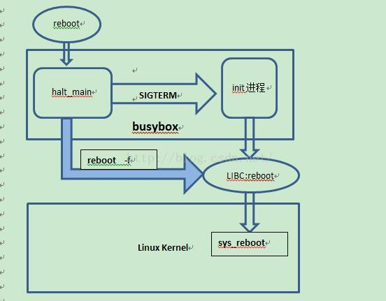

## reboot/poweroff

`boards/default/dts/cv181x/cv181x_base.dtsi` 中定义了 `restart-controller` 设备。

```dts
restart: restart-controller {
	compatible = "cvitek,restart";
	reg = <0x0 0x05025000 0x0 0x2000>;
};
```

`drivers/power/reset/cvi-reboot.c` 中实现了对应的一个平台驱动：

```c
static const struct of_device_id cvi_reboot_of_match[] = {
	{ .compatible = "cvitek,restart" },
	{}
};

static struct platform_driver cvi_reboot_driver = {
	.probe = cvi_reboot_probe,
	.driver = {
		.name = "cvi-reboot",
		.of_match_table = cvi_reboot_of_match,
	},
};
```

主要看下 `cvi_reboot_probe`，它做的事情很简单，注册 `restart` 以及 `poweroff` 的回调处理函数。

```c
static struct notifier_block cvi_restart_nb = {
	.notifier_call = cvi_restart_handler,
	.priority = 128,
};
static int cvi_reboot_probe(struct platform_device *pdev)
{
	struct device_node *np = pdev->dev.of_node;
	int err;

	// 根据设备树信息调用 ioremap 映射基址 0x05025000, size 0x2000
	base = of_iomap(np, 0);
	if (!base) {
		WARN(1, "failed to map base address");
		return -ENODEV;
	}

	// 注册 restart 的回调函数
	err = register_restart_handler(&cvi_restart_nb);
	if (err) {
		dev_err(&pdev->dev, "cannot register restart handler (err=%d)\n",
			err);
		iounmap(base);
	}

	// 注册 poweroff 的回调函数
	pm_power_off = &cvi_do_pwroff;

	return err;
}
```

## reboot 调用链

上面只是在了 kernel 中注册了一个 reboot 指令的一个回调函数，但 reboot 的完整流程:

> https://blog.csdn.net/davion_zhang/article/details/52233043



普通的reboot是通过busybox为入口，进入halt_main函数，然后给init进程发送SIGTERM信号，init进程接收到信号后给其他进程发送终止信号，最后调用C库函数reboot，reboot通过系统调用sys_reboot进入内核，内核将整个系统重启。**其中在shell中执行reboot –f则通过halt_main直接调用C函数reboot，不经过init进程**。

### reboot 应用层实现

reboot 本身也只是 busybox 实现的。所以看 busybox 的源码就好。

```bash
[root@milkv-duo]~# whereis reboot
reboot: /sbin/reboot
[root@milkv-duo]~# cd /sbin/
[root@milkv-duo]/sbin# ll reboot
lrwxrwxrwx 1 root root 14 Aug  1  2024 reboot -> ../bin/busybox*
```

**✨✨✨✨✨✨✨ 实际上，reboot、poweroff、CTRL-ALT-DEL 等都是由INIT 进程去处理的，init 进程中配置了 信号-信号处理函数，reboot、poweroff、CTRL-ALT-DEL 本质上都是给init 进程发送信号，从而让 init 进去去执行相应的动作。
USR1/TERM/USR2/INT: run halt/reboot/poweroff/Ctrl-Alt-Del script。所以，你可以通过 `kill -s SIGTERM 1` 实现reboot操作，其余类似。所以，得熟悉  [信号](./Linux系统编程-信号.md)✨✨✨✨✨✨✨✨✨✨**

基于上面的结论，再来看代码。在 `init/init.c halt.c` 中，reboot 的具体实现是这样的：

首先，有个全局变量 G 。数据结构如下所示，主要包含一个action list代表初始化过程会执行的操作。

```c
struct globals {
	struct init_action *init_action_list;
	#if !ENABLE_FEATURE_INIT_SYSLOG
	const char *log_console;
	#endif
	sigset_t delayed_sigset;
	struct timespec zero_ts;
} FIX_ALIASING;
```

init进程本身是通过信号传递消息，进而处理对应的动作。这里主要先通过 [sigprocmask](./Linux系统编程-信号.md) 把一些影响系统启动的信号进行阻塞。防止干扰前期初始化过程。

```c
int init_main(int argc UNUSED_PARAM, char **argv)
{
	struct sigaction sa;

	INIT_G();
	/* Some users send poweroff signals to init VERY early.
	 * To handle this, mask signals early.
	 */
	sigaddset(&G.delayed_sigset, SIGINT);  /* Ctrl-Alt-Del */
	sigaddset(&G.delayed_sigset, SIGQUIT); /* re-exec another init */
#ifdef SIGPWR
	sigaddset(&G.delayed_sigset, SIGPWR);  /* halt */
#endif
	sigaddset(&G.delayed_sigset, SIGUSR1); /* halt */
	sigaddset(&G.delayed_sigset, SIGTERM); /* reboot */
	sigaddset(&G.delayed_sigset, SIGUSR2); /* poweroff */
#if ENABLE_FEATURE_USE_INITTAB
	sigaddset(&G.delayed_sigset, SIGHUP);  /* reread /etc/inittab */
#endif
	sigaddset(&G.delayed_sigset, SIGCHLD); /* make sigtimedwait() exit on SIGCHLD */
	sigprocmask(SIG_BLOCK, &G.delayed_sigset, NULL);
```

如果参数带了-q就直接给 进程1 （init）发送 SIGHUP 信号.

```c
	if (argv[1] && strcmp(argv[1], "-q") == 0) {
		return kill(1, SIGHUP);
	}
```

init进程的进程号必须是1.

```c
#if !DEBUG_INIT
	/* Expect to be invoked as init with PID=1 or be invoked as linuxrc */
	if (getpid() != 1
	 && (!ENABLE_LINUXRC || applet_name[0] != 'l') /* not linuxrc? */
	) {
		bb_simple_error_msg_and_die("must be run as PID 1");
	}

# ifdef RB_DISABLE_CAD
	/* Turn off rebooting via CTL-ALT-DEL - we get a
	 * SIGINT on CAD so we can shut things down gracefully... */
	reboot(RB_DISABLE_CAD); /* misnomer */
# endif
#endif
```

设置环境变量，如果有参数的话，设置 RUNLEVEL

```c
	/* Make sure environs is set to something sane */
	putenv((char *) "HOME=/");
	putenv((char *) bb_PATH_root_path);
	putenv((char *) "SHELL=/bin/sh");
	putenv((char *) "USER=root"); /* needed? why? */

	if (argv[1])
		xsetenv("RUNLEVEL", argv[1]);
```

```bash
[root@milkv-duo]/sbin# printenv
USER=root
HOSTNAME=milkv-duo
SHLVL=1
LD_LIBRARY_PATH=/mnt/system/lib:/mnt/system/usr/lib
HOME=/root
OLDPWD=/root
TERMINFO=/usr/share/terminfo
PAGER=/bin/more
PS1=[\u@\h]\w\$
LOGNAME=root
TERM=vt100
PATH=/usr/local/bin:/usr/bin:/bin:/usr/local/sbin:/usr/sbin:/sbin:/mnt/system/usr/bin:/mnt/system/usr/sbin
SHELL=/bin/sh
PWD=/sbin
EDITOR=/bin/vi
```

非单用户模式下，读取 /etc/inittab。

```c
	/* Check if we are supposed to be in single user mode */
	if (argv[1]
	 && (strcmp(argv[1], "single") == 0 || strcmp(argv[1], "-s") == 0 || LONE_CHAR(argv[1], '1'))
	) {
		/* ??? shouldn't we set RUNLEVEL="b" here? */
		/* Start a shell on console */
		new_init_action(RESPAWN, bb_default_login_shell, "");
	} else {
		/* Not in single user mode - see what inittab says */

		/* NOTE that if CONFIG_FEATURE_USE_INITTAB is NOT defined,
		 * then parse_inittab() simply adds in some default
		 * actions (i.e., INIT_SCRIPT and a pair
		 * of "askfirst" shells) */
		parse_inittab();
	}
```
> https://elixir.bootlin.com/busybox/1.36.1/source/init/init.c#L1248
> 即使没有 /etc/inittab 文件，也有默认配置。
> 这个文件非常重要💥💥，这是只关注 action 和 process
> Valid actions include: **sysinit, respawn, askfirst, wait, once, restart, ctrlaltdel, and shutdown**.\n"
>
> **Run only-once actions:**
> - sysinit: 'sysinit' is the first item run on boot. init waits until all sysinit actions are completed before continuing.
> - wait: then all 'wait' actions are run. wait' actions, like 'sysinit' actions, cause init to wait until the specified task completes.
> - once: 'once' actions are asynchronous, therefore, init does not wait for them to complete.
> - restart: 'restart' is the action taken to restart the init process. By default this should simply run /sbin/init, but can be a script which runs pivot_root or it can do all sorts of other interesting things.
> - ctrlaltdel: run when the system detects that someone on the system console has pressed the CTRL-ALT-DEL key combination. Typically one wants to run 'reboot' at this point to cause the system to reboot.
> - shutdown: Finally the 'shutdown' action specifies the actions to taken when init is told to reboot. Unmounting filesystems and disabling swap is a very good here.
> **Run repeatedly actions**:
> - respawn: 'respawn' actions are run after the 'once' actions. When a process started with a 'respawn' action exits, init automatically restarts it. Unlike sysvinit, BusyBox init does not stop processes from respawning out of control. emmm 就是 ctrl+d 时又重新有登陆吗？
> - askfirst: The 'askfirst' actions acts just like respawn, except that before running the specified process it displays the line \"Please press Enter to activate this console.\" and then waits for the user to press enter before starting the specified process.
```
//usage:	"BusyBox init works just fine without an inittab. If no inittab is found,\n"
//usage:	"it has the following default behavior:\n"
//usage:	"\n"
//usage:	"	::sysinit:/etc/init.d/rcS\n"
//usage:	"	::askfirst:/bin/sh\n"
//usage:	"	::ctrlaltdel:/sbin/reboot\n"
//usage:	"	::shutdown:/sbin/swapoff -a\n"
//usage:	"	::shutdown:/bin/umount -a -r\n"
//usage:	"	::restart:/sbin/init\n"
//usage:	"	tty2::askfirst:/bin/sh\n"
//usage:	"	tty3::askfirst:/bin/sh\n"
//usage:	"	tty4::askfirst:/bin/sh\n"
//usage:	"\n"
//usage:	"If you choose to use an /etc/inittab file, the inittab entry format is as follows:\n"
//usage:	"\n"
//usage:	"	<id>:<runlevels>:<action>:<process>\n"
```

demo in ramdisk/rootfs/common_musl_riscv64/etc/inittab

```
# Format for each entry: <id>:<runlevels>:<action>:<process>
#
# id        == tty to run on, or empty for /dev/console
# runlevels == ignored
# action    == one of sysinit, respawn, askfirst, wait, and once
# process   == program to run

# Startup the system
::sysinit:/sbin/mdev -s
::sysinit:/bin/mkdir -p /dev/pts
::sysinit:/bin/mkdir -p /dev/shm
::sysinit:/bin/mount -a
null::sysinit:/bin/hostname -F /etc/hostname

# now run any rc scripts
::sysinit:/etc/init.d/rcS

# now run any post scripts
::sysinit:/etc/init.d/rcP

# Put a getty on the serial port
console::respawn:/sbin/getty -L  console 115200 vt100 -n -l /usr/local/bin/autologin

# Stuff to do for the 3-finger salute
::ctrlaltdel:/sbin/reboot

# Stuff to do before rebooting
::shutdown:/etc/init.d/rcK
::shutdown:/sbin/swapoff -a
::shutdown:/bin/umount -a -r
```

顺序执行 /etc/inittab 中的事情。All actions are run in the order they appear in /etc/inittab.

```c
	/* Now run everything that needs to be run */
	/* First run the sysinit command */
	run_actions(SYSINIT);
	check_delayed_sigs(&G.zero_ts);
	/* Next run anything that wants to block */
	run_actions(WAIT);
	check_delayed_sigs(&G.zero_ts);
	/* Next run anything to be run only once */
	run_actions(ONCE);
```

可以看到 `SYSINIT | WAIT | CTRLALTDEL | SHUTDOWN` 4 种类型的任务都是阻塞的，等一个命令执行完才会继续执行下一个。

```c
/* Run all commands of a particular type */
static void run_actions(int action_type)
{
	struct init_action *a;

	for (a = G.init_action_list; a; a = a->next) {
		if (!(a->action_type & action_type))
			continue;

		if (a->action_type & (SYSINIT | WAIT | ONCE | CTRLALTDEL | SHUTDOWN)) {
			pid_t pid = run(a);
			if (a->action_type & (SYSINIT | WAIT | CTRLALTDEL | SHUTDOWN))
				waitfor(pid);
		}
		if (a->action_type & (RESPAWN | ASKFIRST)) {
			/* Only run stuff with pid == 0. If pid != 0,
			 * it is already running
			 */
			if (a->pid == 0)
				a->pid = run(a);
		}
	}
}
```

由于 init 进程主要是通过信号来处理消息，init 进程本身并不会退出，而是阻塞休眠。

```c
	/* Now run the looping stuff for the rest of forever */
	while (1) {
		/* (Re)run the respawn/askfirst stuff */
		run_actions(RESPAWN | ASKFIRST);

		/* Wait for any signal (typically it's SIGCHLD) */
		⛔⛔⛔⛔ 就这里是阻塞，直到有信号到来。
		check_delayed_sigs(NULL); /* NULL timespec makes it wait */

		/* Wait for any child process(es) to exit */
		while (1) {
			pid_t wpid;
			struct init_action *a;

			wpid = waitpid(-1, NULL, WNOHANG);
			if (wpid <= 0)
				break;

			a = mark_terminated(wpid);
			if (a) {
				message(L_LOG, "process '%s' (pid %u) exited. "
						"Scheduling for restart.",
						a->command, (unsigned)wpid);
			}
		}

		/* Don't consume all CPU time - sleep a bit */
		sleep1();
	} /* while (1) */
```

```c
static void check_delayed_sigs(struct timespec *ts)
{
	⛔⛔⛔⛔⛔⛔⛔⛔⛔⛔ 就这里是阻塞，直到有信号到来。
	int sig = sigtimedwait(&G.delayed_sigset, /* siginfo_t */ NULL, ts);
	if (sig <= 0)
		return;

	/* The signal "sig" was caught */

#if ENABLE_FEATURE_USE_INITTAB
	if (sig == SIGHUP)
		reload_inittab();
#endif
	不同信号，不同处理。
	if (sig == SIGINT)
		run_actions(CTRLALTDEL);
	if (sig == SIGQUIT) {
		exec_restart_action();
		/* returns only if no restart action defined */
	}
	if ((1 << sig) & (0
#ifdef SIGPWR
	    | (1 << SIGPWR)
#endif
	    | (1 << SIGUSR1)
	    | (1 << SIGUSR2)
	    | (1 << SIGTERM)
	)) {
		/* reboot, poweroff, or halt */
		halt_reboot_pwoff(sig);
	}
	/* if (sig == SIGCHLD) do nothing */
}

static void halt_reboot_pwoff(int sig)
{
	const char *m;
	unsigned rb;

	/* We may call run() and it unmasks signals,
	 * including the one masked inside this signal handler.
	 * Testcase which would start multiple reboot scripts:
	 *  while true; do reboot; done
	 * Preventing it:
	 */
	reset_sighandlers_and_unblock_sigs();

	// https://elixir.bootlin.com/busybox/1.36.1/source/init/init.c#L758
    // run_actions(SHUTDOWN); 这里运行 inittab 中定义的 shutdown  📢📢📢📢📢📢📢📢📢📢📢📢📢
	// kill(-1, SIGTERM);
    // kill(-1, SIGKILL);
    // 延时后再次发送SIGKILL信号，这里说明一下为什么要发送SIGKILL信号，一般的SIGINT和SIGTERM信号都可以屏蔽或转作他用，SIGKILL信号是不可被屏蔽的，
	run_shutdown_and_kill_processes();

	m = "halt";
	rb = RB_HALT_SYSTEM;
	if (sig == SIGTERM) {
		m = "reboot";
		rb = RB_AUTOBOOT;
	} else if (sig == SIGUSR2) {
		m = "poweroff";
		rb = RB_POWER_OFF;
	}
	message(L_CONSOLE, "Requesting system %s", m);
	//
	pause_and_low_level_reboot(rb); // reboot(magic);
	/* not reached */
}
```

### 库函数 musl clib

https://elixir.bootlin.com/musl/v1.2.5/source/src/linux/reboot.c#L4

```c
type:
/* Perform a hard reset now.  */
#define RB_AUTOBOOT	0x01234567

/* Halt the system.  */
#define RB_HALT_SYSTEM	0xcdef0123

/* Enable reboot using Ctrl-Alt-Delete keystroke.  */
#define RB_ENABLE_CAD	0x89abcdef

/* Disable reboot using Ctrl-Alt-Delete keystroke.  */
#define RB_DISABLE_CAD	0

/* Stop system and switch power off if possible.  */
#define RB_POWER_OFF	0x4321fedc

/* Suspend system using software suspend.  */
#define RB_SW_SUSPEND	0xd000fce2

/* Reboot system into new kernel.  */
#define RB_KEXEC	0x45584543

int reboot(int type)
{
	return syscall(SYS_reboot, 0xfee1dead, 672274793, type);
}
```

### 内核实现

```c
// kernel/reboot.c https://elixir.bootlin.com/linux/v5.10.186/source/kernel/reboot.c#L310
SYSCALL_DEFINE4(reboot, int, magic1, int, magic2, unsigned int, cmd,
		void __user *, arg)
{
	/* Instead of trying to make the power_off code look like
	 * halt when pm_power_off is not set do it the easy way.
	 */
	if ((cmd == LINUX_REBOOT_CMD_POWER_OFF) && !pm_power_off)
		cmd = LINUX_REBOOT_CMD_HALT;

	mutex_lock(&system_transition_mutex);
	switch (cmd) {
	case LINUX_REBOOT_CMD_RESTART: // restart
		kernel_restart(NULL);
		break;

	case LINUX_REBOOT_CMD_HALT:
		kernel_halt();
		do_exit(0);
		panic("cannot halt");

	case LINUX_REBOOT_CMD_POWER_OFF:
		kernel_power_off();
		do_exit(0);
		break;

	case LINUX_REBOOT_CMD_RESTART2: // 这个带 buffer ?
		ret = strncpy_from_user(&buffer[0], arg, sizeof(buffer) - 1);
		if (ret < 0) {
			ret = -EFAULT;
			break;
		}
		buffer[sizeof(buffer) - 1] = '\0';

		kernel_restart(buffer);
		break;
	}
```

```c
void kernel_restart_prepare(char *cmd)
{
	blocking_notifier_call_chain(&reboot_notifier_list, SYS_RESTART, cmd);
	system_state = SYSTEM_RESTART;
	usermodehelper_disable();
	device_shutdown();
}

/**
 * syscore_shutdown - Execute all the registered system core shutdown callbacks.
 */
void syscore_shutdown(void)
{
	struct syscore_ops *ops;

	mutex_lock(&syscore_ops_lock);

	list_for_each_entry_reverse(ops, &syscore_ops_list, node)
		if (ops->shutdown) {
			if (initcall_debug)
				pr_info("PM: Calling %pS\n", ops->shutdown);
			ops->shutdown();
		}

	mutex_unlock(&syscore_ops_lock);
}

void kernel_restart(char *cmd)
{
	kernel_restart_prepare(cmd);
	migrate_to_reboot_cpu();
	syscore_shutdown();
	if (!cmd)
		pr_emerg("Restarting system\n");
	else
		pr_emerg("Restarting system with command '%s'\n", cmd);
	kmsg_dump(KMSG_DUMP_SHUTDOWN);
	machine_restart(cmd);
}
// arch/riscv/kernel/reset.c
void machine_restart(char *cmd)
{
	do_kernel_restart(cmd);
	while (1);
}

/**
 *	do_kernel_restart - Execute kernel restart handler call chain
 *
 *	Calls functions registered with register_restart_handler.
 *
 *	Expected to be called from machine_restart as last step of the restart
 *	sequence.
 *
 *	Restarts the system immediately if a restart handler function has been
 *	registered. Otherwise does nothing.
 */
void do_kernel_restart(char *cmd)
{
	// 这里就会调用到
	atomic_notifier_call_chain(&restart_handler_list, reboot_mode, cmd);
}
```

这里就会调用到 [reboot/poweroff](#reboot/poweroff) 中注册的处理函数了.

看 datasheet . https://github.com/sophgo/sophgo-doc/releases/tag/sg2002-trm-v1.01

```c
// reg = <0x0 0x05025000 0x0 0x2000>;
static int cvi_restart_handler(struct notifier_block *this,
				unsigned long mode, void *cmd)
{
	void __iomem *REG_RTC_CTRL_BASE = base;
	void __iomem *REG_RTC_BASE = base + 0x1000;

	/* Enable power suspend wakeup source mask */
	// rtcsys_clkdiv 0x03c
	writel(0x1, REG_RTC_BASE + 0x3C); // 1 = select prdata from 32K domain

	// rtc_ctrl_unlockkey 0x004
	writel(0xAB18, REG_RTC_CTRL_BASE + RTC_CTRL0_UNLOCKKEY);

	// 这个datasheet 上没有 0x0cc
	writel(0x1, REG_RTC_BASE + RTC_EN_WARM_RST_REQ);

	while (readl(REG_RTC_BASE + RTC_EN_WARM_RST_REQ) != 0x01)
		;

	while (readl(REG_RTC_BASE + RSM_STATE) != ST_ON)
		;

	writel(0xFFFF0800 | (0x1 << 4), REG_RTC_CTRL_BASE + RTC_CTRL0);

	return NOTIFY_DONE;
}
```

算了，不管了，这里看起来就是最后的一步了。
