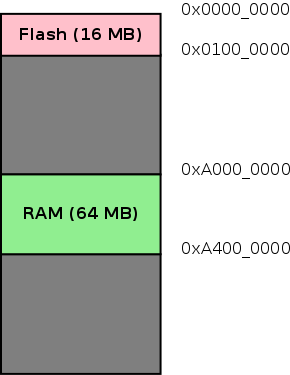
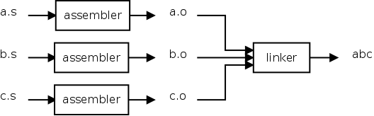
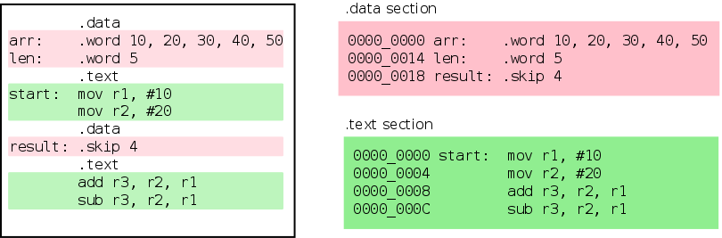
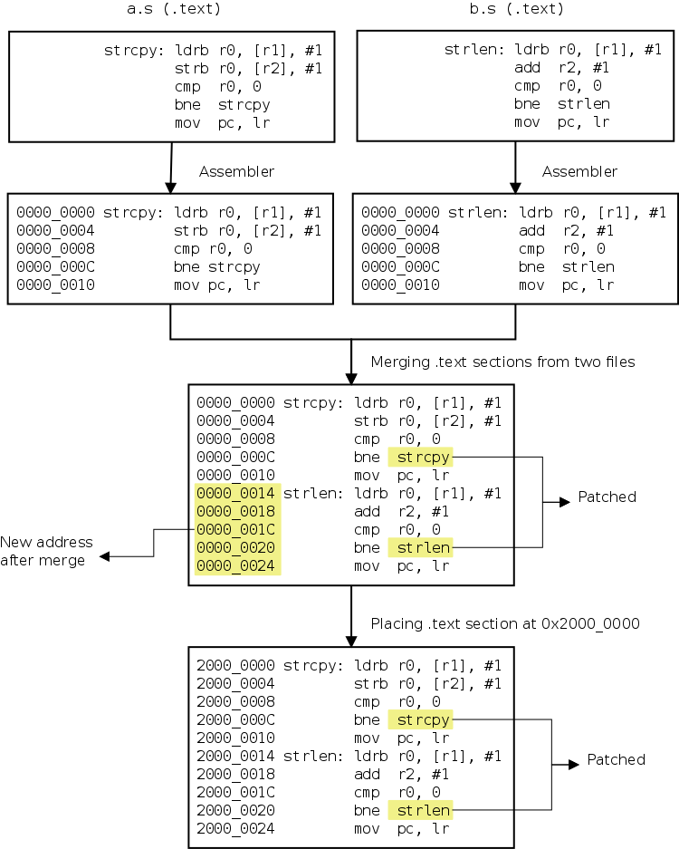
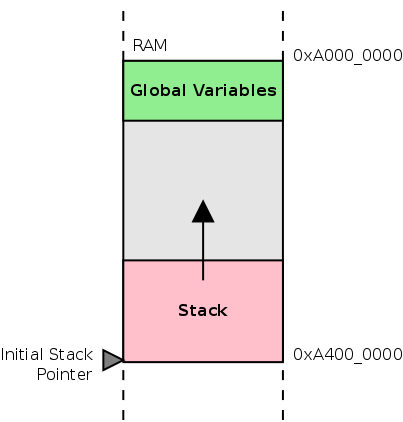
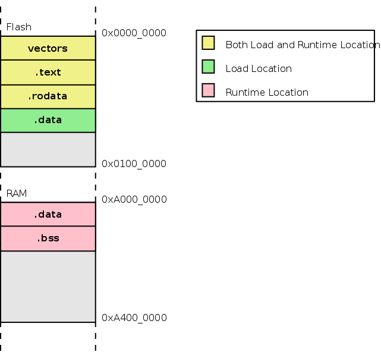

> Origin online url: https://www.bravegnu.org/gnu-eprog/
>
> github repo: https://github.com/bravegnu/gnu-eprog/blob/master/gnu-eprog.asciidoc

## 1. Introduction

GNU工具链越来越多地被用于深度嵌入式软件开发。这种类型的软件开发也被称为独立C编程和裸机C编程。独立C编程带来了新的问题，处理这些问题需要对GNU工具链有更深入的理解。GNU工具链的手册提供了关于工具链的极好信息，但从工具链的角度，而不是问题的角度。好吧，无论如何，手册应该是这样写的。结果是常见问题的答案分散在各处，GNU工具链的新用户感到困惑。

本教程试图通过从问题的角度解释工具来弥合差距。希望这能让更多人能够使用 GNU 工具链进行嵌入式项目开发。

在本教程中，使用Qemu模拟基于ARM的嵌入式系统。有了这个，您可以在舒适的桌面上学习GNU工具链，而无需投资硬件。本教程本身不教授ARM指令集。它应该与其他书籍和在线教程一起使用，例如：

- ARM Assembler - http://www.heyrick.co.uk/assembler/
- ARM汇编程序-http://www.heyrick.co.uk/assembler/
- ARM Assembly Language Programming - http://www.arm.com/miscPDFs/9658.pdf
- ARM汇编语言编程-http://www.arm.com/miscPDFs/9658.pdf

但为了方便读者，附录中列出了常用的ARM指令。顺序看文中代码时，有 arm 指令不清楚可以跳转到附录查看。

---

## 2. Setting up the ARM Lab

本节介绍如何在你的电脑上使用 Qemu 和 GNU 工具链设置一个简单的 ARM 开发和测试环境。Qemu 是一款可以模拟多种机器（包括基于 ARM 的机器）的机器模拟器。你可以编写 ARM 汇编程序，使用 GNU 工具链进行编译，并在 Qemu 中执行和测试这些程序。

### 2.1. Qemu ARM

Qemu 将用于模拟来自 Gumstix 的基于 PXA255 的 *connex* 开发板。要运行本教程，你需要至少 0.9.1 版本的 Qemu。

PXA255 处理器具有符合 ARMv5TE 指令集的 ARM 核心。PXA255 还包含多个片上外设。在本教程中，将介绍其中的一些外设。.

### 2.2. Installing Qemu in Debian

This tutorial requires qemu version 0.9.1 or above. The qemu package available in Debian Squeeze/Wheezy, meets this requirement. Install `qemu` using `apt-get`.

> Ubuntu 22.04 上测试，后续使用的，应该通过 `apt install qemu-system-arm`

```bash
$ sudo apt install qemu-system-arm
```

### 2.3. Installing GNU Toolchain for ARM

1. Folks at CodeSourcery (part of Mentor Graphics) have been kind enough to make GNU toolchains available for various architectures. Download the GNU toolchain for ARM, available from from http://www.mentor.com/embedded-software/sourcery-tools/sourcery-codebench/editions/lite-edition/

   > ⛔ 上诉链接早已失效，官方工具链下载地址：https://developer.arm.com/downloads/-/arm-gnu-toolchain-downloads。
   >
   > 不过上面链接下载的工具链也有问题，部分工具链接异常。改用 https://github.com/sophgo/host-tools 下的工具链。

2. Extract the tar archive, to `~/toolchains`.

   ```bash
   $ mkdir ~/toolchains
   $ cd ~/toolchains
   $ tar -jxf ~/downloads/arm-2008q1-126-arm-linux-gnueabihf-i686-pc-linux-gnu.tar.bz2
   ```

3. Add the toolchain to your `PATH`.

   ```bash
   $ export PATH=/home/yogurt/Documents/sophgo/host-tools/gcc/gcc-linaro-6.3.1-2017.05-x86_64_arm-linux-gnueabihf/bin:$PATH
   ```

4. You might want to add the previous line to your `.bashrc`.

---

## 3. Hello ARM

在本节中，你将学习如何汇编一个简单的 ARM 程序，并在由 Qemu 模拟的裸机 connex 开发板上进行测试。

汇编程序的源文件由一系列语句组成，每行一条语句。每条语句的格式如下：

```asm
label:    instruction         @ comment
```

上面三个部分都是可选的。

- 📌 `label`: 标签是一个方便的方式，**用于指代内存中指令的位置**。标签可以在任何地址可以出现的地方使用，例如作为分支指令的操作数。标签名称应由字母、数字、下划线（`_`）和美元符号（`$`）组成。

  > The label is a convenient way to refer to the location of the instruction in memory. The label can be used where ever an address can appear, for example as an operand of the branch instruction. The label name should consist of alphabets, digits, `_` and `$`.

- 📝 `comment`: 注释以 `@` 开始，`@` 后出现的字符将被忽略。

- 📜 `instruction`: 可以是 ARM 指令或汇编指令。汇编指令是给汇编器的命令，💡💡 **汇编指令总是以 `.`（句点）开头**。

  > The `instruction` could be an ARM instruction or an assembler directive. Assembler directives are commands to the assembler. Assembler directives always start with a `.` (period).

> 💡💡 注意后续区分汇编指令与 ARM 指令！！！

以下是一个非常简单的 ARM 汇编程序，用于将两个数字相加：

**Listing 1. Adding Two Numbers**

```asm
        .text
start:                       @ Label, not really required
        mov   r0, #5         @ Load register r0 with the value 5
        mov   r1, #4         @ Load register r1 with the value 4
        add   r2, r1, r0     @ Add r0 and r1 and store in r2

stop:   b stop               @ Infinite loop to stop execution
```

`.text` 是一个**汇编指令**，表示接下来的指令应被汇编到代码段，而不是 `.data` 段。关于段的内容将在后面的教程中详细介绍。

```
The `.text` is an assembler directive, which says that the following instructions
have to be assembled into the code section, rather than the `.data` section.
Sections will be covered in detail, later in the tutorial.
```

### 3.1. Building the Binary

将下面的程序保存到一个名为 `add.s` 的文件中。要汇编该文件，可以使用 GNU 工具链的汇编器 `as`，命令如下：

```bash
$ arm-linux-gnueabihf-as -o add.o add.s
```

`-o`选项指定输出 文件名。

> 交叉工具链总是以目标架构的前缀命名，以避免与主机工具链的名称冲突。为了可读性，文本中将不带前缀地提及这些工具。

要生成可执行文件，可以使用 GNU 工具链中的链接器 `ld`，如下所示的命令：

```bash
$ arm-linux-gnueabihf-ld -Ttext=0x0 -o add.elf add.o
arm-linux-gnueabihf-ld: warning: cannot find entry symbol _start; defaulting to 0000000000000000
```

这里同样地，`-o` 选项用于指定输出文件名。`-Ttext=0x0` 指定了标签 `text` 应被分配的地址，使得指令从地址 `0x0` 开始。要查看各个标签的地址分配，可以使用 `nm` 命令，如下所示：

```bash
# Here again, the `-o` option specifies the output filename.
# The `-Ttext=0x0`, specifies that addresses should be assigned to the labels,
# such that the instructions were starting from address `0x0`.
# To view the address assignment for various labels, the `nm` command can be used as shown below.

$ arm-linux-gnueabihf-nm add.elf
00010010 T __bss_end__
00010010 T _bss_end__
00010010 T __bss_start
00010010 T __bss_start__
00010010 T _edata
00010010 T __end__
00010010 T _end
00000000 t start
0000000c t stop
```

请注意标签 `start` 和 `stop` 的地址分配。`start` 的地址被分配为 `0x0`，因为它是第一条指令的标签。`stop` 标签在 3 条指令之后。每条指令占用 4 字节，因此 `stop` 被分配的地址是 12（`0xC`）。

使用不同的基地址进行链接将导致标签被分配到不同的地址集。

```bash
# Note the address assignment for the labels `start` and `stop`. The address assigned
# for `start` is `0x0`. Since it is the label of the first instruction.
# The label `stop` is after 3 instructions. Each instructions is 4 bytes.
# Hence `stop` is assigned an address `12` (`0xC`).

# Linking with a different base address for the instructions will result in
# a different set of addresses being assigned to the labels.

$ arm-linux-gnueabihf-ld -Ttext=0x20000000 -o add.elf add.o
$ arm-linux-gnueabihf-nm add.elf
... clip ...
20000000 t start
2000000c t stop
```
`ld` 创建的输出文件格式称为 `ELF`。有多种文件格式可用于存储可执行代码。ELF 格式在有操作系统时运行良好，但由于我们将要在裸机上运行程序，因此需要将其转换为一种更简单的文件格式，称为 `binary` 格式。

```
The output file created by `ld` is in a format called `ELF`. Various file formats are available
 for storing executable code. The ELF format works fine when you have an OS around,
 but since we are going to run the program on bare metal,
 we will have to convert it to a simpler file format called the `binary` format.
```

`binary` 格式的文件包含从特定内存地址开始的连续字节。该文件中不存储任何其他附加信息。**这对于 Flash 烧录工具来说非常方便**，因为编程时只需将文件中的每个字节复制到从指定基地址开始的连续地址中即可。

> 有点像烧录固件时，提前将固件打包为的整包工具。

GNU 工具链中的 `objcopy` 命令可用于在不同的目标文件格式之间进行转换。以下是该命令的一种常见用法：

```bash
# A file in `binary` format contains consecutive bytes from a specific memory address.
# No other additional information is stored in the file. This is convenient for Flash programming tools,
# since all that has to be done when programming is to copy each byte in the file,
# to consecutive address starting from a specified base address in memory.

# The GNU toolchain’s `objcopy` command can be used to convert between different object file formats.
# A common usage of the command is given below.

objcopy -O <output-format> <in-file> <out-file>
```

将`add.elf`转换为 `binary` 格式 可以使用以下命令。

```bash
$ arm-linux-gnueabihf-objcopy -O binary add.elf add.bin
```

检查文件的大小。该文件正好是16个字节。因为有4条指令，每条指令占用4个字节。

```bash
$ ls -al add.bin
-rw-r--r-- 1 vijaykumar vijaykumar 16 2008-10-03 23:56 add.bin
```

### 3.2. Executing in Qemu


当 ARM 处理器复位时，它从地址 `0x0` 开始执行。在 connex 开发板上，16MB 的 Flash 存储器位于地址 `0x0`。Flash 开始处的指令将被执行。

当 `qemu` 模拟 connex 开发板时，必须指定一个文件，该文件将被视为 Flash 存储器。Flash 文件格式非常简单。要从 Flash 中的地址 X 获取字节，`qemu` 从文件的偏移量 X 读取字节。实际上，这与二进制文件格式是相同的。

为了在模拟的 Gumstix connex 开发板上测试程序，我们首先创建一个 16MB 的文件来表示 Flash。我们使用 `dd` 命令从 `/dev/zero` 复制 16MB 的零字节到文件 `flash.bin`。数据以 4K 块的形式复制。

```bash
$ dd if=/dev/zero of=flash.bin bs=4096 count=4096
```

然后，可以使用以下命令将 `add.bin` 文件复制到 Flash 的开头：

```bash
$ dd if=add.bin of=flash.bin bs=4096 conv=notrunc
```

这相当于将`bin`文件烧录到闪存上。

在复位后，处理器将从地址 `0x0` 开始执行，程序中的指令将被执行。调用 `qemu` 的命令如下：

```bash
$ qemu-system-arm -M connex -pflash flash.bin -nographic -serial /dev/null
```

`-M connex` 选项指定要模拟的机器为 `connex`。`-pflash` 选项指定 `flash.bin` 文件表示 Flash 存储器。`-nographic` 表示不需要图形显示的模拟。`-serial /dev/null` 指定 connex 开发板的串口连接到 `/dev/null`，以便丢弃串口数据。

系统执行指令后，会在 `stop: b stop` 指令处无限循环。要查看寄存器的内容，可以使用 `qemu` 的监视器接口。监视器接口是一个命令行界面，通过它可以控制模拟的系统并查看系统状态。当 `qemu` 以上述命令启动时，监视器接口将通过 `qemu` 的标准输入/输出提供。

要查看寄存器的内容，可以使用`info registers`监视器命令。

```bash
$ qemu-system-arm -M connex -pflash flash.bin -nographic -serial /dev/null
WARNING: Image format was not specified for 'flash.bin' and probing guessed raw.
         Automatically detecting the format is dangerous for raw images, write operations on block 0 will be restricted.
         Specify the 'raw' format explicitly to remove the restrictions.
QEMU 6.2.0 monitor - type 'help' for more information
(qemu) info registers
R00=00000005 R01=00000004 R02=00000009 R03=00000000
R04=00000000 R05=00000000 R06=00000000 R07=00000000
R08=00000000 R09=00000000 R10=00000000 R11=00000000
R12=00000000 R13=00000000 R14=00000000 R15=0000000c
PSR=400001d3 -Z-- A svc32
FPSCR: 00000000
(qemu)
```

请注意寄存器 `R02` 的值。该寄存器包含加法的结果，应该与预期值 9 相符。

### 3.3. More Monitor Commands

一些有用的`qemu`监控命令 列在下表中。

| Command        | Purpose                         |
| -------------- | ------------------------------- |
|                |                                 |
| `help`         | List available commands         |
| `quit`         | Quits the emulator              |
| `xp /fmt addr` | Dump 物理内存中 `addr` 处的内容   |
| `system_reset` | Reset the system.              |


`xp` 命令需要更多的解释。`/fmt` 作为参数指定内存内容的显示方式。`fmt` 的语法为 `<count><format><size>`。

- `count`: 表示要显示的 `item` 数量，例如要显示 4 个字节可以写为 `4`

- `format`: 指定显示格式。`x` 代表十六进制，`d`代表有符号十进制， `u`代表无符号十进制，`o`代表八进制，`c`代表 char和`i`用于asm指令。

- `size`: 表示每个 `item` 的大小，`b`表示8位，`h`表示 16位，`w`代表32位 `g`为64位。

这个 `xp` 命令使用 `i` 格式可以用于反汇编内存中存在的指令。如要反汇编位于 `0x0` 的指令，可以使用以下 `xp` 命令，`fmt` 指定为 `4iw`：

```bash
(qemu) xp /4iw 0x0
0x00000000:  mov        r0, #5  ; 0x5
0x00000004:  mov        r1, #4  ; 0x4
0x00000008:  add        r2, r1, r0
0x0000000c:  b  0xc
```

在这个命令中：

- `4` 指定要显示 4 个 `item`。
- `i` 指定这些项目将以指令形式打印（是的，这个命令内置了反汇编功能！）。
- `w` 指定每个项目的大小为 32 位。

该命令的输出将显示从地址 `0x0` 开始的 4 条指令的反汇编结果。

---

## 4. More Assembler Directives

在本节中，我们将描述一些常用的**汇编指令**，并使用两个示例程序进行说明。

> 💡💡 **汇编指令总是以 `.` 开头**。

1. 一个计算数组总和的程序
2. 一个计算字符串长度的程序

### 4.1. Sum an Array

以下代码对一个字节数组进行求和，并将结果存储在 `r3` 中。

**Listing 2. Sum an Array**

```asm
        .text
entry:  b start                 @ Skip over the data
arr:    .byte 10, 20, 25        @ Read-only array of bytes
eoa:                            @ Address of end of array + 1

        .align
start:
        ldr   r0, =eoa          @ r0 = &eoa
        ldr   r1, =arr          @ r1 = &arr
        mov   r3, #0            @ r3 = 0
loop:   ldrb  r2, [r1], #1      @ r2 = *r1++
        add   r3, r2, r3        @ r3 += r2
        cmp   r1, r0            @ if (r1 != r2)
        bne   loop              @    goto loop
stop:   b stop
```

该代码引入了两个新的**汇编指令**——`.byte` 和 `.align`。以下是对这些汇编指令的描述。

#### 4.1.1. `.byte` Directive


`.byte` 的字节大小参数**在内存中被组装成连续的字节**。还有类似的指令 `.2byte` 和 `.4byte` 分别用于存储 16 位值和 32 位值。一般的语法如下所示。

```plaintext
The byte sized arguments of `.byte` are assembled into consecutive bytes in memory.
There are similar directives `.2byte` and `.4byte` for storing 16 bit values and 32 bit values, respectively.
The general syntax is given below.
```

```asm
.byte   exp1, exp2, ...
.2byte  exp1, exp2, ...
.4byte  exp1, exp2, ...
```

参数可以是简单的整数字面量，可以用二进制（以 `0b` 或 `0B` 为前缀）、八进制（以 `0` 为前缀）、十进制或十六进制（以 `0x` 或 `0X` 为前缀）表示。整数也可以用字符常量表示（字符用单引号括起来），在这种情况下将使用字符的 ASCII 值。

参数还可以是**由字面量和其他符号构成的 C 表达式**。下面给出了示例。

```
The arguments could be simple integer literal, represented as binary (prefixed by `0b` or `0B`),
octal (prefixed by `0`), decimal or hexadecimal (prefixed by `0x` or `0X`).
The integers could also be represented as character constants (character surrounded by single quotes),
in which case the ASCII value of the character will be used.

The arguments could also be C expressions constructed out of literals and other symbols. Examples are shown below.
```

```asm
pattern:  .byte 0b01010101, 0b00110011, 0b00001111
npattern: .byte npattern - pattern
halpha:   .byte 'A', 'B', 'C', 'D', 'E', 'F'
dummy:    .4byte 0xDEADBEEF
nalpha:   .byte 'Z' - 'A' + 1
```

#### 4.1.2. `.align` Directive

ARM 要求**指令**必须位于 32 位对齐的内存位置。指令中的 4 个字节的第一个字节的地址应该是 4 的倍数。为了满足这一要求，可以使用 `.align` 指令插入填充字节，直到下一个字节地址为 4 的倍数。这仅在代码中插入数据字节或半字时需要。

> 💡💡注意是 arm 指令，不是数据（或者说标签），也不是 **汇编指令**（不然 .align 本身就得先对齐才能使用了）。

```
ARM requires that the instructions be present in 32-bit aligned memory locations.
The address of the first byte, of the 4 bytes in an instruction, should be a multiple of 4.
To adhere to this, the `.align` directive can be used to insert padding bytes
till the next byte address will be a multiple of 4.
This is required only when data bytes or half words are inserted within code.
```

### 4.2. String Length

以下代码计算字符串的长度，并将长度存储在寄存器 `r1` 中。

**Listing 3. String Length**

```asm
        .text
        b start

str:    .asciz "Hello World"

        .equ   nul, 0

        .align
start:  ldr   r0, =str          @ r0 = &str
        mov   r1, #0

loop:   ldrb  r2, [r0], #1      @ r2 = *(r0++)
        add   r1, r1, #1        @ r1 += 1
        cmp   r2, #nul          @ if (r2 != nul)
        bne   loop              @    goto loop

        sub   r1, r1, #1        @ r1 -= 1
stop:   b stop
```

该代码引入了两个新的汇编指令——`.asciz` 和 `.equ`。以下是对这些汇编指令的描述。

#### 4.2.1. `.asciz` Directive

`.asciz` 指令接受字符串字面量作为参数。**字符串字面量是用双引号括起来的字符序列**。这些字符串字面量被组装到连续的内存位置。汇编程序会自动在每个字符串后插入一个 `nul` 字符（`\0` 字符）。

`.ascii` 指令与 `.asciz` 相同，但**汇编程序不会在每个字符串后插入 `nul` 字符**。

> ⛔⛔⛔ 注意二者区别。

#### 4.2.2. `.equ` Directive


汇编程序维护一个称为符号表的结构。符号表将标签名称映射到地址。**每当汇编程序遇到标签定义时，它会在符号表中创建一个条目**。每当汇编程序遇到标签引用时，它会用符号表中对应的地址替换该标签。

💡💡**使用汇编指令 `.equ`，也可以手动向符号表中插入条目，将名称映射到不一定是地址的值**。每当汇编程序遇到这些名称时，它会用相应的值替换它们。这些名称和标签名称统称为**符号名称**。

该指令的一般语法如下所示。

```
The assembler maintains something called a symbol table. The symbol table maps label names to addresses.
Whenever the assembler encounters a label definition, the assembler makes an entry in the symbol table.
And whenever the assembler encounters a label reference, it replaces the label by the corresponding
address from the symbol table.

Using the assembler directive `.equ`, it is also possible to manually insert entries in the symbol table,
to map names to values, which are not necessarily addresses. Whenever the assembler encounters these names,
it replaces them by their corresponding values. These names and label names are together called symbol names.
```

```asm
.equ name, expression
```

- `name` 是一个符号名称，其限制与标签名称相同。
- `expression` 可以是简单的字面量，也可以是如 `.byte` 指令中所解释的表达式。

> 与 `.byte` 指令不同，`.equ` 指令本身并不分配任何内存。它们只是创建符号表中的条目。

---

## 5. Using RAM

Flash 存储器中存储的前面的示例程序是一种 EEPROM。它是一种有用的二级存储，类似于硬盘，但在 Flash 中存储变量并不方便。变量应存储在 RAM 中，以便可以轻松修改。

Connex 板具有 64 MB 的 RAM，从地址 `0xA0000000` 开始，可以在其中存储变量。Connex 板的内存映射可以如下图所示。

**Figure 1. Memory Map**



需要进行必要的设置，以将变量放置在该地址。要理解需要做什么，就必须了解汇编器和链接器的角色。

> 个人理解：汇编器将单个文件解释为机器指令。链接器将这些机器指令组合在一起，形成最终的可执行文件。

---

## 6. Linker

在编写多文件程序时，每个文件会单独汇编成目标文件。链接器将这些目标文件组合在一起，形成最终的可执行文件。

**Figure 2. Role of the Linker**



在合并目标文件时，**链接器**执行以下操作：

1. Symbol Resolution 符号解析
2. Relocation 重定位

在本节中，我们将详细介绍这些操作。

### 6.1. Symbol Resolution

在单文件程序中，在生成目标文件时，汇编器将所有标签的引用替换为相应的地址。但在多文件程序中，如果存在对其他文件中定义的标签的引用，汇编器将这些引用标记为“**未解决**”。当这些目标文件被传递给链接器时，链接器从其他目标文件中确定这些引用的值，并使用正确的值修补代码。

> 想想动态库的例子，板端运行程序时才去使用链接器进行链接，而汇编器仅在编译时使用。链接器也可以在编译时使用，静态链接 `-static`。
>
> 不过编译和运行时的链接器不同：
>
> - 链接器：工作于链接阶段，用`-l -L`指定动态库路径。
> - 动态链接器：工作于程序运行阶段，工作时需要提供动态库所在目录位置，通过环境变量：`export LD_LIBRARY_PATH=/path`。

```
In a single file program, while producing the object file, all references to labels are replaced by
their corresponding addresses by the assembler. But in a multi-file program, if there are any references
to labels defined in another file, the assembler marks these references as "unresolved".
When these object files are passed to the linker, the linker determines the values for
these references from the other object files, and patches the code with the correct values.
```

为了演示链接器执行的**符号解析**，数组求和示例被分为两个文件。这两个文件将被汇编，并检查它们的符号表，以显示未解决引用的存在。

文件 `sum-sub.s` 包含 `sum` 子程序，而文件 `main.s` 使用所需的参数调用该子程序。文件的源代码如下所示。

**Listing 4. `main.s` - Subroutine Invocation** 子程序调用

```asm
        .text
        b start                 @ Skip over the data
arr:    .byte 10, 20, 25        @ Read-only array of bytes
eoa:                            @ Address of end of array + 1

        .align
start:
        ldr   r0, =arr          @ r0 = &arr
        ldr   r1, =eoa          @ r1 = &eoa
        bl    sum               @ Invoke the sum subroutine

stop:   b stop
```

**Listing 5. `sum-sub.s` - Subroutine Definition **子程序定义

```asm
        @ Args
        @ r0: Start address of array
        @ r1: End address of array
        @
        @ Result
        @ r3: Sum of Array

        .global sum

sum:    mov   r3, #0            @ r3 = 0
loop:   ldrb  r2, [r0], #1      @ r2 = *r0++    ; Get array element
        add   r3, r2, r3        @ r3 += r2      ; Calculate sum
        cmp   r0, r1            @ if (r0 != r1) ; Check if hit end-of-array
        bne   loop              @    goto loop  ; Loop
        mov   pc, lr            @ pc = lr       ; Return when done
```

关于 `.global` 指令需要说明一下。在 C 语言中，所有在函数外部声明的变量对其他文件可见，直到明确声明为 `static`。
**但**在汇编语言中，所有标签都是 `static`（即本地文件的），直到明确声明它们应该对其他文件可见，使用 `.global` 指令。

这些文件被汇编，并使用 `nm` 命令查看符号表。

```bash
$ arm-linux-gnueabihf-as -o main.o main.s
$ arm-linux-gnueabihf-as -o sum-sub.o sum-sub.s
$ arm-linux-gnueabihf-nm main.o
00000004 t arr
00000007 t eoa # 注意看这里并没有对齐，回顾上面 `.align` 指令
00000008 t start
00000018 t stop
         U sum
$ arm-linux-gnueabihf-nm sum-sub.o
00000004 t loop
00000000 T sum
```

关注第二列中的字母，它指定了符号类型。`t` 表示符号在文本段中定义。`u` 表示符号未定义。**:fire: 大写字母表示符号是** `.global`。

显然，符号 `sum` 在 `sum-sub.o` 中定义，在 `main.o` 中尚未解析。当链接器被调用时，符号引用将被解析，并生成可执行文件。

### 6.2. Relocation

**重定位是指更改已经分配给标签的地址的过程**。这还涉及修补所有标签引用，以反映新分配的地址。重定位主要出于以下两个原因进行：

1. Section Merging 段合并
2. Section Placement 段放置

要理解重定位的过程，必须先了解**节**`sections`的概念。

> 有时候容易将 `section` 误认为段。

代码和数据在运行时有不同的要求。例如，代码可以放置在只读内存中，而数据可能需要读写内存。**把代码和数据分开放置，将会更方便**。为此，程序被分为不同的节 `section`。大多数程序至少有两个 `section`，`.text` 用于代码，`.data` 用于数据。汇编指令 `.text` 和 `.data` 用于在这两个 `section` 之间切换。

```plaintext
Code and data have different run time requirements. For example code can be placed in
read-only memory, and data might require read-write memory. It would be convenient,
if code and data is **not** interleaved. For this purpose, programs are divided into sections.
Most programs have at least two sections, `.text` for code and `.data` for data.
Assembler directives `.text` and `.data`, are used to switch back and forth between the two sections.
```

想象每个 `section` 都是一个桶。当汇编器遇到 `section` 指令时，它会将 `section` 指令后面的代码/数据放入所选的桶中。因此，属于特定 `section` 的代码/数据会出现在连续的位置。以下图显示了汇编器如何将数据重新排列到段中。

```plaintext
It helps to imagine each section as a bucket. When the assembler hits a section directive,
it puts the code/data following the directive in the selected bucket.
Thus the code/data that belong to particular section appear in contiguous locations.
The following figures show how the assembler re-arranges data into sections.
```

**Figure 3. Sections**



现在我们理解了 `section` 的概念，让我们看一下重定位的主要原因。

#### 6.2.1. Section Merging

在处理多文件程序时，每个文件中可能会出现同名的节（例如 `.text`）。链接器负责将输入文件中的节合并到输出文件的节中。默认情况下，同名的节会连续放置，并且标签引用会被修补以反映新地址。

```
When dealing with multi-file programs, the sections with the same name (example `.text`)
might appear, in each file. The linker is responsible for merging sections from
the input files, into sections of the output file. By default, the sections,
with the same name, from each file is placed contiguously and the label references
are patched to reflect the new address.
```

可以通过查看目标文件的符号表以及可执行文件的符号表，看到段合并的效果。可以使用多文件的[数组求和程序](#6.1.-Symbol-Resolution)来说明段合并的过程。目标文件 `main.o` 和 `sum-sub.o` 的符号表以及可执行文件 `sum.elf` 的符号表如下所示。

```
The effects of section merging can be seen by looking at the symbol table of the object
files and the corresponding executable file. The multi-file sum of array program can be
used to illustrate section merging. The symbol table of the object files `main.o` and
`sum-sub.o` and the symbol table of the executable file `sum.elf` is shown below.
```

```bash
$ arm-linux-gnueabihf-nm main.o
00000004 t arr
00000007 t eoa
00000008 t start
00000018 t stop
         U sum
$ arm-linux-gnueabihf-nm sum-sub.o
00000004 t loop ❶
00000000 T sum
$ arm-linux-gnueabihf-ld -Ttext=0x0 -o sum.elf main.o sum-sub.o
$ arm-linux-gnueabihf-nm sum.elf
...
00000004 t arr
00000007 t eoa
00000008 t start
00000018 t stop
00000028 t loop ❶
00000024 T sum
```

在 `sum-sub.o` 中，`loop` 符号的地址为 `0x4`，而在 `sum.elf` 中则为 `0x28`，因为 `sum-sub.o` 的 `.text` 节被放置在 `main.o` 的 `.text` 节之后。

```bash
yogurt@s:GNUToolchain$ arm-linux-gnueabihf-ld main.o sum-sub.o -o main -Ttext=0x0
$ arm-linux-gnueabihf-nm main.o sum-sub.o main

main.o:
00000004 t arr
00000007 t eoa
00000008 t start
00000014 t stop
         U sum

sum-sub.o:
00000004 t loop
00000000 T sum

main:
00000004 t arr
00000007 t eoa
00000008 t start
00000014 t stop
00000020 T sum
00000024 t loop # 0x24
00010038 T __bss_end__
00010038 T _bss_end__
00010038 T __bss_start
00010038 T __bss_start__
00010038 T _edata
00010038 T __end__
00010038 T _end

############## 对比链接顺序的差异
yogurt@s:GNUToolchain$ arm-linux-gnueabihf-ld sum-sub.o main.o  -o main -Ttext=0x0
arm-linux-gnueabihf-ld: warning: cannot find entry symbol _start; defaulting to 0000000000000000
yogurt@s:GNUToolchain$ arm-linux-gnueabihf-nm main.o sum-sub.o main

main.o:
00000004 t arr
00000007 t eoa
00000008 t start
00000014 t stop
         U sum

sum-sub.o:
00000004 t loop
00000000 T sum

main:
00000000 T sum
00000004 t loop
0000001c t arr
0000001f t eoa
00000020 t start
0000002c t stop # 0x2c
00010038 T __bss_end__
00010038 T _bss_end__
00010038 T __bss_start
00010038 T __bss_start__
00010038 T _edata
00010038 T __end__
00010038 T _end
```

#### 6.2.2. Section Placement

当程序被汇编时，每个段被假定从地址 0 开始。因此，标签相对于段的起始位置分配值。当最终可执行文件创建时，该段被放置在某个地址 X。所有在该段内定义的标签的引用都将增加 X，以使它们指向新位置。

```
When a program is assembled, each section is assumed to start from address 0.
And thus labels are assigned values relative to start of the section. When the
final executable is created, the section is placed at some address X.
And all references to the labels defined within the section, are incremented by X,
so that they point to the new location.
```

每个段在内存中特定位置的放置以及对段中标签的所有引用的修补，由链接器完成。

```
The placement of each section at a particular location in memory and the patching
of all references to the labels in the section, is done by the linker.
```

可以通过查看目标文件的符号表以及可执行文件的符号表，看到段放置的效果。可以使用单文件的[数组求和程序](#4.1.-Sum-an-Array)来说明段放置的过程。为了更清楚起见，我们将把 `.text` 段放置在地址 `0x100`。

```
The effects of section placement can be seen by looking at the symbol table of the object file and the corresponding executable file. The single file sum of array program can be used to illustrate section placement. To make things clearer, we will place the `.text` section at address `0x100`.
```

```bash
$ arm-linux-gnueabihf-as -o sum.o sum.s
$ arm-linux-gnueabihf-nm -n sum.o
00000000 t entry ❶
00000004 t arr
00000007 t eoa
00000008 t start
00000014 t loop
00000024 t stop
$ arm-linux-gnueabihf-ld -Ttext=0x100 -o sum.elf sum.o ❷
$ arm-linux-gnueabihf-nm -n sum.elf
00000100 t entry ❸
00000104 t arr
00000107 t eoa
00000108 t start
00000114 t loop
00000124 t stop
...
```

❶`section` 节内标签的地址从 0 开始分配。

❷当可执行文件创建时，链接器被指示将文本段放置在地址 `0x100`。

❸`.text` 段中的标签的地址被重新分配，起始地址为 `0x100`，所有标签引用将被修补以反映此更改。

段合并和放置的过程如下图所示。

**Figure 4. Section Merging and Placement**



---

## 7. Linker Script File

如上一节所述，节合并和放置是由链接器完成的。程序员可以通过链接器脚本文件控制部分的合并方式，以及它们在内存中的位置。一个非常简单的链接器脚本文件，如下所示。

**Listing 6. Basic linker script**

```asm
SECTIONS { ❶
        . = 0x00000000; ❷
        .text : { ❸
                abc.o (.text);
                def.o (.text);
        } ❹
}
```

1. 该`SECTIONS`命令是最重要的链接器 命令，它指定如何合并部分以及合并到什么位置 它们要放置的位置。

   > The `SECTIONS` command is the most important linker command, it specifies how the sections are to be merged and at what location they are to be placed.
2. 在后面的块内 `SECTIONS`命令中，`.`（句点）表示位置计数器 位置总是初始化为`0x0`。 可以通过为其分配一个新值来修改它。设置 开头`0x0`的值是多余的。

   > Within the block following the `SECTIONS` command, the `.` (period) represents the location counter. The location is always initialised to `0x0`. It can be modified by assigning a new value to it. Setting the value to `0x0` at the beginning is superfluous.
3. 脚本的这一部分指定 输入中的`.text`部分 文件`abc.o`和`def.o`应该转到输出文件的`.text`部分。

   > This part of the script specifies that, the `.text` section from the input files `abc.o` and `def.o` should go to the `.text` section of the output file.

链接器脚本可以通过以下方式进一步简化和概括 使用通配符`*` 而不是单独指定文件名。

**Listing 7. Wildcard in linker scripts**

```asm
SECTIONS {
        . = 0x00000000;
        .text : { * (.text); }
}
```

如果程序同时包含`.text` 和`.data`部分，`.data`部分合并和位置可以是 指定如下所示。

**Listing 8. Multiple sections in linker scripts**

```asm
SECTIONS {
         . = 0x00000000;
         .text : { * (.text); }

         . = 0x00000400;
         .data : { * (.data); }
}
```

在这里，`.text`部分位于 at`0x0`和`.data`位于`0x400`。请注意，**如果位置计数器`.`没有手动分配值，`.text` 和`.data`部分将位于相邻的内存位置**。

```
Here, the `.text` section is located at `0x0` and `.data` is located at `0x400`.
Note that, if the location counter is not assigned a different value,
the `.text` and `.data` sections will be located at adjacent memory locations.
```

### 7.1. Linker Script Example

To demonstrate the use of linker scripts, we will use the linker script shown in [Listing 8, “Multiple sections in linker scripts”](https://www.bravegnu.org/gnu-eprog/lds.html#linker1) to control the placement of a program’s `.text` and `.data` section. We will use a slightly modified version of the sum of array program for this purpose. The code is shown below.

为了演示链接器脚本的使用，我们将使用[**Listing 8. Multiple sections in linker scripts**](https://www.bravegnu.org/gnu-eprog/lds.html#linker1)中的链接器脚本来控制的程序`.text`和`.data` 部分。我们将使用[sum of array](#4.1.-Sum-an-Array)的稍微修改的版本 用于此目的的数组程序。代码如下所示。

```asm
        .data
arr:    .byte 10, 20, 25        @ Read-only array of bytes
eoa:                            @ Address of end of array + 1

        .text
start:
        ldr   r0, =eoa          @ r0 = &eoa
        ldr   r1, =arr          @ r1 = &arr
        mov   r3, #0            @ r3 = 0
loop:   ldrb  r2, [r1], #1      @ r2 = *r1++
        add   r3, r2, r3        @ r3 += r2
        cmp   r1, r0            @ if (r1 != r2)
        bne   loop              @    goto loop
stop:   b stop
```

这里唯一的变化是数组现在位于 `.data` 段。还要注意，跳过数据的分支指令也不再需要了，因为链接脚本会适当地放置 `.text` 段和 `.data` 段。因此，语句可以以任何方便的方式放置在程序中，链接脚本将负责将各个段正确放置在内存中。

> The only change here is that the array is now in the `.data` section. Also note that the nasty branch instruction to skip over the data is also not required, since the linker script will place the `.text` section and `.data` section appropriately. As a result, statements can be placed in the program, in any convenient way, and the linker script will take care of placing the sections correctly in memory.

链接程序时，链接器脚本作为输入参数传递给链接器，如以下命令所示。

```bash
$ arm-linux-gnueabihf-as -o sum-data.o sum-data.s
$ arm-linux-gnueabihf-ld -T sum-data.lds -o sum-data.elf sum-data.o
```

选项 `-T sum-data.lds` 指定使用 `sum-data.lds` 作为链接脚本。Dump 符号表将有助于了解各个段是如何放置在内存中的。

```bash
$ arm-linux-gnueabihf-nm -n sum-data.elf
00000000 t start
0000000c t loop
0000001c t stop
00000400 d arr
00000403 d eoa
```

从符号表中可以明显看出，`.text` 段从地址 `0x0` 开始放置，`.data` 段从地址 `0x400` 开始放置。

## 8. Data in RAM, Example

现在我们已经了解了如何编写链接脚本，我们将尝试编写一个程序，并将 `.data` 段放置在 RAM 中。

加法程序经过修改，将从 RAM 中加载两个值，将它们相加并将结果存储回 RAM。这两个值以及存放结果的空间被放置在 `.data` 段中。

**Listing 9. Add Data in RAM**

```asm
        .data
val1:   .4byte 10               @ First number
val2:   .4byte 30               @ Second number
result: .4byte 0                @ 4 byte space for result

        .text
        .align
start:
        ldr   r0, =val1         @ r0 = &val1
        ldr   r1, =val2         @ r1 = &val2

        ldr   r2, [r0]          @ r2 = *r0
        ldr   r3, [r1]          @ r3 = *r1

        add   r4, r2, r3        @ r4 = r2 + r3

        ldr   r0, =result       @ r0 = &result
        str   r4, [r0]          @ *r0 = r4

stop:   b stop
```

当程序被链接时，使用如下所示的链接脚本：

```asm
SECTIONS {
        . = 0x00000000;
        .text : { * (.text); }

        . = 0xA0000000;
        .data : { * (.data); }
}
```

`.elf` 文件的符号表如下所示。

```asm
$ arm-linux-gnueabihf-nm -n add-mem.elf
00000000 t start
0000001c t stop
a0000000 d val1
a0000001 d val2
a0000002 d result
```

链接脚本似乎已经解决了将 `.data` 段放置在 RAM 中的问题。但等等，解决方案还没有完全完成！

> 问：为什么说这里是将 `.data` 放置在了 RAM？
>
> 答：看上面 [5. Using RAM](#5.-Using-RAM) 的介绍，这里用的 qemu 模拟的平台 Connex 板，具有 64 MB 的 RAM，从地址 `0xA0000000` 开始。

### 8.1. RAM is Volatile!

RAM 是易失性存储器，因此在上电时无法直接使数据在 RAM 中可用。

所有代码和数据在上电前**必须**存储在 Flash 中。上电后，启动代码会将数据从 Flash 复制到 RAM，然后继续执行程序。因此，程序的 `.data` 段有两个地址，一个是 Flash 中的**加载地址**，另一个是 RAM 中的**运行时地址**。

> 💡TIP
>
> 在 `ld` 的术语中，加载地址称为 LMA（**加载内存地址**，Load Memory Address），**运行时地址**称为 VMA（虚拟内存地址，Virtual Memory Address）。

要使程序正常运行，需要进行以下两项修改：

1. 必须修改链接脚本，为 `.data` 段指定加载地址和运行时地址。
2. 需要一小段代码将 `.data` 段从 Flash（加载地址）复制到 RAM（运行时地址）。

### 8.2. Specifying Load Address

运行时地址应用于确定标签的地址。在之前的链接脚本中，我们为 `.data` 段指定了运行时地址。**加载地址没有明确指定，默认情况下与运行时地址相同**。在之前的示例中这是可以的，因为程序是直接从 Flash 中执行的。但如果在执行过程中需要将数据放入 RAM，加载地址应对应 Flash，而运行时地址应对应 RAM。

可以使用 `AT` 关键字指定不同于运行时地址的**加载地址**。修改后的链接脚本如下所示。

```asm
SECTIONS {
        . = 0x00000000;
        .text : { * (.text); }
        etext = .; ❶

        . = 0xA0000000;
        .data : AT (etext) { * (.data); } ❷
}
```

1. 可以通过在 `SECTIONS` 命令中动态创建符号，并给它们赋值。这里，`etext` 被赋予当前位置计数器的值，`etext` 包含了代码段结束后在 Flash 中的下一个空闲位置的地址。稍后将使用这个符号来指定 `.data` 段在 Flash 中的放置位置。请注意，`etext` 本身不会分配任何内存，它只是符号表中的一个条目。

   > **AT 指定的是加载地址**。这里 `. = 0xA0000000;` 后面紧跟 `.data` 就表示了 `.data` 的运行地址是 `0xA0000000`

2. `AT` 关键字用于指定 `.data` 段的**加载地址**。可以将一个地址或符号（其值为有效地址）作为 `AT` 的参数传递。这里，`.data` 段的加载地址被指定为 Flash 中所有代码结束后的位置。

### 8.3. Copying `.data` to RAM

要将数据从 Flash 复制到 RAM，需要以下信息：

1. Flash 中数据的地址 (`flash_sdata`)
2. RAM 中数据的地址 (`ram_sdata`)
3. `.data` 段的大小 (`data_size`)

有了这些信息，可以使用以下代码片段将数据从 Flash 复制到 RAM。

```asm
        ldr   r0, =flash_sdata
        ldr   r1, =ram_sdata
        ldr   r2, =data_size

copy:
        ldrb  r4, [r0], #1      @ r4 = *(r0++);
        strb  r4, [r1], #1      @ *(r1++) = r4;
        subs  r2, r2, #1        @ r2 -= 1; if r2 > 0
        bne   copy              @    goto copy;
```

链接脚本可以稍作修改，以提供这些信息。

**Listing 10. Linker Script with Section Copy Symbols**

```asm
SECTIONS {
        . = 0x00000000;
        .text : {
              * (.text);
        }
        flash_sdata = .; ❶

        . = 0xA0000000;
        ram_sdata = .; ❷
        .data : AT (flash_sdata) {
              * (.data);
        };
        ram_edata = .; ❸
        data_size = ram_edata - ram_sdata; ❹
}
```

地址信息通过在链接脚本中，创建符号，这些符号也会记录在符号表中，因此程序可以拿到地址信息。

1. `.data` 节在 Flash 中的起始位置是在所有 `.text` 节内容之后。
2. 记录 RAM 中 `data` 的起始位置。
3. 获取数据大小并不是直接的。数据大小是通过 RAM 中数据起始位置和数据结束位置之间的差值来计算的。是的，**链接脚本中允许使用简单的表达式**。

将数据从 Flash 复制到 RAM 的加法程序如下所示。

**Listing 11. Add Data in RAM (with copy)**

```asm
        .data
val1:   .4byte 10               @ First number
val2:   .4byte 30               @ Second number
result: .space 4                @ 1 byte space for result

        .text

        ;; Copy data to RAM.
start:
        ldr   r0, =flash_sdata
        ldr   r1, =ram_sdata
        ldr   r2, =data_size

copy:
        ldrb  r4, [r0], #1      @ r4 = *(r0++);
        strb  r4, [r1], #1      @ *(r1++) = r4;
        subs  r2, r2, #1        @ r2 -= 1; if r2 > 0
        bne   copy              @    goto copy;

        ;; Add and store result.
        ldr   r0, =val1         @ r0 = &val1
        ldr   r1, =val2         @ r1 = &val2

        ldr   r2, [r0]          @ r2 = *r0
        ldr   r3, [r1]          @ r3 = *r1

        add   r4, r2, r3        @ r4 = r2 + r3

        ldr   r0, =result       @ r0 = &result
        str   r4, [r0]          @ *r0 = r4

stop:   b stop
```

该程序使用在 [Listing 10, “Linker Script with Section Copy Symbols”](https://www.bravegnu.org/gnu-eprog/data-in-ram.html#linker2) 中列出的链接脚本进行了汇编和链接。程序在 Qemu 中执行和测试。

```bash
qemu-system-arm -M connex -pflash flash.bin -nographic -serial /dev/null
(qemu) xp /4dw 0xA0000000
a0000000:         10         30         40          0
```

> Note:
>
> 在实际系统中，使用 SDRAM 时，内存不应立即访问。必须在执行内存访问之前初始化内存控制器。我们的代码之所以能正常工作，是因为模拟内存不需要初始化内存控制器。

## 9. Exception Handling

到目前为止给出的示例存在一个主要缺陷。**内存映射中的前 8 个字`word`是为异常向量`exception vector`保留的**。当发生异常时，控制权会转移到这 8 个位置中的一个。异常及其异常向量地址如下表所示。

**Table 1. Exception Vector Addresses**

| Exception                | Address |
| ------------------------ | ------- |
| Reset                    | 0x00    |
| Undefined Instruction    | 0x04    |
| Software Interrupt (SWI) | 0x08    |
| Prefetch Abort           | 0x0C    |
| Data Abort               | 0x10    |
| Reserved, not used       | 0x14    |
| IRQ                      | 0x18    |
| FIQ                      | 0x1C    |

这些位置应该包含一个分支，用于转移控制到适当的异常处理程序。在我们迄今为止看到的例子中，我们没有在异常向量地址插入分支指令。由于这些异常并未发生，我们没有遇到问题。所有上述程序都可以通过将它们与以下汇编代码链接来修复。

> 就是需要在这些位置，增加跳转指令，跳转到对应的错误处理代码位置。
>
> These locations are supposed to contain a branch that will transfer control the appropriate exception handler. In the examples we have seen so far, we haven’t inserted branch instructions at the exception vector addresses. We got away without issues since these exceptions did not occur. All the above programs can be fixed, by linking them with the following assembly code.

```asm
        .section "vectors"
reset:  b     start
undef:  b     undef
swi:    b     swi
pabt:   b     pabt
dabt:   b     dabt
        nop
irq:    b     irq
fiq:    b     fiq
```

只有复位异常被向量到不同的地址 `start`。所有其他异常都被向量到相同的地址。**因此，如果发生复位以外的任何异常，处理器将会在同一位置循环**。然后，**可以通过调试器（在我们这个例子中是监视器接口）查看 `pc` 的值来识别该异常**。

为了确保这些指令被放置在异常向量地址，链接器脚本应该如下所示。

```asm
SECTIONS {
        . = 0x00000000;
        .text : {
                * (vectors); @ 上面声明的 section
                * (.text);
                ...
        }
        ...
}
```

注意到 `vectors` 部分被放置在所有其他代码之前，确保 `vectors` 位于从 0x0 开始的地址。

## 10. C Startup

在处理器复位后，无法直接执行 C 代码，因为与汇编语言不同，C 程序需要满足一些基本的前提条件。本节将描述这些前提条件以及如何满足它们。

我们将以计算数组和的 C 程序为例。在本节结束时，我们将能够进行必要的设置，将控制权转移到 C 代码并执行它。

**Listing 12. Sum of Array in C**

```
static int arr[] = { 1, 10, 4, 5, 6, 7 };
static int sum;
static const int n = sizeof(arr) / sizeof(arr[0]);

int main()
{
        int i;

        for (i = 0; i < n; i++)
                sum += arr[i];
}
```

在将控制权转移到 C 代码之前，必须正确设置以下内容：

1. 栈
2. 全局变量
   1. 已初始化的
   2. 未初始化的
3. 只读数据

### 10.1. Stack

C 使用栈来存储局部（自动）变量、传递函数参数、存储返回地址等。因此，在将控制权转移到 C 代码之前，确保栈正确设置至关重要。

在 ARM 架构中，栈非常灵活，因为其实现完全依赖于软件。对于不熟悉 ARM 架构的人，附录 C 中提供了概述 [*ARM Stacks*](https://www.bravegnu.org/gnu-eprog/arm-stacks.html)。

为了确保不同编译器生成的代码能够互操作，ARM 制定了 [ARM 架构过程调用标准 (AAPCS)](http://infocenter.arm.com/help/topic/com.arm.doc.ihi0042a/IHI0042A_aapcs.pdf)。要使用的栈指针寄存器以及栈的增长方向均由 AAPCS 规定。根据 AAPCS，**寄存器 `r13`** 应用作栈指针。同时，栈应为 **全递减**（full-descending）。

以下图示展示了全局变量和栈的放置方式。

**Figure 5. Stack Placement**



因此，**在启动代码中需要做的就是将 `r13` 指向最高的 RAM 地址**，以便栈可以向下增长（朝向较低的地址）。对于 `connex` 板，可以使用以下 ARM 指令来实现这一点。

```asm
        ldr sp, =0xA4000000
```

请注意，汇编器为 `r13` 寄存器提供了一个别名 `sp`。（Stack pointer ?）

> Note
>
> 地址 `0xA4000000` 本身并不对应于 RAM。RAM 的结束地址是 `0xA3FFFFFF`。但这没关系，因为栈是 **全递减**（full-descending）的，在第一次压栈时，栈指针会先被递减，然后存储值。

### 10.2. Global Variables

当 C 代码被编译时，编译器将已初始化的全局变量放置在 `.data` 段中。因此，像汇编一样，`.data` 段必须从 Flash 复制到 RAM。

C 语言保证**所有未初始化的全局变量将被初始化为零**。当 C 程序被编译时，**未初始化变量使用一个称为 `.bss` 的单独段**。由于这些变量的初始值都是零，因此不必将它们存储在 Flash 中。在将控制权转移到 C 代码之前，必须将对应于这些变量的内存位置初始化为零。

### 10.3. Read-only Data

GCC 将标记为 `const` 的全局变量放置在一个称为 `.rodata` 的单独段中。`.rodata` 也用于存储字符串常量。

由于 `.rodata` 段的内容不会被修改，因此可以将其放置在 Flash 中。链接器脚本必须进行修改以适应这一点。

### 10.4. Startup Code

现在我们知道了前提条件，可以创建链接器脚本和启动代码。链接器脚本 [Listing 10, “Linker Script with Section Copy Symbols”](https://www.bravegnu.org/gnu-eprog/data-in-ram.html#linker2) 被修改以适应以下内容：

1. `.bss` 段的放置
2. `vectors` 段的放置
3. `.rodata` 段的放置

`.bss` 被放置在 RAM 中的 `.data` 段之后。链接器脚本中还创建了用于定位 `.bss` 的开始和结束符号。`.rodata` 被放置在 Flash 中的 `.text` 段之后。以下图示显示了各个段的放置位置。

**Figure 6. Section Placement**




**Listing 13. Linker Script for C code**

```asm
SECTIONS {
        . = 0x00000000;
        .text : {
              * (vectors); # 异常向量
              * (.text);
        }
        .rodata : { # 只读数据
              * (.rodata);
        }
        flash_sdata = .; # 记录 .data 的加载地址（flash偏移）

        . = 0xA0000000;
        ram_sdata = .;
        .data : AT (flash_sdata) {
              * (.data);
        }
        ram_edata = .;
        data_size = ram_edata - ram_sdata;

        sbss = .; # data 之后，是 .bss 的起始地址，.bss 没有指定加载地址，因为就不存储在flash中
        .bss : {
             * (.bss);
        }
        ebss = .;
        bss_size = ebss - sbss;
}
```

The startup code has the following parts

1. exception vectors
2. code to copy the `.data` from Flash to RAM
3. code to zero out the `.bss`
4. code to setup the stack pointer
5. branch to main

**Listing 14. C Startup Assembly**

```asm
        .section "vectors"
reset:  b     start
undef:  b     undef
swi:    b     swi
pabt:   b     pabt
dabt:   b     dabt
        nop
irq:    b     irq
fiq:    b     fiq

        .text
start:
        @@ Copy data to RAM.
        ldr   r0, =flash_sdata
        ldr   r1, =ram_sdata
        ldr   r2, =data_size

        @@ Handle data_size == 0 @ data 大小为0，就不需要继续初始化，直接跳转到后面处理
        cmp   r2, #0
        beq   init_bss      @ 注意 beq, bne 都是跳转指令，为真的条件不同 if == , if !=
copy:
        ldrb   r4, [r0], #1
        strb   r4, [r1], #1
        subs   r2, r2, #1
        bne    copy

init_bss:
        @@ Initialize .bss
        ldr   r0, =sbss
        ldr   r1, =ebss
        ldr   r2, =bss_size

        @@ Handle bss_size == 0  @ bss 大小为0，就不需要继续初始化，直接跳转到后面处理
        cmp   r2, #0
        beq   init_stack

        mov   r4, #0
zero:
        strb  r4, [r0], #1
        subs  r2, r2, #1
        bne   zero

init_stack:
        @@ Initialize the stack pointer
        ldr   sp, =0xA4000000

        bl    main

stop:   b     stop
```

要编译代码，不必单独调用汇编器、编译器和链接器。`gcc` 足够智能，可以为我们完成这些工作。

如之前所承诺的，我们将编译并执行 [Listing 12, “Sum of Array in C”](https://www.bravegnu.org/gnu-eprog/c-startup.html#csum) 中显示的 C 代码。

```
$ arm-linux-gnueabihf-gcc -nostdlib -o csum.elf -T csum.lds csum.c startup.s
```

`-nostdlib` 选项用于指定不链接标准 C 库。当链接 C 库时需要额外小心。有关此内容的讨论，请参见 [Section 11, “Using the C Library”](https://www.bravegnu.org/gnu-eprog/c-library.html)。

符号表的 dump 将更清楚地展示各个部分在内存中的放置情况。

```
$ arm-linux-gnueabihf-nm -n csum.elf
00000000 t reset        ❶
00000004 A bss_size
00000004 t undef
00000008 t swi
0000000c t pabt
00000010 t dabt
00000018 A data_size
00000018 t irq
0000001c t fiq
00000020 T main
00000090 t start        ❷
000000a0 t copy
000000b0 t init_bss
000000c4 t zero
000000d0 t init_stack
000000d8 t stop
000000f4 r n            ❸
000000f8 A flash_sdata
a0000000 d arr          ❹
a0000000 A ram_sdata
a0000018 A ram_edata
a0000018 A sbss
a0000018 b sum          ❺
a000001c A ebss
```

| [❶](https://www.bravegnu.org/gnu-eprog/c-startup.html#CO6-1) | `reset` and the rest of the exception vectors are placed starting from `0x0`. |
| ------------------------------------------------------------ | ------------------------------------------------------------ |
| [❷](https://www.bravegnu.org/gnu-eprog/c-startup.html#CO6-2) | The assembly code is placed right after the 8 exception vectors (`8 * 4 = 32 = 0x20`). |
| [❸](https://www.bravegnu.org/gnu-eprog/c-startup.html#CO6-3) | The read-only data `n`, is placed in Flash after the code.   |
| [❹](https://www.bravegnu.org/gnu-eprog/c-startup.html#CO6-4) | The initialized data `arr`, an array of 6 integers, is placed at the start of RAM `0xA0000000`. |
| [❺](https://www.bravegnu.org/gnu-eprog/c-startup.html#CO6-5) | The uninitialized data `sum` is placed after the array of 6 integers. (`6 * 4 = 24 = 0x18`) |

要执行程序，请将程序转换为 `.bin` 格式，在 Qemu 中执行，然后查看位于 `0xA0000018` 的 `sum` 变量。

```
$ arm-linux-gnueabihf-objcopy -O binary csum.elf csum.bin
$ dd if=csum.bin of=flash.bin bs=4096 conv=notrunc
$ qemu-system-arm -M connex -pflash flash.bin -nographic -serial /dev/null
(qemu) xp /6dw 0xa0000000
a0000000:          1         10          4          5
a0000010:          6          7
(qemu) xp /1dw 0xa0000018
a0000018:         33
```
