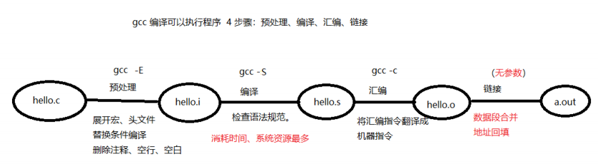

静态库文件名格式为：`lib{name}.a`，只有 {name} 部分可自定义。

动态库文件名格式为：`lib{name}.so`，只有 {name} 部分可自定义。

静态库和动态库的区别：

- 静态库会被链接到程序中，而动态库则只记录了库的名称，程序运行时才去对应的路径中加载库。
- 静态库加载速度快，但较消耗内存，动态库则相反。

## gcc 编译流程



- `-I` 指定头文件所在目录位置
- `-c` 只做预处理，编译，汇编。得到二进制文件
- `-g` 编译时添加调试文件，用于 gdb 调试
- `-Wall` 显示所有警告信息
- `-D` 向程序中“动态”注册宏定义
- `-l` 指定动态库库名
- `-L` 指定动态库路径
- `-O0` 关闭优化 (默认)
- `-O1/-O` 让可执⾏⽂件更⼩，速度更快
- `-O2` 采⽤⼏乎所有的优化⼿段

## 静态库

静态库在生成时应提供一个头文件（包含函数声明），以便其他人知晓库提供的方法，方便使用库。

1. 写好源代码 `mymath.c,  mymath.h`

    ```c
    // mymath.c
    int add(int a, int b) {
        return a + b;
    }

    int sub(int a, int b) {
        return a - b;
    }

    // mymath.h
    #ifndef _MYMATH_H_
    #define _MYMATH_H_

    int add(int, int);
    int sub(int, int);

    #endif

    // main.c
    #include <stdio.h>
    #include "mymath.h"

    int main() {
        int a = 10, b = 5;

        printf("add: %d, sub: %d\n", add(a, b), sub(a, b));
        return 0;
    }
    ```

2. 将 `.c` 生成 `.o` 文件 `gcc -c mymath.c -o mymath.o`
3. 使用 `ar` 工具制作静态库 `ar rcs libmymath.a mymath.o`

**使用方法：**有了生成的静态库`lib{name}.a`，就可以使用该文件，而不需要源文件`.c`。

```bash
gcc main.c ./lib/libmymath.a -I ./include -o static

.
├── include
│   └── mymath.h
├── lib
│   └── libmymath.a
├── main.c
├── mymath.c    # 已经可以删除了
└── static      # 生成的可执行文件
```

虽然通过上面的方式，让`mymath`这个库静态链接到了目标文件中，但用`ldd static`可以看到还是有一些标准库是动态链接的。`gcc -static` 选项可使所有库都通过静态链接。

要点：

- 通过相对或绝对路径指定静态库文件的位置
- 通过 `-I` 指定静态库的头文件所在目录位置

## 动态库

1. 将 `.c` 生成 `.o` 文件，（生成与位置无关的代码 `-fPIC`） `gcc -c mymath.c -o mymath.o -fPIC`
2. 使用 `gcc -shared` 制作动态库 `gcc -shared -o libmymath.so mymath.o`
3. 编译可执行文件时，指定所使用的动态库，`-l` 指定库名（去掉lib前缀与.so后缀），`-L`指定库路径

**使用方法：**下面就可以指定动态库名称和路径生成可执行文件了，但运行会出错！

```bash
gcc main.c -l mymath -L ./lib/ -I ./include/ -o dynamic

.
├── dynamic    # 生成的可执行文件
├── include
│   └── mymath.h
├── lib
│   └── libmymath.so
├── main.c
└── mymath.c

$ ./dynamic
./dynamic: error while loading shared libraries: libmymath.so: cannot open shared object file: No such file or directory
```

**原因：**编译和运行时的链接器不同！

- 链接器：工作于链接阶段，用`-l -L`指定动态库路径
- 动态链接器：工作于程序运行阶段，工作时需要提供动态库所在目录位置，通过环境变量：`export LD_LIBRARY_PATH=/path`

**解决办法：**设置 `LD_LIBRARY_PATH` 指定动态库的目录（建议使用绝对路径），环境变量是进程的概念，要让动态库地址一直生效：

1. 通过环境变量 `export LD_LIBRARY_PATH=/path`，退出该终端后失效
2. 在`.bashrc`中添加环境变量，每次打开终端自动加载环境变量
3. 将库文件复制到 `/lib` 目录下，标准c库所在目录
4. 在`/etc/ld.so.conf`中添加 `include /path/lib.so`，使用 `ldconfig -v` 使修改生效

一个程序运行时，其依赖的动态库的加载过程分为两种方式：**加载时动态链接**和**运行时动态链接**。
加载时动态链接是指程序在启动时，由动态链接器根据程序的依赖信息，将所需的动态库文件加载到内存，并进行重定位和初始化。
运行时动态链接是指程序在运行过程中，通过调用特定的函数（如dlopen和dlsym），来打开、关闭和使用指定的动态库文件。

## Makefile

**命名**：必须为 `Makefile / makefile`

**缩进**：必须用`Tab`，不能用空格

**变量**：与`bash`类似，但用 `$()` 而不是 `${}`

**一个规则**：目标的时间必须晚于依赖条件的时间，否则，更新目标

```makefile
目标：依赖
（Tab）命令
```

**两个函数**：匹配函数和替换函数

```makefile
# 匹配当前工作目录下的所有.c 文件。将文件名组成列表，赋值给变量 src
# src = add.c sub.c div1.c
src = $(wildcard *.c)
src = $(wildcard ./*.c) # 和上面等价
src = $(wildcard ./dir/*.c)  # 匹配子目录 src=./dir/add.c ./dir/sub.c
```

```makefile
# 将参数 3 中，包含参数 1 的部分，替换为参数 2
# obj = add.o sub.o div1.o
obj = $(patsubst %.c, %.o, $(src))
```

**三个自动变量**：

- `$@`：表示规则中的目标
- `$<`：表示规则中的第一个依赖条件
- `$^`：表示规则中所有的依赖条件

**模式规则**：自动匹配当前目录下的文件

```makefile
# 目标：依赖
#（Tab）命令
%.o:%.c
    gcc -c $< -o %@
# 等价于为每一个 .c 文件写
# a.o:a.c
#   gcc -c a.c -o a.o
```

**静态模式规则**：以指定变量中值为目标，而不是在当前文件夹中搜索

```makefile
# 变量：目标：依赖
#（Tab）命令
$(obj):%.o:%.c
    gcc -c $< -o %@
```

**clean**：清理文件

```makefile
clean: (没有依赖)
    -rm -rf $(obj)
# “-”：作用是，删除不存在文件时，不报错。顺序执行结束。
```

**目标**：第一个目标为总目标，该目标若不需要更新，就不会检查其他目标

**伪目标：**当前目录若存在文件`ALL`，`clean`时，会导致`make`执行异常，使用伪目标可避免

```makefile
.PHONY: clean ALL
```

### Example

```makefile
src = $(wildcard ./src/*.c)
obj = $(patsubst ./src/*.c ./src/*.o $(src))

inc_path = ./include
args = -Wall -std=c99

ALL: main

$(obj):./src/%.o:./src/%.c
    gcc -c $< -o $@ $(args) -I $(inc_path)

main:$(obj)
    gcc $^ -o $@ $(args)

clean:
    -rm -rf $(obj) main
```

## 相关工具

### objdump 查看汇编

查看可执行文件汇编！

```bash
objdump -dS dynamic
```

### ldd 依赖动态库

查看程序依赖动态库的路径！

```bash
ldd static
    linux-vdso.so.1 (0x00007ffd507e9000)
    libc.so.6 => /lib/x86_64-linux-gnu/libc.so.6 (0x00007fba762d7000)
    /lib64/ld-linux-x86-64.so.2 (0x00007fba764ee000)
ldd dynamic
    linux-vdso.so.1 (0x00007ffee615b000)
    libmymath.so => ./lib/libmymath.so (0x00007f482012c000)
    libc.so.6 => /lib/x86_64-linux-gnu/libc.so.6 (0x00007f481ff1c000)
    /lib64/ld-linux-x86-64.so.2 (0x00007f4820138000)
```

### strace 系统调用

跟踪程序执行时的系统调用！

`=` 后是该系统调用的返回值！

第一行是`execve`，在当前shell的进程中，开了一个子进程，并通过`execve`执行了另一个程序。

```bash
strace ./static
#############################################################################
execve("./static", ["./static"], 0x7ffcdd67dc70 /* 73 vars */) = 0
brk(NULL)                               = 0x56030df70000
arch_prctl(0x3001 /* ARCH_??? */, 0x7fff63567720) = -1 EINVAL (Invalid argument)
access("/etc/ld.so.preload", R_OK)      = -1 ENOENT (No such file or directory)
openat(AT_FDCWD, "/etc/ld.so.cache", O_RDONLY|O_CLOEXEC) = 3
fstat(3, {st_mode=S_IFREG|0644, st_size=121662, ...}) = 0
mmap(NULL, 121662, PROT_READ, MAP_PRIVATE, 3, 0) = 0x7f8755dc8000
close(3)                                = 0
openat(AT_FDCWD, "/lib/x86_64-linux-gnu/libc.so.6", O_RDONLY|O_CLOEXEC) = 3
read(3, "\177ELF\2\1\1\3\0\0\0\0\0\0\0\0\3\0>\0\1\0\0\0\360A\2\0\0\0\0\0"..., 832) = 832
pread64(3, "\6\0\0\0\4\0\0\0@\0\0\0\0\0\0\0@\0\0\0\0\0\0\0@\0\0\0\0\0\0\0"..., 784, 64) = 784
pread64(3, "\4\0\0\0\20\0\0\0\5\0\0\0GNU\0\2\0\0\300\4\0\0\0\3\0\0\0\0\0\0\0", 32, 848) = 32
pread64(3, "\4\0\0\0\24\0\0\0\3\0\0\0GNU\0\237\333t\347\262\27\320l\223\27*\202C\370T\177"..., 68, 880) = 68
fstat(3, {st_mode=S_IFREG|0755, st_size=2029560, ...}) = 0
mmap(NULL, 8192, PROT_READ|PROT_WRITE, MAP_PRIVATE|MAP_ANONYMOUS, -1, 0) = 0x7f8755dc6000
pread64(3, "\6\0\0\0\4\0\0\0@\0\0\0\0\0\0\0@\0\0\0\0\0\0\0@\0\0\0\0\0\0\0"..., 784, 64) = 784
pread64(3, "\4\0\0\0\20\0\0\0\5\0\0\0GNU\0\2\0\0\300\4\0\0\0\3\0\0\0\0\0\0\0", 32, 848) = 32
pread64(3, "\4\0\0\0\24\0\0\0\3\0\0\0GNU\0\237\333t\347\262\27\320l\223\27*\202C\370T\177"..., 68, 880) = 68
mmap(NULL, 2037344, PROT_READ, MAP_PRIVATE|MAP_DENYWRITE, 3, 0) = 0x7f8755bd4000
mmap(0x7f8755bf6000, 1540096, PROT_READ|PROT_EXEC, MAP_PRIVATE|MAP_FIXED|MAP_DENYWRITE, 3, 0x22000) = 0x7f8755bf6000
mmap(0x7f8755d6e000, 319488, PROT_READ, MAP_PRIVATE|MAP_FIXED|MAP_DENYWRITE, 3, 0x19a000) = 0x7f8755d6e000
mmap(0x7f8755dbc000, 24576, PROT_READ|PROT_WRITE, MAP_PRIVATE|MAP_FIXED|MAP_DENYWRITE, 3, 0x1e7000) = 0x7f8755dbc000
mmap(0x7f8755dc2000, 13920, PROT_READ|PROT_WRITE, MAP_PRIVATE|MAP_FIXED|MAP_ANONYMOUS, -1, 0) = 0x7f8755dc2000
close(3)                                = 0
arch_prctl(ARCH_SET_FS, 0x7f8755dc7540) = 0
mprotect(0x7f8755dbc000, 16384, PROT_READ) = 0
mprotect(0x56030bfe1000, 4096, PROT_READ) = 0
mprotect(0x7f8755e13000, 4096, PROT_READ) = 0
munmap(0x7f8755dc8000, 121662)          = 0
fstat(1, {st_mode=S_IFCHR|0620, st_rdev=makedev(0x88, 0), ...}) = 0
brk(NULL)                               = 0x56030df70000
brk(0x56030df91000)                     = 0x56030df91000
write(1, "add: 15, sub: 5\n", 16add: 15, sub: 5
)       = 16    # 写到标准输出，字符串长度为16
exit_group(0)                           = ?
+++ exited with 0 +++
```

### Valgrind 内存泄露

Valgrind 是运行在Linux上一套基于仿真技术的程序调试和分析工具，是公认的最接近Purify的产品，它包含一个内核——一个软件合成的CPU，和一系列的小工具，每个工具都可以完成一项任务——调试，分析，或测试等。Valgrind可以**检测内存泄漏和内存越界**，还可以分析cache的使用等，灵活轻巧而又强大。

1. `memcheck`：检查程序中的内存问题，如泄漏、越界、非法指针等。
2. `callgrind`：检测程序代码覆盖，以及分析程序性能。
3. `cachegrind`：分析CPU的cache命中率、丢失率，用于进行代码优化。
4. `helgrind`：用于检查多线程程序的竞态条件。
5. `massif`：堆栈分析器，指示程序中使用了多少堆内存等信息。
6. `lackey`：
7. `nulgrind`：

## 参考资料

> [bilibili黑马程序员-Linux系统编程](https://www.bilibili.com/video/BV1KE411q7ee)
> 参考笔记：[https://github.com/ABottomCoder/Linux-system-programming](https://github.com/ABottomCoder/Linux-system-programming)
> [Valgrind使用说明](https://www.cnblogs.com/wangkangluo1/archive/2011/07/20/2111248.html)
