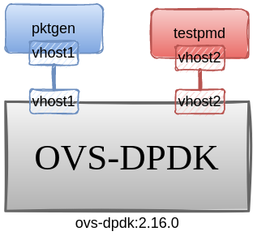
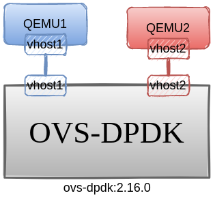
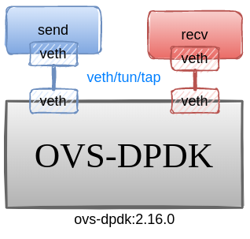
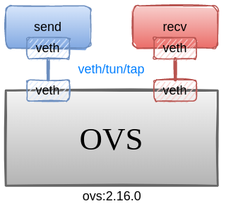
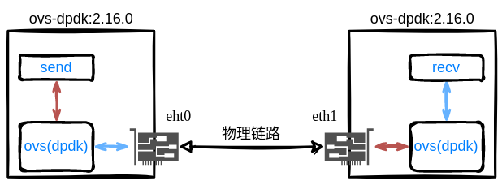

> OVS基于DPDK的数据通路绕过了内核协议栈，并且做了很多优化，带来了一定的性能提升，但也引入了很多需要配置的参数，而且这些参数和性能密切相关。

## 参数说明

> [ovsdb 官方文档](https://man7.org/linux/man-pages/man5/ovs-vswitchd.conf.db.5.html)，下面的参数表格只是简单翻译了一下作用，仅供参考，具体信息还得看官方文档

`ovsdb`中存储着`OVS`所有配置信息，并按结构划分为一张张表`TABLE`，这里只关注其中与`dpdk`有关的配置参数。

### Open_vSwitch Table

<style>
table th:first-of-type {
    width: 40%;
}
table th:nth-of-type(2) {
    width: 60%;
}
</style>

| 参数                                       | 说明                                                         |
| ------------------------------------------ | ------------------------------------------------------------ |
| `other_config:dpdk-init=true`              | 是否启用`dpdk`数据通路                                       |
| `other_config:dpdk-lcore-mask=0x1`         | 指定在哪些`core`上创建`lcore`线程，该线程用于`dpdk`库内部消息处理，如日志等；若没有指定，则默认为`cpu affinity list`中的第一个。**为达到最佳性能，最好将其设置在单个`core`上** |
| `other_config:pmd-cpu-mask=0x30`           | 设置在哪些`core`上创建`pmd`线程；若没有指定，则默认在每个`NUMA`节点上创建一个`pmd`线程，并绑定到对应`NUMA`的`core`上 |
| `other_config:smc-enable=true`             | 是否启用`SMC`缓存，相对于`EMC`，内存更高效；当流表的数量超过8192时，`SMC`尤其有用。**默认为`false`** |
| `other_config:per-port-memory=true`        | 是否使用每端口内存模型；默认有相同MTU和CPU socket的设备共享内存池 |
| `other_config:dpdk-alloc-mem`              | 指定预先从`hugepage`上分配的内存大小，单位为`MB`，与`socket(cpu)`无关；推荐用`dpdk-socket-mem`指定 |
| `other_config:dpdk-socket-mem="1024,1024"` | 指定预先从`hugepage`上为每个`socket(cpu)`分配的内存大小；值用逗号分割，如对4个CPU socket的系统，"1024,0,1024"，表示为第0和第3个CPU分配1024Mb。`dpdk-alloc-mem`和`dpdk-socket-mem`都没有指定的话，会为每个NUMA用DPDK库中设定的默认值。若同时指定了，则采用`dpdk-socket-mem`。修改后，需要重启守护进程才生效 |
| `other_config:dpdk-socket-limit`           | 限制每一个`socket(cpu)`最大可用的内存大小（上面的`dpdk-socket-mem`可动态扩容）。值用逗号分割，如对4个CPU socket的系统，"2048,0,0"，值为0表示不设限制。未指定时，**默认为不设限制** |
| `other_config:dpdk-hugepage-dir`           | 指定`hugetlbfs`挂载点的路径，默认为`/dev/hugepages`          |
| `other_config:dpdk-extra`                  | 为 `DPDK` 指定其他 `EAL` 命令行参数                          |
| `other_config:vhost-sock-dir`              | 指定为`vhost-user`生成的`socket`文件路径，该值为基于`external_ids:rundir`的相对路径。未指定时，则生成在`external_ids:rundir`目录下 |
| `other_config:tx-flush-interval=0`         | 指定一个数据包在`output batch`中可等待的最大时间（为了凑足32个批量发送），**单位微秒`us`**；该值可调节吞吐率和网络延迟的平衡，值越小：网络延迟越低，但吞吐率也相对低；**默认值为0** |
| `other_config:pmd-perf-metrics=true`       | 是否使能记录`PMD`的详细性能数据，**默认为false**             |
| `other_config:pmd-rxq-assign=cycles`       | 指定接受队列如何分配到`core`；有三种算法：`cycles/roundrobin/group`。**默认为`cycles`** |
| `other_config:pmd-rxq-isolate=true`        | 指定一个`core`在分配（通过`pmd-rxq-affinity`）一个接受队列后，是否要 `isolate`。若该值为`false`，表示允许OVS再将其他`RXQ`分配给该`core`。**默认为 `true`**。 |
| `other_config:emc-insert-inv-prob`         | 配置流表插入到`EMC`的概率（`1 / emc-insert-inv-prob`），1表示100%插入 |
| `other_config:vhost-postcopy-support=true` | 没看懂，但实测发现对`vhost-user`端口**性能有一定提升**！     |

对这些参数的修改主要通过以下方式（需要注意某些参数设置后需要重启`OVS`才会生效）：

```bash
ovs-vsctl set open_vswitch . other_config:vhost-postcopy-support=true
ovs-vsctl set open_vswitch . other_config:per-port-memory=true
```

## 测试说明

> **注：此处测试的都是原版`OVS`，没有经过修改**！未作特殊说明，则表示基于以下平台得到的测试结果
>
> - ovs-2.16.0
> - dpdk-20.11.6
> - 处理器：i7-12700k
> - 系统：ubuntu:22.04
> - 内核：5.15.0-52-generic

主要对比`OVS`内核数据通路与`DPDK`数据通路的吞吐率情况，以及不同配置参数下对性能的影响。

除了`OVS`的配置参数，网卡支持的功能`ethtool --show-features {eth0}`、收发包工具及其配置参数等都可能影响最终的测试结果！

| <br />topo1 | <br />topo2 |
| :----------------------------------------------------------: | :----------------------------------------------------------: |
| <br />topo3 | <br />topo4 |

指标：接收带宽！

1. `Topo1`：测试不同配置参数下的性能对比。
2. `Topo2`：使用其他发包工具`iperf`（可在`veth`类端口上使用）同`topo1`进行对比测试。
3. `Topo3`：使用`veth`等端口时，不会启动`PMD`线程，测试此时的性能。
4. `Topo4`：不使用`DPDK`，和`topo3`测试流程一致，两者对比。

------



在两台主机上启动`OVS`，分别测试`OVS/OVS-DPDK`的转发能力。

------

## base

首先测试在不使用`OVS`，单独两个虚拟端口直接连接的情况下，**链路**的带宽。


```bash
sudo ip netns add A
sudo ip netns add B

sudo ip link add ethA type veth peer name ethB
sudo ip link set dev ethA name ethA netns A up
sudo ip link set dev ethB name ethB netns B up
sudo ip netns exec A ifconfig ethA 10.0.0.10/24 up
sudo ip netns exec B ifconfig ethB 10.0.0.11/24 up

# terminal B: B作为Server
sudo ip netns exec B iperf -s -i 1
# terminal A: A作为Client
sudo ip netns exec B iperf -s -i 1

# 其他可能用到的命令
ip netns list
ip netns delete A
```

### 测试结果

|      | 测试环境                   | iperf-tcp |
| ---- | -------------------------- | --------- |
| c1   | `veth-veth`直连            | 102 Gbps  |
| c2   | docker 默认交换机`docker0` | 79.7 Gbps |

```bash
# terminal A
$ sudo ip netns exec A iperf -c 10.0.0.11
------------------------------------------------------------
Client connecting to 10.0.0.11, TCP port 5001
TCP window size: 85.0 KByte (default)
------------------------------------------------------------
[  1] local 10.0.0.10 port 44154 connected with 10.0.0.11 port 5001
[ ID] Interval       Transfer     Bandwidth
[  1] 0.0000-10.0099 sec   119 GBytes   102 Gbits/sec

# terminal B
$ sudo ip netns exec B iperf -s -i 1
```

> 注：`iperf`也支持打`udp`流进行测试，但实际测出来的带宽远不如`tcp`，[iperf TCP much faster than UDP, why?](https://stackoverflow.com/questions/47035263/iperf-tcp-much-faster-than-udp-why)，虽然这里说调整发包大小，但并没有用，`iperf`默认的报文大小就是最大值`1470`，调大后反而需要切片处理，导致速率更低。
>
> 从测试情况来看，应该是`iperf`发送端的发送速率不足，导致测出的带宽远小于`tcp`。
>
> ```bash
> # server
> sudo ip netns exec B iperf -s -i 1 -u
>
> # client
> sudo ip netns exec A iperf -u -c 10.0.0.11 -b 10g
> ------------------------------------------------------------
> Client connecting to 10.0.0.11, UDP port 5001
> Sending 1470 byte datagrams, IPG target: 1.18 us (kalman adjust)
> UDP buffer size:  208 KByte (default)
> ------------------------------------------------------------
> [  1] local 10.0.0.10 port 50645 connected with 10.0.0.11 port 5001
> [ ID] Interval       Transfer     Bandwidth
> [  1] 0.0000-10.0047 sec  8.37 GBytes  7.19 Gbits/sec
> [  1] Sent 6113230 datagrams
> [  1] Server Report:
> [ ID] Interval       Transfer     Bandwidth        Jitter   Lost/Total Datagrams
> [  1] 0.0000-10.0046 sec  8.26 GBytes  7.09 Gbits/sec   0.001 ms 88036/6123229 (1.4%)
> ```

## vhost-user

```bash
## 删除之前的配置文件
rm /usr/local/etc/openvswitch/*
rm /usr/local/var/run/openvswitch/*
rm /usr/local/var/log/openvswitch/*

ovs-ctl --no-ovs-vswitchd start --system-id=random
ovs-vsctl --no-wait set Open_vSwitch . other_config:dpdk-lcore-mask=0x1
ovs-vsctl --no-wait set Open_vSwitch . other_config:pmd-cpu-mask=0x2
ovs-vsctl --no-wait set Open_vSwitch . other_config:dpdk-socket-mem="1024"
ovs-vsctl --no-wait set Open_vSwitch . other_config:dpdk-init=true
ovs-ctl --no-ovsdb-server --db-sock="$DB_SOCK" start

## 添加 bridge
ovs-vsctl add-br br0 -- set bridge br0 datapath_type=netdev
ovs-vsctl add-port br0 vhost-user1 \
    -- set Interface vhost-user1 type=dpdkvhostuser ofport_request=1
ovs-vsctl add-port br0 vhost-user2 \
    -- set Interface vhost-user2 type=dpdkvhostuser ofport_request=2
```

|                 | 1    | 2    | 3    | 4    | 5    | 6    | 7    | 8    | 9    | 10   | 11   | 12   |
| --------------- | ---- | ---- | ---- | ---- | ---- | ---- | ---- | ---- | ---- | ---- | ---- | ---- |
| `pmd=0x1`       | *    | *    |      |      |      |      |      |      |      |      |      |      |
| `pktgen=0x30`   |      |      |      |      | *    | *    |      |      |      |      |      |      |
| `testpmd=0x300` |      |      |      |      |      |      |      |      | *    | *    |      |      |

`pktgen`和`testpmd`好像也采用了`PMD`轮询驱动类似的方式运行，会占满某些核，在配置参数时需要将`core`错开，否则影响性能！

```bash
# pktgen
docker run -it --rm --privileged --name=app-pktgen \
    -v /dev/hugepages:/dev/hugepages \
    -v /usr/local/var/run/openvswitch:/var/run/openvswitch \
    pktgen20:latest /bin/bash

pktgen -c 0x30 -n 1 --socket-mem 1024 --file-prefix pktgen --no-pci  \
--vdev 'net_virtio_user1,mac=00:00:00:00:00:01,path=/var/run/openvswitch/vhost-user1' \
-- -T -P -m "5.0"
```

```bash
# testpmd
docker run -it --rm --privileged --name=app-testpmd \
    -v /dev/hugepages:/dev/hugepages \
    -v /usr/local/var/run/openvswitch:/var/run/openvswitch \
    pktgen20:latest /bin/bash

dpdk-testpmd -c 0x300 -n 1 --socket-mem 1024 --file-prefix testpmd --no-pci \
--vdev 'net_virtio_user2,mac=00:00:00:00:00:02,path=/var/run/openvswitch/vhost-user2' \
-- -i -a --coremask=0x200 --forward-mode=rxonly
```


可以看到CPU的占用情况与配置一致！`Pktgen`占用了两个核。

### 测试结果

|      |                             | pktgen-64byte     | pktgen-1500byte    |
| ---- | --------------------------- | ----------------- | ------------------ |
| c1   | 默认流表 Normal             | 3 016 608 216 bps | 42 754 318 664 bps |
|      |                             | 6 284 600 pps     | 3 572 386 pps      |
| c2   | c1 + 匹配入端口流表         | 7 849 813 576 bps | 88 330 499 920 bps |
|      |                             | 16 353 825 pps    | 7 380 556 pps      |
| c3   | c2 + vhost-postcopy-support | 8 086 507 608 bps | 96 284 271 416 bps |
|      |                             | 16 846 890 pps    | 8 045 142 pps      |

`c2`：配置匹配入端口的流表；

```bash
ovs-ofctl add-flow br0 in_port=vhost-user1,actions=output:vhost-user2
```

`c3`：配置`vhost-postcopy-support=true`；

```bash
ovs-vsctl set open_vswitch . other_config:vhost-postcopy-support=true
```

## QEMU

```bash
## 删除之前的配置文件
rm /usr/local/etc/openvswitch/*
rm /usr/local/var/run/openvswitch/*
rm /usr/local/var/log/openvswitch/*

ovs-ctl --no-ovs-vswitchd start --system-id=random
ovs-vsctl --no-wait set Open_vSwitch . other_config:dpdk-lcore-mask=0x1
ovs-vsctl --no-wait set Open_vSwitch . other_config:pmd-cpu-mask=0x02
ovs-vsctl --no-wait set Open_vSwitch . other_config:dpdk-socket-mem="1024"
ovs-vsctl --no-wait set Open_vSwitch . other_config:dpdk-init=true
ovs-ctl --no-ovsdb-server --db-sock="$DB_SOCK" start

## 添加 bridge
ovs-vsctl add-br br0 -- set bridge br0 datapath_type=netdev
ovs-vsctl add-port br0 vhost-user1 \
    -- set Interface vhost-user1 type=dpdkvhostuser ofport_request=1
ovs-vsctl add-port br0 vhost-user2 \
    -- set Interface vhost-user2 type=dpdkvhostuser ofport_request=2
```

使用QEMU虚拟机

```bash
# 基于vhost-user1, vhost-user2创建虚拟机
qemu-system-x86_64 -enable-kvm -m 2048 -smp 4 \
    -chardev socket,id=char0,path=/usr/local/var/run/openvswitch/vhost-user1 \
    -netdev type=vhost-user,id=mynet1,chardev=char0,vhostforce \
    -device virtio-net-pci,netdev=mynet1,mac=52:54:00:02:d9:01 \
    -object memory-backend-file,id=mem,size=2048M,mem-path=/dev/hugepages,share=on \
    -numa node,memdev=mem -mem-prealloc \
    -net user,hostfwd=tcp::10021-:22 -net nic \
    ./qemu-vm1.img

qemu-system-x86_64 -enable-kvm -m 2048 -smp 4 \
    -chardev socket,id=char0,path=/usr/local/var/run/openvswitch/vhost-user2 \
    -netdev type=vhost-user,id=mynet1,chardev=char0,vhostforce \
    -device virtio-net-pci,netdev=mynet1,mac=52:54:00:02:d9:02 \
    -object memory-backend-file,id=mem,size=2048M,mem-path=/dev/hugepages,share=on \
    -numa node,memdev=mem -mem-prealloc \
    -net user,hostfwd=tcp::10022-:22 -net nic \
    ./qemu-vm2.img &
```

### 测试结果

|      |                             | iperf-tcp |
| ---- | --------------------------- | --------- |
| c1   | 默认流表 Normal             | 22.3 Gbps |
| c2   | c1 + 匹配入端口流表         | 22.4 Gbps |
| c3   | c2 + vhost-postcopy-support | 22.3 Gbps |

> 这三种情况下，速率几乎一致！而且使用`iperf-udp`测试时，指定带宽小于`5Gbps`时，测试速率比较正常。但若指定的带宽大于`5g`，会导致速率严重下降，为`1.5Gbps`左右。
>
> 不过这里也涉及到配置`qemu`虚拟机的相关参数，没进一步调试。

## 物理网卡

> 这里为在两台物理服务器上做测试，每台服务器用两张网卡，每张网卡两个端口，一张网卡为光口，另一张则是正常的RJ45接口。除一个RJ45口接入网络外，其余端口都两两直连。
>
> ```bash
> $ lspci | grep Eth
> 3d:00.0 Ethernet controller: Intel Corporation Ethernet Connection X722 for 10GBASE-T (rev 09)
> 3d:00.1 Ethernet controller: Intel Corporation Ethernet Connection X722 for 10GBASE-T (rev 09)
> af:00.0 Ethernet controller: Intel Corporation 82599ES 10-Gigabit SFI/SFP+ Network Connection (rev 01)
> af:00.1 Ethernet controller: Intel Corporation 82599ES 10-Gigabit SFI/SFP+ Network Connection (rev 01)
> $ uname -a
> Linux uestc 5.15.0-52-generic #58~20.04.1-Ubuntu SMP
> 
> $ lscpu # 两台服务器CPU 频率稍有差别
> Model name:                      Intel(R) Xeon(R) Gold 6133 CPU @ 2.50GHz
> Stepping:                        4
> CPU MHz:                         1000.000
> CPU max MHz:                     3000.0000
> CPU min MHz:                     1000.0000
> BogoMIPS:                        5000.00
> -----------------------------------------------
> Model name:                      Intel(R) Xeon(R) Gold 6145 CPU @ 2.00GHz
> Stepping:                        4
> CPU MHz:                         1000.120
> CPU max MHz:                     3700.0000
> CPU min MHz:                     1000.0000
> BogoMIPS:                        4000.00
> ```

### ovs

```bash
## 删除之前的配置文件
rm /usr/local/etc/openvswitch/*
rm /usr/local/var/run/openvswitch/*
rm /usr/local/var/log/openvswitch/*

ovs-ctl start
ovs-vsctl add-br br0 -- set bridge br0 datapath_type=system

# Server A
ifconfig br0 192.168.5.80
ovs-vsctl add-port br0 eno0
ovs-ofctl add-flow br0 ip,nw_dst=192.168.5.40,actions=output:eno0
ovs-ofctl add-flow br0 ip,nw_dst=192.168.5.80,actions=output:LOCAL

# Server B
ifconfig br0 192.168.5.40
ovs-vsctl add-port br0 eno1
ovs-ofctl add-flow br0 ip,nw_dst=192.168.5.80,actions=output:eno1
ovs-ofctl add-flow br0 ip,nw_dst=192.168.5.40,actions=output:LOCAL
```

### ovs-dpdk

```bash
## 删除之前的配置文件
rm /usr/local/etc/openvswitch/*
rm /usr/local/var/run/openvswitch/*
rm /usr/local/var/log/openvswitch/*

ovs-ctl --no-ovs-vswitchd start --system-id=random
ovs-vsctl --no-wait set Open_vSwitch . other_config:dpdk-lcore-mask=0x1
ovs-vsctl --no-wait set Open_vSwitch . other_config:pmd-cpu-mask=0x2
ovs-vsctl --no-wait set Open_vSwitch . other_config:dpdk-socket-mem="1024"
ovs-vsctl --no-wait set Open_vSwitch . other_config:dpdk-init=true
ovs-ctl --no-ovsdb-server --db-sock="$DB_SOCK" start
ovs-vsctl add-br br1 -- set bridge br1 datapath_type=netdev

# server A
ifconfig br1 192.168.6.80
modprobe vfio enable_unsafe_noiommu_mode=1
echo 1 > /sys/module/vfio/parameters/enable_unsafe_noiommu_mode
ifconfig eno0 down
ifconfig ens1f0 down
ifconfig ens1f1 down
dpdk-devbind.py --bind=vfio-pci 0000:60:00.0
dpdk-devbind.py --bind=vfio-pci 0000:18:00.0
dpdk-devbind.py --bind=vfio-pci 0000:18:00.1
ovs-vsctl add-port br1 rj45 \
    -- set Interface rj45 type=dpdk options:dpdk-devargs=0000:60:00.0
ovs-ofctl add-flow br1 ip,nw_dst=192.168.6.40,actions=output:rj45
ovs-ofctl add-flow br1 ip,nw_dst=192.168.6.80,actions=output:LOCAL

# server B
ifconfig br1 192.168.4.80
modprobe vfio enable_unsafe_noiommu_mode=1
echo 1 > /sys/module/vfio/parameters/enable_unsafe_noiommu_mode
ifconfig eno1 down
ifconfig ens802f0 down
ifconfig ens802f1 down
dpdk-devbind.py --bind=vfio-pci 0000:3d:00.0
dpdk-devbind.py --bind=vfio-pci 0000:af:00.0
dpdk-devbind.py --bind=vfio-pci 0000:af:00.1

ovs-vsctl add-port br1 rj45 \
    -- set Interface rj45 type=dpdk options:dpdk-devargs=0000:3d:00.0
ovs-ofctl add-flow br1 ip,nw_dst=192.168.6.80,actions=output:rj45
ovs-ofctl add-flow br1 ip,nw_dst=192.168.6.40,actions=output:LOCAL
```


### 测试结果

|      |                                     | iperf-tcp |
| ---- | ----------------------------------- | --------- |
| c1   | 无OVS，网口直连（RJ45与光口差不多） | 9.38 Gbps |
| c2   | OVS，RJ45与光口同样差不多           | 9.41 Gbps |
| c3   | OVS-DPDK，(不知道为什么这么慢)      | 3.89 Gbps |
| c4   | OVS-DPDK-pktgen                     | 9.8 Gbps  |

```bash
# server A: pktgen
ovs-ofctl add-flow br1 in_port=vhost-user1,actions=output:g1

# server B: testpmd
ovs-ofctl add-flow br1 in_port=g1,actions=output:vhost-user1
```

### vhost-user


### OVS-OVS

补：该方案使用`veth pair`连接两容器，本想借此测试OVS-DPDK的转发性能，但[使用`veth`端口会让OVS回落到system datapath](https://www.cnblogs.com/dream397/p/13964154.html#%E5%9F%BA%E4%BA%8E%E5%86%85%E6%A0%B8%E5%8D%8F%E8%AE%AE%E6%A0%88%E7%9A%84%E5%BA%94%E7%94%A8)，而且搭建下面的拓扑并启动OVS后，会发现没有核被占满（PMD运行时不会休眠）。当添加了`vhost-user`端口后，才会看到有个核跑满了。


**拓扑搭建**：

```bash
dpdk-hugepages.py -p 1G --setup 4G
modprobe openvswitch

## 创建容器
sudo docker create -it --name=s1 --privileged -v /dev/hugepages:/dev/hugepages -v /root/run:/root/run ovs-dpdk:2.16.0-qdisc
sudo docker create -it --name=s2 --privileged -v /dev/hugepages:/dev/hugepages -v /root/run:/root/run ovs-dpdk:2.16.0-qdisc
sudo docker start s1
sudo docker start s2

## 添加 veth-peer
sudo ip link add p1_2 type veth peer name p2_1 > /dev/null
sudo ip link set dev p1_2 name p1_2 netns $(sudo docker inspect -f '{{.State.Pid}}' s1) up
sudo ip link set dev p2_1 name p2_1 netns $(sudo docker inspect -f '{{.State.Pid}}' s2) up
```

**启动OVS**：

```bash
################################ s1 ####################################
docker exec -it s1 bash
ovs-ctl --no-ovs-vswitchd start --system-id=1001
ovs-vsctl --no-wait set Open_vSwitch . other_config:pmd-cpu-mask=0x02
ovs-vsctl --no-wait set Open_vSwitch . other_config:dpdk-socket-mem="1024"
ovs-vsctl --no-wait set Open_vSwitch . other_config:dpdk-init=true
ovs-ctl --no-ovsdb-server --db-sock="$DB_SOCK" start

## 添加 bridge
ovs-vsctl add-br s1 -- set bridge s1 datapath_type=netdev
ifconfig s1 192.168.1.12 netmask 255.255.255.0 up
ovs-vsctl add-port s1 p1_2 -- set Interface p1_2 ofport_request=12
# ovs-vsctl add-port s1 vhost-user1 -- set Interface vhost-user1 type=dpdkvhostuser ofport_request=2

################################ s2 ####################################
docker exec -it s2 bash
ovs-ctl --no-ovs-vswitchd start --system-id=1002
ovs-vsctl --no-wait set Open_vSwitch . other_config:pmd-cpu-mask=0x08
ovs-vsctl --no-wait set Open_vSwitch . other_config:dpdk-socket-mem="1024"
ovs-vsctl --no-wait set Open_vSwitch . other_config:dpdk-init=true
ovs-ctl --no-ovsdb-server --db-sock="$DB_SOCK" start

## 添加 bridge
ovs-vsctl add-br s2 -- set bridge s2 datapath_type=netdev
ifconfig s2 192.168.1.21 netmask 255.255.255.0 up
ovs-vsctl add-port s2 p2_1 -- set Interface p2_1 ofport_request=21
# ovs-vsctl add-port s2 vhost-user1 -- set Interface vhost-user1 type=dpdkvhostuser ofport_request=2
```

### OVS-OVS-OVS


**拓扑搭建**：

```bash
dpdk-hugepages.py -p 1G --setup 6G
modprobe openvswitch

## 创建容器
sudo docker create -it --name=s1 --privileged -v /dev/hugepages:/dev/hugepages -v /root/run:/root/run ovs-dpdk:2.16.0-vlog
sudo docker create -it --name=s2 --privileged -v /dev/hugepages:/dev/hugepages -v /root/run:/root/run ovs-dpdk:2.16.0-vlog
sudo docker create -it --name=s3 --privileged -v /dev/hugepages:/dev/hugepages -v /root/run:/root/run ovs-dpdk:2.16.0-vlog
sudo docker start s1 s2 s3

## 添加 veth-peer
sudo ip link add s1_2 type veth peer name s2_1 > /dev/null
sudo ip link add s3_2 type veth peer name s2_3 > /dev/null
sudo ip link add s1_3 type veth peer name s3_1 > /dev/null
sudo ip link set dev s1_2 name s1_2 netns $(sudo docker inspect -f '{{.State.Pid}}' s1) up
sudo ip link set dev s1_3 name s1_3 netns $(sudo docker inspect -f '{{.State.Pid}}' s1) up
sudo ip link set dev s2_1 name s2_1 netns $(sudo docker inspect -f '{{.State.Pid}}' s2) up
sudo ip link set dev s2_3 name s2_3 netns $(sudo docker inspect -f '{{.State.Pid}}' s2) up
sudo ip link set dev s3_1 name s3_1 netns $(sudo docker inspect -f '{{.State.Pid}}' s3) up
sudo ip link set dev s3_2 name s3_2 netns $(sudo docker inspect -f '{{.State.Pid}}' s3) up
```

**启动OVS**：

```bash
################################ s1 ####################################
docker exec -it s1 bash
ovs-ctl --no-ovs-vswitchd start --system-id=1001
ovs-vsctl --no-wait set Open_vSwitch . other_config:pmd-cpu-mask=0x02
ovs-vsctl --no-wait set Open_vSwitch . other_config:dpdk-socket-mem="1024"
ovs-vsctl --no-wait set Open_vSwitch . other_config:dpdk-init=true
ovs-ctl --no-ovsdb-server --db-sock="$DB_SOCK" start

## 添加 bridge
ovs-vsctl add-br s1 -- set bridge s1 datapath_type=netdev
ovs-vsctl set bridge s1 other_config:hwaddr="00:00:00:00:10:01"
ifconfig s1 192.168.10.1 netmask 255.255.255.0 up
ovs-vsctl add-port s1 s1_2 -- set Interface s1_2 ofport_request=12
ovs-vsctl add-port s1 s1_3 -- set Interface s1_3 ofport_request=13
# ovs-vsctl add-port s1 vhost-user1 -- set Interface vhost-user1 type=dpdkvhostuser ofport_request=2

################################ s2 ####################################
docker exec -it s2 bash
ovs-ctl --no-ovs-vswitchd start --system-id=1002
ovs-vsctl --no-wait set Open_vSwitch . other_config:pmd-cpu-mask=0x08
ovs-vsctl --no-wait set Open_vSwitch . other_config:dpdk-socket-mem="1024"
ovs-vsctl --no-wait set Open_vSwitch . other_config:dpdk-init=true
ovs-ctl --no-ovsdb-server --db-sock="$DB_SOCK" start

## 添加 bridge
ovs-vsctl add-br s2 -- set bridge s2 datapath_type=netdev
ovs-vsctl set bridge s2 other_config:hwaddr="00:00:00:00:10:02"
ifconfig s2 192.168.10.2 netmask 255.255.255.0 up
ovs-vsctl add-port s2 s2_1 -- set Interface s2_1 ofport_request=21
ovs-vsctl add-port s2 s2_3 -- set Interface s2_3 ofport_request=23
# ovs-vsctl add-port s2 vhost-user1 -- set Interface vhost-user1 type=dpdkvhostuser ofport_request=2

################################ s3 ####################################
docker exec -it s3 bash
ovs-ctl --no-ovs-vswitchd start --system-id=1002
ovs-vsctl --no-wait set Open_vSwitch . other_config:pmd-cpu-mask=0x20
ovs-vsctl --no-wait set Open_vSwitch . other_config:dpdk-socket-mem="1024"
ovs-vsctl --no-wait set Open_vSwitch . other_config:dpdk-init=true
ovs-ctl --no-ovsdb-server --db-sock="$DB_SOCK" start

## 添加 bridge
ovs-vsctl add-br s3 -- set bridge s3 datapath_type=netdev
ovs-vsctl set bridge s3 other_config:hwaddr="00:00:00:00:10:03"
ifconfig s3 192.168.10.3 netmask 255.255.255.0 up
ovs-vsctl add-port s3 s3_1 -- set Interface s3_1 ofport_request=31
ovs-vsctl add-port s3 s3_2 -- set Interface s3_2 ofport_request=32
# ovs-vsctl add-port s3vhost-user1 -- set Interface vhost-user1 type=dpdkvhostuser ofport_request=2
```

**转发流表**：

```bash
# s1
ovs-ofctl add-flow s1 ip,nw_dst=192.168.10.1,actions=output:LOCAL
ovs-ofctl add-flow s1 ip,nw_dst=192.168.10.2,actions=output:s1_2
ovs-ofctl add-flow s1 ip,nw_dst=192.168.10.3,actions=output:s1_3
# s2
ovs-ofctl add-flow s2 ip,nw_dst=192.168.10.2,actions=output:LOCAL
ovs-ofctl add-flow s2 ip,nw_dst=192.168.10.1,actions=output:s2_1
ovs-ofctl add-flow s2 ip,nw_dst=192.168.10.3,actions=output:s2_3
# s3
ovs-ofctl add-flow s3 ip,nw_dst=192.168.10.3,actions=output:LOCAL
ovs-ofctl add-flow s3 ip,nw_dst=192.168.10.1,actions=output:s3_1
ovs-ofctl add-flow s3 ip,nw_dst=192.168.10.2,actions=output:s3_2
# arp
arp -s 192.168.10.1 00:00:00:00:10:01
arp -s 192.168.10.2 00:00:00:00:10:02
arp -s 192.168.10.3 00:00:00:00:10:03
```

**转发流表2**：1<->2<->3 (1与3不直连)

```bash
# s1
ovs-ofctl add-flow s1 ip,nw_dst=192.168.10.1,actions=output:LOCAL
ovs-ofctl add-flow s1 ip,nw_dst=192.168.10.2,actions=output:s1_2
ovs-ofctl add-flow s1 ip,nw_dst=192.168.10.3,actions=output:s1_2
# s2
ovs-ofctl add-flow s2 ip,nw_dst=192.168.10.2,actions=output:LOCAL
ovs-ofctl add-flow s2 ip,nw_dst=192.168.10.1,actions=output:s2_1
ovs-ofctl add-flow s2 ip,nw_dst=192.168.10.3,actions=output:s2_3
# s3
ovs-ofctl add-flow s3 ip,nw_dst=192.168.10.3,actions=output:LOCAL
ovs-ofctl add-flow s3 ip,nw_dst=192.168.10.1,actions=output:s3_2
ovs-ofctl add-flow s3 ip,nw_dst=192.168.10.2,actions=output:s3_2
```

#### 测试ATS

```bash
ovs-vsctl set interface s1_2 other_config:qdisc-params="rate:1=10000" # 10M
ovs-appctl vlog/set dpif_qdisc:file:dbg
# s1
ovs-vsctl set interface s1_2 other_config:qdisc=ATS
# s2
ovs-vsctl set interface s2_3 other_config:qdisc=ATS
ovs-vsctl set interface s2_1 other_config:qdisc=ATS
# s3
ovs-vsctl set interface s3_2 other_config:qdisc=ATS
```

```bash
################################ s1 ####################################
docker exec -it s1 bash
ovs-ctl --no-ovs-vswitchd start --system-id=1001
ovs-vsctl --no-wait set Open_vSwitch . other_config:pmd-cpu-mask=0x02
ovs-vsctl --no-wait set Open_vSwitch . other_config:dpdk-socket-mem="1024"
ovs-vsctl --no-wait set Open_vSwitch . other_config:dpdk-init=true
ovs-ctl --no-ovsdb-server --db-sock="$DB_SOCK" start

## 添加 bridge
ovs-vsctl add-br s1 -- set bridge s1 datapath_type=netdev
ovs-vsctl set bridge s1 other_config:hwaddr="00:00:00:00:10:01"
ifconfig s1 192.168.10.1 netmask 255.255.255.0 up
ovs-vsctl add-port s1 s1_2 -- set Interface s1_2 ofport_request=12
ovs-vsctl add-port s1 s1_3 -- set Interface s1_3 ofport_request=13
arp -s 192.168.10.1 00:00:00:00:10:01
arp -s 192.168.10.2 00:00:00:00:10:02
arp -s 192.168.10.3 00:00:00:00:10:03
ovs-ofctl add-flow s1 ip,nw_dst=192.168.10.1,actions=output:LOCAL
ovs-ofctl add-flow s1 ip,nw_dst=192.168.10.2,actions=output:s1_2
ovs-ofctl add-flow s1 ip,nw_dst=192.168.10.3,actions=output:s1_2
# ovs-vsctl add-port s1 vhost-user1 -- set Interface vhost-user1 type=dpdkvhostuser ofport_request=2

################################ s2 ####################################
docker exec -it s2 bash
ovs-ctl --no-ovs-vswitchd start --system-id=1002
ovs-vsctl --no-wait set Open_vSwitch . other_config:pmd-cpu-mask=0x08
ovs-vsctl --no-wait set Open_vSwitch . other_config:dpdk-socket-mem="1024"
ovs-vsctl --no-wait set Open_vSwitch . other_config:dpdk-init=true
ovs-ctl --no-ovsdb-server --db-sock="$DB_SOCK" start

## 添加 bridge
ovs-appctl vlog/set dpif_qdisc:file:dbg
ovs-vsctl add-br s2 -- set bridge s2 datapath_type=netdev
ovs-vsctl set bridge s2 other_config:hwaddr="00:00:00:00:10:02"
ifconfig s2 192.168.10.2 netmask 255.255.255.0 up
ovs-vsctl add-port s2 s2_1 -- set Interface s2_1 ofport_request=21
ovs-vsctl add-port s2 s2_3 -- set Interface s2_3 ofport_request=23
arp -s 192.168.10.1 00:00:00:00:10:01
arp -s 192.168.10.2 00:00:00:00:10:02
arp -s 192.168.10.3 00:00:00:00:10:03
ovs-ofctl add-flow s2 ip,nw_dst=192.168.10.2,actions=output:LOCAL
ovs-ofctl add-flow s2 ip,nw_dst=192.168.10.1,actions=output:s2_1
ovs-ofctl add-flow s2 ip,nw_dst=192.168.10.3,actions=output:s2_3
# ovs-vsctl add-port s2 vhost-user1 -- set Interface vhost-user1 type=dpdkvhostuser ofport_request=2

################################ s3 ####################################
docker exec -it s3 bash
ovs-ctl --no-ovs-vswitchd start --system-id=1002
ovs-vsctl --no-wait set Open_vSwitch . other_config:pmd-cpu-mask=0x20
ovs-vsctl --no-wait set Open_vSwitch . other_config:dpdk-socket-mem="1024"
ovs-vsctl --no-wait set Open_vSwitch . other_config:dpdk-init=true
ovs-ctl --no-ovsdb-server --db-sock="$DB_SOCK" start

## 添加 bridge
ovs-vsctl add-br s3 -- set bridge s3 datapath_type=netdev
ovs-vsctl set bridge s3 other_config:hwaddr="00:00:00:00:10:03"
ifconfig s3 192.168.10.3 netmask 255.255.255.0 up
ovs-vsctl add-port s3 s3_1 -- set Interface s3_1 ofport_request=31
ovs-vsctl add-port s3 s3_2 -- set Interface s3_2 ofport_request=32
arp -s 192.168.10.1 00:00:00:00:10:01
arp -s 192.168.10.2 00:00:00:00:10:02
arp -s 192.168.10.3 00:00:00:00:10:03
ovs-ofctl add-flow s3 ip,nw_dst=192.168.10.3,actions=output:LOCAL
ovs-ofctl add-flow s3 ip,nw_dst=192.168.10.1,actions=output:s3_2
ovs-ofctl add-flow s3 ip,nw_dst=192.168.10.2,actions=output:s3_2
# ovs-vsctl add-port s3vhost-user1 -- set Interface vhost-user1 type=dpdkvhostuser ofport_request=2
```

### veth-OVS-veth

```bash
sudo docker create -it --name=s1 --privileged -v /dev/hugepages:/dev/hugepages -v /root/run:/root/run ovs-dpdk:2.16.0-vlog
sudo docker create -it --name=s2 --privileged -v /dev/hugepages:/dev/hugepages -v /root/run:/root/run ovs-dpdk:2.16.0-vlog
sudo docker start s1 s2

## 添加 veth-peer
sudo ip link add sh_1 type veth peer name s1_h > /dev/null
sudo ip link add sh_2 type veth peer name s2_h > /dev/null
sudo ip link set dev s1_h name s1_h netns $(sudo docker inspect -f '{{.State.Pid}}' s1) up
sudo ip link set dev s2_h name s2_h netns $(sudo docker inspect -f '{{.State.Pid}}' s2) up
ifconfig sh_1 up
ifconfig sh_2 up
```

```bash
docker exec -it s1 bash
ifconfig s1_h 192.168.10.1
ip link set dev s1_h address 00:00:00:00:10:01
arp -s 192.168.10.2 00:00:00:00:10:02

docker exec -it s2 bash
ifconfig s2_h 192.168.10.2
ip link set dev s2_h address 00:00:00:00:10:02
arp -s 192.168.10.1 00:00:00:00:10:01
```

```bash
## 删除之前的配置文件
rm /usr/local/etc/openvswitch/*
rm /usr/local/var/run/openvswitch/*
rm /usr/local/var/log/openvswitch/*

ovs-ctl --no-ovs-vswitchd start --system-id=random
ovs-vsctl --no-wait set Open_vSwitch . other_config:pmd-cpu-mask=0x02
ovs-vsctl --no-wait set Open_vSwitch . other_config:dpdk-socket-mem="1024"
ovs-vsctl --no-wait set Open_vSwitch . other_config:dpdk-init=true
ovs-ctl --no-ovsdb-server --db-sock="$DB_SOCK" start

## 添加 bridge
ovs-vsctl add-br br0 -- set bridge br0 datapath_type=netdev
ovs-vsctl add-port br0 sh_1 -- set Interface sh_1 ofport_request=11
ovs-vsctl add-port br0 sh_2 -- set Interface sh_2 ofport_request=12
ovs-ofctl add-flow br0 ip,nw_dst=192.168.10.1,actions=output:sh_1
ovs-ofctl add-flow br0 ip,nw_dst=192.168.10.2,actions=output:sh_2

## ATS
ovs-vsctl set interface sh_1 other_config:qdisc=ATS
ovs-vsctl set interface sh_2 other_config:qdisc=ATS
```

### PKTGEN-OVS-TESTPMD

.png)

由于上面的拓扑存在连接问题，只好用单节点测试OVS的速率与PMD的关系，这里OVS就直接部署在主机上，pktgen和testpmd放置在Docker中运行。

**拓扑搭建**：基本拓扑搭建方法如下，但实际测试时会修改参数！

```bash
## 删除之前的配置文件
rm /usr/local/etc/openvswitch/*
rm /usr/local/var/run/openvswitch/*
rm /usr/local/var/log/openvswitch/*

ovs-ctl --no-ovs-vswitchd start --system-id=random
ovs-vsctl --no-wait set Open_vSwitch . other_config:pmd-cpu-mask=0x02
ovs-vsctl --no-wait set Open_vSwitch . other_config:dpdk-socket-mem="1024"
ovs-vsctl --no-wait set Open_vSwitch . other_config:dpdk-init=true
ovs-ctl --no-ovsdb-server --db-sock="$DB_SOCK" start

## 添加 bridge
ovs-vsctl add-br br0 -- set bridge br0 datapath_type=netdev
ovs-vsctl add-port br0 vhost-user1 \
    -- set Interface vhost-user1 type=dpdkvhostuser ofport_request=1
ovs-vsctl add-port br0 vhost-user2 \
    -- set Interface vhost-user2 type=dpdkvhostuser ofport_request=2

## 启动容器
# pktgen
docker run -it --rm --privileged --name=app-pktgen \
    -v /dev/hugepages:/dev/hugepages \
    -v /usr/local/var/run/openvswitch:/var/run/openvswitch \
    pktgen20:latest /bin/bash

pktgen -c 0x19 --main-lcore 3 -n 1 --socket-mem 1024 --file-prefix pktgen --no-pci  \
--vdev 'net_virtio_user1,mac=00:00:00:00:00:01,path=/var/run/openvswitch/vhost-user1' \
-- -T -P -m "0.0"

# testpmd
docker run -it --rm --privileged --name=app-testpmd \
    -v /dev/hugepages:/dev/hugepages \
    -v /usr/local/var/run/openvswitch:/var/run/openvswitch \
    pktgen20:latest /bin/bash

dpdk-testpmd -c 0xE0 -n 1 --socket-mem 1024 --file-prefix testpmd --no-pci \
--vdev 'net_virtio_user2,mac=00:00:00:00:00:02,path=/var/run/openvswitch/vhost-user2' \
-- -i -a --coremask=0xc0 --forward-mode=rxonly
```

**参数说明**：

- `pmd-cpu-mask`：指定在哪些核上面绑定PMD线程，即指定了PMD创建的数量。

- `dpdk-lcore-mask`：指定在哪些核上创建lcore 线程，该线程用于 dpdk 库内部消息处理，如日志等。

- `-c`：指定在哪些核上运行Pktgen发包或接收线程。

- `-m`：指定核与端口的对应关系，注意这里的编号从0开始数。

  ```
  “1.0, 2.1, 3.2”               - core 1 handles port 0 rx/tx,
                                  core 2 handles port 1 rx/tx
                                  core 3 handles port 2 rx/tx
  1.[0-2], 2.3, ...             - core 1 handle ports 0,1,2 rx/tx,
                                  core 2 handle port 3 rx/tx
  [1:2].0, [4:6].1, ...         - core 1 handles port 0 rx,
                                  core 2 handles port 0 tx,
  ```

- `--coremask=0xXX`：指定在哪些核上运行包转发。

#### 测试1

CPU为 `i7-12700k`，系统为 `Ubuntu 20.04`！


```bash
ovs-vsctl --no-wait set Open_vSwitch . other_config:pmd-cpu-mask=0x2
ovs-vsctl --no-wait set Open_vSwitch . other_config:dpdk-lcore-mask=0x1

pktgen -c 0x30 -n 1 --socket-mem 1024 --file-prefix pktgen --no-pci  \
--vdev 'net_virtio_user1,mac=00:00:00:00:00:01,path=/var/run/openvswitch/vhost-user1' \
-- -T -P -m "5.0"

dpdk-testpmd -c 0x300 -n 1 --socket-mem 1024 --file-prefix testpmd --no-pci \
--vdev 'net_virtio_user2,mac=00:00:00:00:00:02,path=/var/run/openvswitch/vhost-user2' \
-- -i -a --coremask=0x200 --forward-mode=rxonly
```


可以看到CPU的占用情况与配置一致！`Pktgen`占用了两个核。

**未配置流表的情况下的速率与配置流表后的速率明显有区别**！

```bash
# 未配置流表情况下，安装默认的 Normal 转发

# 数据包大小为 64 BYTE，测得接收速率为 3 Gbps
testpmd> show port stats all
  ######################## NIC statistics for port 0  ########################
  Throughput (since last show)
  Rx-pps:      6284600          Rx-bps:   3 016 608 216
  Tx-pps:            0          Tx-bps:            0
  ############################################################################

# 数据包大小为 1500 BYTE，测得接收速率为 42 Gbps
testpmd> show port stats all
  ######################## NIC statistics for port 0  ########################
  Throughput (since last show)
  Rx-pps:      3572386          Rx-bps:  42 754 318 664
  Tx-pps:            0          Tx-bps:            0
  ############################################################################
```

```bash
############################################################################
ovs-ofctl add-flow br0 in_port=vhost-user1,actions=output:vhost-user2
############################################################################
```

```bash
# 数据包大小为 64 BYTE，测得接收速率为 7.8 Gbps
testpmd> show port stats all
  ######################## NIC statistics for port 0  ########################
  Throughput (since last show)
  Rx-pps:     16353825          Rx-bps:   7 849 813 576
  Tx-pps:            0          Tx-bps:            0
  ############################################################################

# 数据包大小为 1500 BYTE，测得接收速率为 88 Gbps
testpmd> show port stats all
  ######################## NIC statistics for port 0  ########################
  Throughput (since last show)
  Rx-pps:      7380556          Rx-bps:  88 330 499 920
  Tx-pps:            0          Tx-bps:            0
  ############################################################################
```

#### 测试2


上面设置流表后，转发速率有了很多提升，但瓶颈在哪一个阶段（发包、转发、收包）还不确定，可能仍然在转发这里，因此先测试启用两个PMD线程后的速率！

```bash
ovs-vsctl --no-wait set Open_vSwitch . other_config:pmd-cpu-mask=0x6
ovs-vsctl --no-wait set Open_vSwitch . other_config:dpdk-lcore-mask=0x1

ovs-vsctl set Interface vhost-user1 options:n_rxq=2

pktgen -c 0x30 -n 1 --socket-mem 1024 --file-prefix pktgen --no-pci  \
--vdev 'net_virtio_user1,mac=00:00:00:00:00:01,path=/var/run/openvswitch/vhost-user1' \
-- -T -P -m "5.0"

dpdk-testpmd -c 0x300 -n 1 --socket-mem 1024 --file-prefix testpmd --no-pci \
--vdev 'net_virtio_user2,mac=00:00:00:00:00:02,path=/var/run/openvswitch/vhost-user2' \
-- -i -a --coremask=0x200 --forward-mode=rxonly
```

根据日志，确实启用了2个PMD线程，但并没有将`vhost-user1`设置为双接收队列！按照文档中的描述[n_rxq](http://www.openvswitch.org/support/dist-docs/ovs-vswitchd.conf.db.5.html) Not supported by DPDK vHost interfaces. 但是在[Intel 的文档](https://www.intel.com/content/www/us/en/developer/articles/technical/configure-vhost-user-multiqueue-for-ovs-with-dpdk.html)中也是用此参数设置的！

```bash
2022-07-03T09:32:20.070Z|00075|dpif_netdev|INFO|PMD thread on numa_id: 0, core id:  1 created.
2022-07-03T09:32:20.073Z|00076|dpif_netdev|INFO|PMD thread on numa_id: 0, core id:  2 created.
2022-07-03T09:32:20.073Z|00077|dpif_netdev|INFO|There are 2 pmd threads on numa node 0
...
2022-07-03T09:32:20.191Z|00086|dpif_netdev|INFO|Core  1 on numa node 0 assigned port 'vhost-user1' rx queue 0 (measured processing cycles 0).
2022-07-03T09:32:20.191Z|00087|dpif_netdev|INFO|Core  2 on numa node 0 assigned port 'vhost-user2' rx queue 0 (measured processing cycles 0).
```

由于一个接收队列只能交给一个PMD处理，所以这里虽然设置两个PMD，但仍然只有一个PMD在转发包，虽然相比之前，不用去轮询`vhost-user2`端口上的队列，不过不知道轮询一个空队列的开销大小。

此情况下，实际测得接收速率仍然为 88 Gbps，故仍然不确定瓶颈在哪！

```bash
# 数据包大小为 1500 BYTE，测得接收速率为 88 Gbps
testpmd> show port stats all
  ######################## NIC statistics for port 0  ########################
  Throughput (since last show)
  Rx-pps:      7421329          Rx-bps:  88818467544
  Tx-pps:            0          Tx-bps:            0
  ############################################################################
```

## 相关资料

[Open_vSwitch 守护进程配置](https://man7.org/linux/man-pages/man5/ovs-vswitchd.conf.db.5.html#Open_vSwitch_TABLE)
[CPU socket](https://zhuanlan.zhihu.com/p/269782783)
[查看网卡归属哪个CPU socket](https://bbs.huaweicloud.com/forum/thread-71514-1-1.html)
[OVS DPDK设备内存模型](https://www.cxyzjd.com/article/sinat_20184565/93471205)
