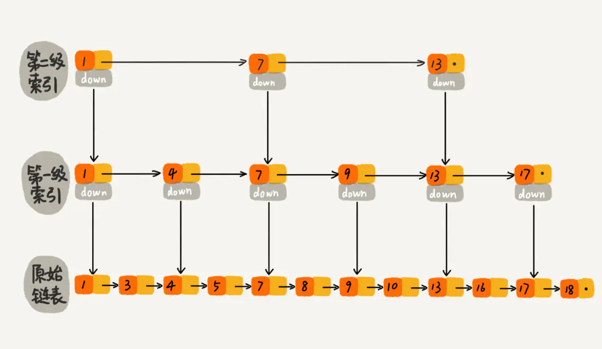

## 常用宏

> include/openvswitch/util.h #119

### typeof

typeof不是C语言本身的关键词或运算符，它是GCC的一个扩展，作用正如其字面意思，用某种已有东西（变量、函数等）的类型去定义新的变量类型。

```c
typeof(int *)a, b;     // 等价于 int *a, *b;
typeof(a) c;           // 等价于 int *c

#define OVS_TYPEOF(OBJECT) typeof(OBJECT)
```

### offsetof

获取结构体`TYPE`中某个成员`MEMBER`的偏移量（相对于结构体地址）。

```c
/* /usr/lib/gcc/x86_64-linux-gnu/9/include/stddef.h */
#define offsetof(TYPE, MEMBER) __builtin_offsetof (TYPE, MEMBER)
/* 类似于 */
#define offsetof(TYPE, MEMBER)    ((size_t)&((TYPE *)0)->MEMBER)

/* 使用方法 */
#include <stddef.h>
#include <stdio.h>
#include <stdlib.h>

int main(void)
{
    struct s {
        int i;
        char c;
        double d;
        char a[];
    };

    /* Output is compiler dependent */
    printf("offsets: i=%zd; c=%zd; d=%zd a=%zd\n",
            offsetof(struct s, i), offsetof(struct s, c),
            offsetof(struct s, d), offsetof(struct s, a));
    printf("sizeof(struct s)=%zd\n", sizeof(struct s));
    exit(EXIT_SUCCESS);
}
```

### OBJECT_OFFSETOF

给定一个指向结构体的指针`OBJECT`，返回其成员`MEMBER`的偏移量。

```c
#define OBJECT_OFFSETOF(OBJECT, MEMBER) offsetof(typeof(*(OBJECT)), MEMBER)

/* 使用方法 */
#include <stddef.h>
#include <stdio.h>
#include <stdlib.h>

#define OBJECT_OFFSETOF(OBJECT, MEMBER) offsetof(typeof(*(OBJECT)), MEMBER)

int main(void)
{
    struct s {
        int i;
        char c;
        double d;
        char a[];
    } *obj = NULL;

    /* Output is compiler dependent */
    printf("offsets: i=%zd; c=%zd; d=%zd a=%zd\n",
            OBJECT_OFFSETOF(obj, i), OBJECT_OFFSETOF(obj, c),
            OBJECT_OFFSETOF(obj, d), OBJECT_OFFSETOF(obj, a));
    printf("sizeof(struct s)=%zd\n", sizeof(struct s));
    exit(EXIT_SUCCESS);
}
```

### CONTAINER_OF

已知结构体`STRUCT`中某个成员`MEMBER`的地址为`POINTER`，返回该结构体`STRUCT`的首地址。

```c
/* include/openvswitch/util.h #119 */
#define CONTAINER_OF(POINTER, STRUCT, MEMBER)                           \
        ((STRUCT *) (void *) ((char *) (POINTER) - offsetof (STRUCT, MEMBER)))

/* 使用方法 */
#include <stddef.h>
#include <stdio.h>
#include <stdlib.h>

#define CONTAINER_OF(POINTER, STRUCT, MEMBER)                           \
        ((STRUCT *) (void *) ((char *) (POINTER) - offsetof (STRUCT, MEMBER)))

int main(void)
{
    struct s {
        int i;
        char c;
        double d;
        char a[];
    } obj;

    printf("obj addr: %p\n", &obj);
    printf("obj addr from i: %p\n", CONTAINER_OF(&obj.i, struct s, i));
    printf("obj addr from c: %p\n", CONTAINER_OF(&obj.c, struct s, c));
    printf("obj addr from d: %p\n", CONTAINER_OF(&obj.d, struct s, d));
    printf("obj addr from a: %p\n", CONTAINER_OF(&obj.a, struct s, a));

    exit(EXIT_SUCCESS);
}
```

#### OBJECT_CONTAINING

已知某个结构体对象中某个成员`MEMBER`的地址为`POINTER`，返回该对象的地址。

与`CONTAINER_OF`类似，**只是由`STRUCT`替换为指向该结构体的指针`OBJECT`，且`OBJECT`是否为空无影响，只是用于通过`type_of`获取结构体类型。**

```c
#define OBJECT_CONTAINING(POINTER, OBJECT, MEMBER)                      \
    ((OVS_TYPEOF(OBJECT)) (void *)                                      \
     ((char *) (POINTER) - OBJECT_OFFSETOF(OBJECT, MEMBER)))

/* 使用方法 */
#include <stddef.h>
#include <stdio.h>
#include <stdlib.h>

#define OBJECT_OFFSETOF(OBJECT, MEMBER) offsetof(typeof(*(OBJECT)), MEMBER)
#define OVS_TYPEOF(OBJECT) typeof(OBJECT)

#define OBJECT_CONTAINING(POINTER, OBJECT, MEMBER)                      \
    ((OVS_TYPEOF(OBJECT)) (void *)                                      \
     ((char *) (POINTER) - OBJECT_OFFSETOF(OBJECT, MEMBER)))

int main(void)
{
    struct s {
        int i;
        char c;
        double d;
        char a[];
    } obj;

    struct s *p = NULL; /* p 为空，但无影响 */
    printf("obj addr: %p\n", &obj);
    printf("obj addr from i: %p\n", OBJECT_CONTAINING(&obj.i, p, i));
    printf("obj addr from c: %p\n", OBJECT_CONTAINING(&obj.c, p, c));
    printf("obj addr from d: %p\n", OBJECT_CONTAINING(&obj.d, p, d));
    printf("obj addr from a: %p\n", OBJECT_CONTAINING(&obj.a, p, a));
    exit(EXIT_SUCCESS);
}
```

#### ASSIGN_CONTAINER

同上，已知某个结构体对象中某个成员`MEMBER`的地址为`POINTER`，但是**将该结构体的地址赋值给`OBJECT`，返回**`(void)0`。

`,`逗号运算符的优先级最低！所以这里是先对`OBJECT`赋值。

```c
#define ASSIGN_CONTAINER(OBJECT, POINTER, MEMBER) \
    ((OBJECT) = OBJECT_CONTAINING(POINTER, OBJECT, MEMBER), (void) 0)

struct s *p = NULL; /* p 为空，但无影响 */
ASSIGN_CONTAINER(p, &obj.i, i)
printf("obj addr from i: %p\n", p); /* p == &obj */
```

#### INIT_CONTAINER

同上，就多个一个对`OBJECT`初始化为`NULL`的操作。

```c
#define INIT_CONTAINER(OBJECT, POINTER, MEMBER) \
    ((OBJECT) = NULL, ASSIGN_CONTAINER(OBJECT, POINTER, MEMBER))
```

### BUILD_ASSERT_TYPE

编译过程做类型一致性检查。如果`POINTER`与指定的类型`TYPE`不匹配的话，会报编译错误。但如果给定的`TYPE`是`void *`，则可以与任意类型的`POINTER`匹配。

- **sizeof**：`POINTER`**可以是表达式**，所以这里用`sizeof`**来确保表达式不会被执行**。
- **(void)**：通过`(void)`**忽略**函数或表达式的值，这里是`sizeof`的返回值。

```c
#define BUILD_ASSERT_TYPE(POINTER, TYPE) \
    ((void) sizeof ((int) ((POINTER) == (TYPE) (POINTER))))
```

### CONST_CAST

将`const`修饰的指针转为指定`TYPE`的`non-const`类型。当指定的类型`TYPE`与指针`POINTER`类型不匹配时，编译会有警告。

```c
#define CONST_CAST(TYPE, POINTER)                               \
    (BUILD_ASSERT_TYPE(POINTER, TYPE),                          \
     (TYPE) (POINTER))

/* 使用方法 */
#include <stddef.h>
#include <stdio.h>
#include <stdlib.h>

#define BUILD_ASSERT_TYPE(POINTER, TYPE) \
    ((void) sizeof ((int) ((POINTER) == (TYPE) (POINTER))))

#define CONST_CAST(TYPE, POINTER)                               \
    (BUILD_ASSERT_TYPE(POINTER, TYPE),                          \
     (TYPE) (POINTER))

int main(void)
{
    const int constant = 26;
    const int* const_p = &constant;
    int* modifier = CONST_CAST(int *, const_p);
    /* int* modifier = CONST_CAST(double *, const_p);
     * 当指定的类型 double* 与指针类型不匹配时，编译会有警告 */
    *modifier = 3;

    printf("constant: %d\n", constant);
    printf("*modifier: %d\n", *modifier);

    return 0;
}
```

### ovs_assert

当条件不满足时，会报错并输出发生错误的位置信息，用于调试阶段。

```c
#define ovs_assert(CONDITION)                                           \
    (OVS_LIKELY(CONDITION)                                              \
     ? (void) 0                                                         \
     : ovs_assert_failure(OVS_SOURCE_LOCATOR, __func__, #CONDITION))
```

## ovs_list

> include/openvswitch/list.h
>
> [Linux内核中常用的数据结构](https://zhuanlan.zhihu.com/p/58087261)

双向链表结构！

```c
struct ovs_list {
    struct ovs_list *prev;     /* Previous list element. */
    struct ovs_list *next;     /* Next list element. */
};

struct s {
    int a;
    int b;
    struct ovs_list node;
}
```

当某个结构体需要实现链表时，只需要将该`ovs_list`嵌入到结构体中。


`prev/next`指向的是`struct s`中的`node`，当需要`s`的地址时，需要通过上面的宏`CONTAINER_OF`或者`OBJECT_CONTAINING`。

**LIST_FOR_EACH**：`ITER`为结构体的空指针`struct s *p = NULL`，遍历过程中会指向当前节点；`MEMBER`为结构体中`ovs_list`成员的名称`node`；`LIST`为链表的头节点（或者任意链表中的任意一个节点），`LIST`自身不会被遍历到；

```c
#define LIST_FOR_EACH(ITER, MEMBER, LIST)                               \
    for (INIT_CONTAINER(ITER, (LIST)->next, MEMBER);                    \
         &(ITER)->MEMBER != (LIST);                                     \
         ASSIGN_CONTAINER(ITER, (ITER)->MEMBER.next, MEMBER))
```

**LIST_FOR_EACH_CONTINUE**：同上，但`ITER`有初始值，从当前位置的下一个节点开始遍历。

```c
#define LIST_FOR_EACH_CONTINUE(ITER, MEMBER, LIST)                      \
    for (ASSIGN_CONTAINER(ITER, (ITER)->MEMBER.next, MEMBER);             \
         &(ITER)->MEMBER != (LIST);                                     \
         ASSIGN_CONTAINER(ITER, (ITER)->MEMBER.next, MEMBER))
```

**LIST_FOR_EACH_REVERSE**：与`LIST_FOR_EACH`类似，但反向遍历。

```c
#define LIST_FOR_EACH_REVERSE(ITER, MEMBER, LIST)                       \
    for (INIT_CONTAINER(ITER, (LIST)->prev, MEMBER);                    \
         &(ITER)->MEMBER != (LIST);                                     \
         ASSIGN_CONTAINER(ITER, (ITER)->MEMBER.prev, MEMBER))
```

一个例子：

- 将该代码放在`ovs`源码根目录下，编译时指定头文件路径：`gcc test.c -o test -I include`。
- 将宏定义展开：`gcc -E -P test.c -o test.i` ，直接跳转到最后看。

```c
#include "openvswitch/list.h"

#include <stdio.h>
#include <stdlib.h>

struct Person {
    char name;
    int age;
    struct ovs_list node;
};

int main() {
    struct Person A = {.name = 'A', .age = 1};
    struct Person B = {.name = 'B', .age = 2};
    struct Person C = {.name = 'C', .age = 3};
    struct Person D = {.name = 'D', .age = 4};

    struct ovs_list head;   /* 可创建一个单独的 ovs_list 作为 head */
    ovs_list_init(&head);

    /* 插入：在 head 前面插入 A */
    ovs_list_insert(&head, &A.node);    /* A - head */
    ovs_list_insert(&head, &B.node);    /* A - B - head */
    ovs_list_insert(&B.node, &C.node);  /* A - C - B - head */

    /* 替换：用 D 替换原来 C 的位置 */
    ovs_list_replace(&D.node, &C.node); /* A - D - B - head */

    struct Person *p = NULL;

    /* 遍历链表，输出：A - D - B */
    LIST_FOR_EACH(p, node, &head) {
        printf("name: %c\n", p->name);
    }

    /* 删除：删除指定节点，返回删除元素的下一个节点 */
    ovs_list *pl = ovs_list_remove(&D.node); /* pl == &B.node */
}
```

## hmap

> include/openvswitch/hmap.h
> lib/hmap.c
>
> [深入分析Hmap](https://www.sdnlab.com/15552.html)

**A hash map.**

一种哈希桶实现。

- 桶的数量可自动扩容、收缩，且总是`2^n`。
- 哈希函数就是`key & mask`，这里`mask = 2^n-1`。
- 通过开链法解决哈希冲突。
- 节点数量为0或1时比较特殊。

> 将哈希桶的大小设置为`2^n`是为了加速。假设桶的大小为`len`，那么哈希函数就应该为`key % len`，而当`len = 2^n`时，`key % len == key & (len - 1)`，相比之下，`&`操作比`%`更快。

```c
struct hmap {
    /* buckets 就是哈希桶，本质为指针数组（hmap_node *）
     * 如果 mask == 0, buckets = &one */
    struct hmap_node **buckets;
    /* one 只有当 mask == 0 时才存储数据，mask != 0, 则 one = NULL; */
    struct hmap_node *one;
    /* buckets 数组的大小为 mask + 1 */
    size_t mask;
    /* hmap 中有效 hmap_node 节点个数 */
    size_t n;
};

/* 一个哈希映射节点，用于嵌入到被映射的数据结构中 */
struct hmap_node {
    size_t hash;                /* 哈希值 */
    struct hmap_node *next;     /* 单链表 */
};
```


同样，通过`hmap`得到`hmap_node`的地址后，需要通过`CONTAINER_OF`获取对应结构体对象的地址。

常用方法：

```c
void hmap_init(struct hmap *);   /* 初始化 */
#define hmap_insert(HMAP, NODE, HASH)   /* 插入节点 */
void hmap_remove(struct hmap *, struct hmap_node *);  /* 删除指定节点 */
struct hmap_node *hmap_random_node(const struct hmap *); /* 随机返回一个节点 */
bool hmap_contains(const struct hmap *, const struct hmap_node *); /* 判断hmap是否包含该节点 */

void hmap_destroy(struct hmap *);  /* 销毁hmap，释放buckets的内存，但不负责销毁hmap_node对应的资源 */
void hmap_clear(struct hmap *);    /* 将 buckets 数组清0，大小不变，只是所有指针置为 NULL(0) */

static inline void
hmap_remove(struct hmap *hmap, struct hmap_node *node)
{
    struct hmap_node **bucket = &hmap->buckets[node->hash & hmap->mask];

    while (*bucket != node) {
        bucket = &(*bucket)->next;
    }
    *bucket = node->next;
    hmap->n--;
}
```

**HMAP_FOR_EACH_WITH_HASH**：遍历 `HMAP` 中所有 `hash_node->hash` 值等于 `HASH` 的节点，`Node`实际`struct`的指针；

根据`HASH`找到哈希桶所在的下标，然后遍历对应的链表。链表中，有可能不同`hash`值的节点，这些节点会被跳过。

```c
#define HMAP_FOR_EACH_WITH_HASH(NODE, MEMBER, HASH, HMAP)               \
    for (INIT_CONTAINER(NODE, hmap_first_with_hash(HMAP, HASH), MEMBER); \
         (NODE != OBJECT_CONTAINING(NULL, NODE, MEMBER))                \
         || ((NODE = NULL), false);                                     \
         ASSIGN_CONTAINER(NODE, hmap_next_with_hash(&(NODE)->MEMBER),   \
                          MEMBER))

/* 返回下一个具有相同 hmap_node->hash 值的节点，没有返回 NULL，会跳过hash值不同的节点 */
struct hmap_node *
hmap_next_with_hash(const struct hmap_node *node)
```

**HMAP_FOR_EACH_IN_BUCKET**：同上，但遍历链表时，**不会跳过**有不同`hash`值的节点。

```c
#define HMAP_FOR_EACH_IN_BUCKET(NODE, MEMBER, HASH, HMAP)               \
    for (INIT_CONTAINER(NODE, hmap_first_in_bucket(HMAP, HASH), MEMBER); \
         (NODE != OBJECT_CONTAINING(NULL, NODE, MEMBER))                \
         || ((NODE = NULL), false);                                     \
         ASSIGN_CONTAINER(NODE, hmap_next_in_bucket(&(NODE)->MEMBER), MEMBER))
```

**HMAP_FOR_EACH**：遍历`HMAP`中的所有节点。

```c
#define HMAP_FOR_EACH(NODE, MEMBER, HMAP) \
    HMAP_FOR_EACH_INIT(NODE, MEMBER, HMAP, (void) 0)
#define HMAP_FOR_EACH_INIT(NODE, MEMBER, HMAP, ...)                     \
    for (INIT_CONTAINER(NODE, hmap_first(HMAP), MEMBER), __VA_ARGS__;   \
         (NODE != OBJECT_CONTAINING(NULL, NODE, MEMBER))                \
         || ((NODE = NULL), false);                                     \
         ASSIGN_CONTAINER(NODE, hmap_next(HMAP, &(NODE)->MEMBER), MEMBER))
```

**HMAP_FOR_EACH_SAFE**：遍历`HMAP`中的所有节点。

与`HMAP_FOR_EACH`相比，在进行循环条件判断时，会通过`NEXT`预取下一个节点，这意味着即使在循环过程中将`NODE`从`HMAP`中移除，仍然可正确遍历后续节点。

其实如果只是从`HMAP`中移除，上面的`HMAP_FOR_EACH`也可以，不过要是还调用了`free(NODE)`，上面的就会导致段错误，或者一些奇怪的值。

```c
#define HMAP_FOR_EACH_SAFE(NODE, NEXT, MEMBER, HMAP) \
    HMAP_FOR_EACH_SAFE_INIT(NODE, NEXT, MEMBER, HMAP, (void) 0)
#define HMAP_FOR_EACH_SAFE_INIT(NODE, NEXT, MEMBER, HMAP, ...)          \
    for (INIT_CONTAINER(NODE, hmap_first(HMAP), MEMBER), __VA_ARGS__;   \
         ((NODE != OBJECT_CONTAINING(NULL, NODE, MEMBER))               \
          || ((NODE = NULL), false)                                     \
          ? INIT_CONTAINER(NEXT, hmap_next(HMAP, &(NODE)->MEMBER), MEMBER), 1 \
          : 0);                                                         \
         (NODE) = (NEXT))
```

**HMAP_FOR_EACH_CONTINUE**：可以从中间某个位置（`NODE`所在位置）开始遍历。

```c
#define HMAP_FOR_EACH_CONTINUE(NODE, MEMBER, HMAP) \
    HMAP_FOR_EACH_CONTINUE_INIT(NODE, MEMBER, HMAP, (void) 0)
#define HMAP_FOR_EACH_CONTINUE_INIT(NODE, MEMBER, HMAP, ...)            \
    for (ASSIGN_CONTAINER(NODE, hmap_next(HMAP, &(NODE)->MEMBER), MEMBER), \
         __VA_ARGS__;                                                   \
         (NODE != OBJECT_CONTAINING(NULL, NODE, MEMBER))                \
         || ((NODE = NULL), false);                                     \
         ASSIGN_CONTAINER(NODE, hmap_next(HMAP, &(NODE)->MEMBER), MEMBER))
```

**hmap_insert**：向`HMAP`中插入节点`NODE`，新节点的哈希值为`HASH`。

该插入函数在插入节点时不会检查是否已经有同样哈希值的节点，也就是说`hmap`中可能存在哈希值相同的节点

```c
#define hmap_insert(HMAP, NODE, HASH) \
    hmap_insert_at(HMAP, NODE, HASH, OVS_SOURCE_LOCATOR)

static inline void
hmap_insert_at(struct hmap *hmap, struct hmap_node *node, size_t hash,
               const char *where)
{
    hmap_insert_fast(hmap, node, hash);
    if (hmap->n / 2 > hmap->mask) {
        hmap_expand_at(hmap, where);
    }
}
hmap_insert_fast(struct hmap *hmap, struct hmap_node *node, size_t hash)
{
    struct hmap_node **bucket = &hmap->buckets[hash & hmap->mask];
    node->hash = hash;
    node->next = *bucket;
    *bucket = node;
    hmap->n++;
}
```

一个例子：

- 将该代码放在`ovs`源码根目录下，编译时指定头文件路径：`gcc test.c -o test -I include`，`hmap.h`也需要一点修改才能编译。
- 将宏定义展开：`gcc -E -P test.c -o test.p -I include -I .` ，直接跳转到最后看。

```c
#include "openvswitch/hmap.h"

#include <stdio.h>
#include <stdlib.h>

struct element {
    int value;
    struct hmap_node node;
};

int main()
{
    size_t i, N_ELEMS = 100;
    int values[N_ELEMS];
    struct element *elem;
    struct hmap hmap;
    struct hmap_node *data = NULL;

    hmap_init(&hmap);
    for (i = 0; i < N_ELEMS; i++) {
        /* 动态分配元素，设置每个元素的hash为 下标+1 */
        elem = malloc(sizeof(struct element));
        elem->value = i+1;
        hmap_insert(&hmap, &elem->node, i+1);
        /* 查看 hmap 自动扩容 */
        printf("i+1 = %ld, hmap.mask = %ld, .n = %ld\n", i, hmap.mask, hmap.n);
    }

    printf("--------------------遍历 hash 值为3的节点 \n");
    HMAP_FOR_EACH_WITH_HASH(elem, node, 3, &hmap) {
        printf("elem .value = %d, .hash = %ld\n", elem->value, elem->node.hash);
    }

    printf("--------------------遍历 hash 值为3 所在 buckets 的全部节点 \n");
    HMAP_FOR_EACH_IN_BUCKET(elem, node, 3, &hmap) {
        printf("elem .value = %d, .hash = %ld\n", elem->value, elem->node.hash);
    }

    printf("--------------------遍历 map，删除值为10的节点 \n");
    struct element *next;
    HMAP_FOR_EACH_SAFE(elem, next, node, &hmap) {
        printf("elem .value = %d, .hash = %ld\n", elem->value, elem->node.hash);
        if (elem->value == 10) {
            printf("free elem\n");
            free(elem);
        }
    }

    printf("--------------------遍历 hmap，删除值为11的节点 \n");
    HMAP_FOR_EACH(elem, node, &hmap) {
        printf("elem .value = %d, .hash = %ld\n", elem->value, elem->node.hash);
        if (elem->value == 11) {
            printf("free elem\n");
            free(elem);
        }
    }

    hmap_destroy(&hmap);
    return 0;
}
```

> include/openvswitch/hmap.h 需要将`hmap.c`中的实现暂时放到`hmap.h`中才能正确编译，而且还注释了一些其他外部函数调用。

```c
#ifndef HMAP_H
#define HMAP_H 1

#include <stdbool.h>
#include <stdlib.h>
#include "openvswitch/util.h"
#include <string.h>
#include "util.h"

#ifdef  __cplusplus
extern "C" {
#endif

/* A hash map node, to be embedded inside the data structure being mapped. */
/* 一个哈希映射节点，用于嵌入到被映射的数据结构中。 */
struct hmap_node {
    size_t hash;                /* Hash value. */
    struct hmap_node *next;     /* Next in linked list. */
};

/* Returns the hash value embedded in 'node'. */
static inline size_t hmap_node_hash(const struct hmap_node *node)
{
    return node->hash;
}

#define HMAP_NODE_NULL ((struct hmap_node *) 1)
#define HMAP_NODE_NULL_INITIALIZER { 0, HMAP_NODE_NULL }

/* Returns true if 'node' has been set to null by hmap_node_nullify() and has
 * not been un-nullified by being inserted into an hmap. */
static inline bool
hmap_node_is_null(const struct hmap_node *node)
{
    return node->next == HMAP_NODE_NULL;
}

/* Marks 'node' with a distinctive value that can be tested with
 * hmap_node_is_null().  */
static inline void
hmap_node_nullify(struct hmap_node *node)
{
    node->next = HMAP_NODE_NULL;
}

/* A hash map. */
struct hmap {
    /* buckets 就是哈希桶，本质为指针数组（hmap_node *）
     * 如果 mask == 0, buckets = &one */
    struct hmap_node **buckets;
    /* one 只有当 mask == 0 时才存储数据，mask != 0, 则 one = NULL; */
    struct hmap_node *one;
    /* buckets 数组的大小为 mask + 1, mask总是 2^n - 1.
    * (节点hash值 & mask)：该节点在buckets数组中的下标 */
    size_t mask;
    /* buckets 中实际有效 hmap_node 节点个数，当 n > 2*mask + 1时才会扩容 */
    size_t n;
};

/* Initializer for an empty hash map. */
/* 初始化 hmap {buckets = &one, one = NULL, mask = 0, n = 0} */
#define HMAP_INITIALIZER(HMAP) \
    { (struct hmap_node **const) &(HMAP)->one, NULL, 0, 0 }

/* Initializer for an immutable struct hmap 'HMAP' that contains 'N' nodes
 * linked together starting at 'NODE'.  The hmap only has a single chain of
 * hmap_nodes, so 'N' should be small. */
#define HMAP_CONST(HMAP, N, NODE) {                                 \
        CONST_CAST(struct hmap_node **, &(HMAP)->one), NODE, 0, N }

/* Initialization. */
void hmap_init(struct hmap *);
void hmap_destroy(struct hmap *);
void hmap_clear(struct hmap *);
void hmap_swap(struct hmap *a, struct hmap *b);
void hmap_moved(struct hmap *hmap);
static inline size_t hmap_count(const struct hmap *);
static inline bool hmap_is_empty(const struct hmap *);

/* Adjusting capacity. */
void hmap_expand_at(struct hmap *, const char *where);
#define hmap_expand(HMAP) hmap_expand_at(HMAP, OVS_SOURCE_LOCATOR)

void hmap_shrink_at(struct hmap *, const char *where);
#define hmap_shrink(HMAP) hmap_shrink_at(HMAP, OVS_SOURCE_LOCATOR)

void hmap_reserve_at(struct hmap *, size_t capacity, const char *where);
#define hmap_reserve(HMAP, CAPACITY) \
    hmap_reserve_at(HMAP, CAPACITY, OVS_SOURCE_LOCATOR)

/* Insertion and deletion. */
static inline void hmap_insert_at(struct hmap *, struct hmap_node *,
                                  size_t hash, const char *where);
#define hmap_insert(HMAP, NODE, HASH) \
    hmap_insert_at(HMAP, NODE, HASH, OVS_SOURCE_LOCATOR)

static inline void hmap_insert_fast(struct hmap *,
                                    struct hmap_node *, size_t hash);
static inline void hmap_remove(struct hmap *, struct hmap_node *);

void hmap_node_moved(struct hmap *, struct hmap_node *, struct hmap_node *);
static inline void hmap_replace(struct hmap *, const struct hmap_node *old,
                                struct hmap_node *new_node);

struct hmap_node *hmap_random_node(const struct hmap *);

/* Search.
 *
 * HMAP_FOR_EACH_WITH_HASH 遍历 HMAP 中所有hash值等于HASH的 NODE。
 *
 * HMAP_FOR_EACH_IN_BUCKET 在HMAP中所有与HASH属于同一桶的节点上迭代 NODE。
 * iterates NODE over all of the nodes in HMAP that would fall in the same bucket as HASH.
 *
 * NODE 是包含 'struct hmap_node' 的结构体名称。
 * MEMBER 必须是 NODE中 'struct hmap_node' 成员的名称。
 *
 * These macros may be used interchangeably to search for a particular value in
 * an hmap, see, e.g. shash_find() for an example.  Usually, using
 * HMAP_FOR_EACH_WITH_HASH provides an optimization, because comparing a hash
 * value is usually cheaper than comparing an entire hash map key.  But for
 * simple hash map keys, it makes sense to use HMAP_FOR_EACH_IN_BUCKET because
 * it avoids doing two comparisons when a single simple comparison suffices.
 *
 * The loop should not change NODE to point to a different node or insert or
 * delete nodes in HMAP (unless it "break"s out of the loop to terminate
 * iteration).
 *
 * HASH is only evaluated once.
 *
 * When the loop terminates normally, meaning the iteration has completed
 * without using 'break', NODE will be NULL.  This is true for all of the
 * HMAP_FOR_EACH_*() macros.
 */
#define HMAP_FOR_EACH_WITH_HASH(NODE, MEMBER, HASH, HMAP)               \
    for (INIT_CONTAINER(NODE, hmap_first_with_hash(HMAP, HASH), MEMBER); \
         (NODE != OBJECT_CONTAINING(NULL, NODE, MEMBER))                \
         || ((NODE = NULL), false);                                     \
         ASSIGN_CONTAINER(NODE, hmap_next_with_hash(&(NODE)->MEMBER),   \
                          MEMBER))
#define HMAP_FOR_EACH_IN_BUCKET(NODE, MEMBER, HASH, HMAP)               \
    for (INIT_CONTAINER(NODE, hmap_first_in_bucket(HMAP, HASH), MEMBER); \
         (NODE != OBJECT_CONTAINING(NULL, NODE, MEMBER))                \
         || ((NODE = NULL), false);                                     \
         ASSIGN_CONTAINER(NODE, hmap_next_in_bucket(&(NODE)->MEMBER), MEMBER))

static inline struct hmap_node *hmap_first_with_hash(const struct hmap *,
                                                     size_t hash);
static inline struct hmap_node *hmap_next_with_hash(const struct hmap_node *);
static inline struct hmap_node *hmap_first_in_bucket(const struct hmap *,
                                                     size_t hash);
static inline struct hmap_node *hmap_next_in_bucket(const struct hmap_node *);

bool hmap_contains(const struct hmap *, const struct hmap_node *);

/* Iteration.
 *
 * The *_INIT variants of these macros additionally evaluate the expressions
 * supplied following the HMAP argument once during the loop initialization.
 * This makes it possible for data structures that wrap around hmaps to insert
 * additional initialization into their iteration macros without having to
 * completely rewrite them.  In particular, it can be a good idea to insert
 * BUILD_ASSERT_TYPE checks for map and node types that wrap hmap, since
 * otherwise it is possible for clients to accidentally confuse two derived
 * data structures that happen to use the same member names for struct hmap and
 * struct hmap_node. */

/* Iterates through every node in HMAP. */
#define HMAP_FOR_EACH(NODE, MEMBER, HMAP) \
    HMAP_FOR_EACH_INIT(NODE, MEMBER, HMAP, (void) 0)
#define HMAP_FOR_EACH_INIT(NODE, MEMBER, HMAP, ...)                     \
    for (INIT_CONTAINER(NODE, hmap_first(HMAP), MEMBER), __VA_ARGS__;   \
         (NODE != OBJECT_CONTAINING(NULL, NODE, MEMBER))                \
         || ((NODE = NULL), false);                                     \
         ASSIGN_CONTAINER(NODE, hmap_next(HMAP, &(NODE)->MEMBER), MEMBER))

/* Safe when NODE may be freed (not needed when NODE may be removed from the
 * hash map but its members remain accessible and intact). */
#define HMAP_FOR_EACH_SAFE(NODE, NEXT, MEMBER, HMAP) \
    HMAP_FOR_EACH_SAFE_INIT(NODE, NEXT, MEMBER, HMAP, (void) 0)
#define HMAP_FOR_EACH_SAFE_INIT(NODE, NEXT, MEMBER, HMAP, ...)          \
    for (INIT_CONTAINER(NODE, hmap_first(HMAP), MEMBER), __VA_ARGS__;   \
         ((NODE != OBJECT_CONTAINING(NULL, NODE, MEMBER))               \
          || ((NODE = NULL), false)                                     \
          ? INIT_CONTAINER(NEXT, hmap_next(HMAP, &(NODE)->MEMBER), MEMBER), 1 \
          : 0);                                                         \
         (NODE) = (NEXT))

/* Continues an iteration from just after NODE. */
#define HMAP_FOR_EACH_CONTINUE(NODE, MEMBER, HMAP) \
    HMAP_FOR_EACH_CONTINUE_INIT(NODE, MEMBER, HMAP, (void) 0)
#define HMAP_FOR_EACH_CONTINUE_INIT(NODE, MEMBER, HMAP, ...)            \
    for (ASSIGN_CONTAINER(NODE, hmap_next(HMAP, &(NODE)->MEMBER), MEMBER), \
         __VA_ARGS__;                                                   \
         (NODE != OBJECT_CONTAINING(NULL, NODE, MEMBER))                \
         || ((NODE = NULL), false);                                     \
         ASSIGN_CONTAINER(NODE, hmap_next(HMAP, &(NODE)->MEMBER), MEMBER))

static inline struct hmap_node *
hmap_pop_helper__(struct hmap *hmap, size_t *bucket) {

    for (; *bucket <= hmap->mask; (*bucket)++) {
        struct hmap_node *node = hmap->buckets[*bucket];

        if (node) {
            hmap_remove(hmap, node);
            return node;
        }
    }

    return NULL;
}

#define HMAP_FOR_EACH_POP(NODE, MEMBER, HMAP)                               \
    for (size_t bucket__ = 0;                                               \
         INIT_CONTAINER(NODE, hmap_pop_helper__(HMAP, &bucket__), MEMBER),  \
         (NODE != OBJECT_CONTAINING(NULL, NODE, MEMBER))                    \
         || ((NODE = NULL), false);)

static inline struct hmap_node *hmap_first(const struct hmap *);
static inline struct hmap_node *hmap_next(const struct hmap *,
                                          const struct hmap_node *);

struct hmap_position {
    unsigned int bucket;
    unsigned int offset;
};

struct hmap_node *hmap_at_position(const struct hmap *,
                                   struct hmap_position *);

/* Returns the number of nodes currently in 'hmap'. */
static inline size_t
hmap_count(const struct hmap *hmap)
{
    return hmap->n;
}

/* Returns the maximum number of nodes that 'hmap' may hold before it should be
 * rehashed. */
static inline size_t
hmap_capacity(const struct hmap *hmap)
{
    return hmap->mask * 2 + 1;
}

/* Returns true if 'hmap' currently contains no nodes,
 * false otherwise.
 * Note: While hmap in general is not thread-safe without additional locking,
 * hmap_is_empty() is. */
static inline bool
hmap_is_empty(const struct hmap *hmap)
{
    return hmap->n == 0;
}

/* Inserts 'node', with the given 'hash', into 'hmap'.  'hmap' is never
 * expanded automatically. */
static inline void
hmap_insert_fast(struct hmap *hmap, struct hmap_node *node, size_t hash)
{
    struct hmap_node **bucket = &hmap->buckets[hash & hmap->mask];
    node->hash = hash;
    node->next = *bucket;
    *bucket = node;
    hmap->n++;
}

/* 用给定的'hash'值将'node'插入到'hmap'中，并在必要时扩容'hmap'以优化搜索性能
 *
 * 'where'用于调试日志记录。通常使用 hmap_insert() 自动提供
 * 调用者的源文件和where的行号。*/
static inline void
hmap_insert_at(struct hmap *hmap, struct hmap_node *node, size_t hash,
               const char *where)
{
    hmap_insert_fast(hmap, node, hash);
    /* 如果hmap中实际节点的数量超过容量的一半时，进行翻倍扩容 */
    if (hmap->n / 2 > hmap->mask) {
        hmap_expand_at(hmap, where);
    }
}

/* Removes 'node' from 'hmap'.  Does not shrink the hash table; call
 * hmap_shrink() directly if desired. */
static inline void
hmap_remove(struct hmap *hmap, struct hmap_node *node)
{
    struct hmap_node **bucket = &hmap->buckets[node->hash & hmap->mask];
    while (*bucket != node) {
        bucket = &(*bucket)->next;
    }
    *bucket = node->next;
    hmap->n--;
}

/* Puts 'new_node' in the position in 'hmap' currently occupied by 'old_node'.
 * The 'new_node' must hash to the same value as 'old_node'.  The client is
 * responsible for ensuring that the replacement does not violate any
 * client-imposed invariants (e.g. uniqueness of keys within a map).
 *
 * Afterward, 'old_node' is not part of 'hmap', and the client is responsible
 * for freeing it (if this is desirable). */
static inline void
hmap_replace(struct hmap *hmap,
             const struct hmap_node *old_node, struct hmap_node *new_node)
{
    struct hmap_node **bucket = &hmap->buckets[old_node->hash & hmap->mask];
    while (*bucket != old_node) {
        bucket = &(*bucket)->next;
    }
    *bucket = new_node;
    new_node->hash = old_node->hash;
    new_node->next = old_node->next;
}

static inline struct hmap_node *
hmap_next_with_hash__(const struct hmap_node *node, size_t hash)
{
    while (node != NULL && node->hash != hash) {
        node = node->next;
    }
    return CONST_CAST(struct hmap_node *, node);
}

/* Returns the first node in 'hmap' with the given 'hash', or a null pointer if
 * no nodes have that hash value. */
static inline struct hmap_node *
hmap_first_with_hash(const struct hmap *hmap, size_t hash)
{
    return hmap_next_with_hash__(hmap->buckets[hash & hmap->mask], hash);
}

/* Returns the first node in 'hmap' in the bucket in which the given 'hash'
 * would land, or a null pointer if that bucket is empty. */
static inline struct hmap_node *
hmap_first_in_bucket(const struct hmap *hmap, size_t hash)
{
    return hmap->buckets[hash & hmap->mask];
}

/* Returns the next node in the same bucket as 'node', or a null pointer if
 * there are no more nodes in that bucket.
 *
 * If the hash map has been reallocated since 'node' was visited, some nodes
 * may be skipped; if new nodes with the same hash value have been added, they
 * will be skipped.  (Removing 'node' from the hash map does not prevent
 * calling this function, since node->next is preserved, although freeing
 * 'node' of course does.) */
static inline struct hmap_node *
hmap_next_in_bucket(const struct hmap_node *node)
{
    return node->next;
}

/* Returns the next node in the same hash map as 'node' with the same hash
 * value, or a null pointer if no more nodes have that hash value.
 *
 * If the hash map has been reallocated since 'node' was visited, some nodes
 * may be skipped; if new nodes with the same hash value have been added, they
 * will be skipped.  (Removing 'node' from the hash map does not prevent
 * calling this function, since node->next is preserved, although freeing
 * 'node' of course does.) */
static inline struct hmap_node *
hmap_next_with_hash(const struct hmap_node *node)
{
    return hmap_next_with_hash__(node->next, node->hash);
}

static inline struct hmap_node *
hmap_next__(const struct hmap *hmap, size_t start)
{
    size_t i;
    for (i = start; i <= hmap->mask; i++) {
        struct hmap_node *node = hmap->buckets[i];
        if (node) {
            return node;
        }
    }
    return NULL;
}

/* Returns the first node in 'hmap', in arbitrary order, or a null pointer if
 * 'hmap' is empty. */
static inline struct hmap_node *
hmap_first(const struct hmap *hmap)
{
    return hmap_next__(hmap, 0);
}

/* Returns the next node in 'hmap' following 'node', in arbitrary order, or a
 * null pointer if 'node' is the last node in 'hmap'.
 *
 * If the hash map has been reallocated since 'node' was visited, some nodes
 * may be skipped or visited twice.  (Removing 'node' from the hash map does
 * not prevent calling this function, since node->next is preserved, although
 * freeing 'node' of course does.) */
static inline struct hmap_node *
hmap_next(const struct hmap *hmap, const struct hmap_node *node)
{
    return (node->next
            ? node->next
            : hmap_next__(hmap, (node->hash & hmap->mask) + 1));
}


/* Initializes 'hmap' as an empty hash table. */
void
hmap_init(struct hmap *hmap)
{
    hmap->buckets = &hmap->one;
    hmap->one = NULL;
    hmap->mask = 0;
    hmap->n = 0;
}

/* Frees memory reserved by 'hmap'.  It is the client's responsibility to free
 * the nodes themselves, if necessary. */
/* 释放 hmap 分配的内存，但仅仅释放 hmap 自身的指针数组的内存，
 * 并不负责释放 嵌入hmap_node的结构 的内存 */
void
hmap_destroy(struct hmap *hmap)
{
    if (hmap && hmap->buckets != &hmap->one) {
        free(hmap->buckets);
    }
}

/* 移除 hmap 的 buckets 中的所有节点，留出空间接收新的节点，没有释放hamp的内存
 *
 * This function is appropriate when 'hmap' will soon have about as many
 * elements as it did before.  If 'hmap' will likely have fewer elements than
 * before, use hmap_destroy() followed by hmap_init() to save memory and
 * iteration time.
 * 当'hmap'很快将拥有和以前一样多的元素时，此函数是合适的。如果'hmap'可能比以前有更少的元素，
 * 使用hmap_destroy()和hmap_init()来节省内存和迭代时间。*/
void
hmap_clear(struct hmap *hmap)
{
    if (hmap->n > 0) {
        hmap->n = 0;
        /* 将 buckets 数组清0 */
        memset(hmap->buckets, 0, (hmap->mask + 1) * sizeof *hmap->buckets);
    }
}

/* Exchanges hash maps 'a' and 'b'. */
/* 注意此处不是指针赋值！！而是结构体赋值（每个成员赋值）*/
void
hmap_swap(struct hmap *a, struct hmap *b)
{
    struct hmap tmp = *a;
    *a = *b;
    *b = tmp;
    hmap_moved(a);
    hmap_moved(b);
}

/* Adjusts 'hmap' to compensate for having moved position in memory (e.g. due
 * to realloc()). */
void
hmap_moved(struct hmap *hmap)
{
    if (!hmap->mask) {
        hmap->buckets = &hmap->one;
    }
}

/* 1. 先以新的容量大小new_mask+1创建一个临时hmap，
 * 2. 再遍历原hmap中的节点，调用hmap_insert 插入到临时hmap中。
 * 3. 交换两个hmap, swap(hmap, tmp);
 * 4. 销毁tmp(即原来的hmap)
 */
static void
resize(struct hmap *hmap, size_t new_mask, const char *where)
{
    struct hmap tmp;
    size_t i;

    /* 再次检查指定的mask是否合理（2^n - 1） */
    // ovs_assert(is_pow2(new_mask + 1));

    /* 1. 先以新的容量大小new_mask+1创建一个临时hmap */
    hmap_init(&tmp);
    if (new_mask) {
        tmp.buckets = malloc(sizeof *tmp.buckets * (new_mask + 1));
        tmp.mask = new_mask;
        for (i = 0; i <= tmp.mask; i++) {
            tmp.buckets[i] = NULL;
        }
    }

    int n_big_buckets = 0;
    int biggest_count = 0;
    int n_biggest_buckets = 0;
    /* 2. 再遍历原hmap中的节点，调用hmap_insert 插入到临时hmap中 */
    for (i = 0; i <= hmap->mask; i++) {
        struct hmap_node *node, *next;
        int count = 0;
        for (node = hmap->buckets[i]; node; node = next) {
            next = node->next;
            hmap_insert_fast(&tmp, node, node->hash);
            count++;
        }
        if (count > 5) {
            n_big_buckets++;
            if (count > biggest_count) {
                biggest_count = count;
                n_biggest_buckets = 1;
            } else if (count == biggest_count) {
                n_biggest_buckets++;
            }
        }
    }
    /* 3. 交换两个hmap, swap(hmap, tmp); */
    hmap_swap(hmap, &tmp);
    /* 4. 销毁tmp (即原来的hmap) */
    hmap_destroy(&tmp);

    // if (n_big_buckets) {
    //     static struct vlog_rate_limit rl = VLOG_RATE_LIMIT_INIT(10, 10);
    //     COVERAGE_INC(hmap_pathological);
    //     VLOG_DBG_RL(&rl, "%s: %d bucket%s with 6+ nodes, "
    //                 "including %d bucket%s with %d nodes "
    //                 "(%"PRIuSIZE" nodes total across %"PRIuSIZE" buckets)",
    //                 where,
    //                 n_big_buckets, n_big_buckets > 1 ? "s" : "",
    //                 n_biggest_buckets, n_biggest_buckets > 1 ? "s" : "",
    //                 biggest_count,
    //                 hmap->n, hmap->mask + 1);
    // }
}

/* hmap的buckets的大小必须是2^n，capacity只是一个参考值，
 * 经过计算，实际取的大小是 <= capacity 的一个2^n 的数，而mask则是2^n - 1.
 */
static size_t
calc_mask(size_t capacity)
{
    size_t mask = capacity / 2;
    mask |= mask >> 1;
    mask |= mask >> 2;
    mask |= mask >> 4;
    mask |= mask >> 8;
    mask |= mask >> 16;
#if SIZE_MAX > UINT32_MAX
    mask |= mask >> 32;
#endif

    /* If we need to dynamically allocate buckets we might as well allocate at
     * least 4 of them. */
    mask |= (mask & 1) << 1;

    return mask;
}

/* 如果需要，扩容“hmap”以优化搜索的性能。
 *
 * 'where' 用于DEBUG日志记录。通常使用 hmap_insert() 自动提供调用者的源文件
 * 和 'where' 的行号。*/
void
hmap_expand_at(struct hmap *hmap, const char *where)
{
    size_t new_mask = calc_mask(hmap->n);
    if (new_mask > hmap->mask) {
        // COVERAGE_INC(hmap_expand);
        resize(hmap, new_mask, where);
    }
}

/* 如果需要，收缩“hmap”以优化迭代的性能
 *
 * 'where' 用于DEBUG日志记录。通常使用 hmap_insert() 自动提供调用者的源文件
 * 和 'where' 的行号。*/
void
hmap_shrink_at(struct hmap *hmap, const char *where)
{
    size_t new_mask = calc_mask(hmap->n);
    if (new_mask < hmap->mask) {
        // COVERAGE_INC(hmap_shrink);
        resize(hmap, new_mask, where);
    }
}

/* 如果有必要，扩容'hmap'，以优化当它有'n'个元素时的搜索性能。
 * (但是在一个已分配容量远远高于当前节点数量的哈希映射中，迭代速度会很慢)
 *
 * 'where' 用于DEBUG日志记录。通常使用 hmap_insert() 自动提供调用者的源文件
 * 和 'where' 的行号。*/
void
hmap_reserve_at(struct hmap *hmap, size_t n, const char *where)
{
    size_t new_mask = calc_mask(n);
    if (new_mask > hmap->mask) {
        // COVERAGE_INC(hmap_reserve);
        resize(hmap, new_mask, where);
    }
}

/* Adjusts 'hmap' to compensate for 'old_node' having moved position in memory
 * to 'node' (e.g. due to realloc()). */
void
hmap_node_moved(struct hmap *hmap,
                struct hmap_node *old_node, struct hmap_node *node)
{
    struct hmap_node **bucket = &hmap->buckets[node->hash & hmap->mask];
    while (*bucket != old_node) {
        bucket = &(*bucket)->next;
    }
    *bucket = node;
}

/* 从'hmap'中选择并返回一个随机选择的节点，该 hmap 不能为空
 *
 * I wouldn't depend on this algorithm to be fair, since I haven't analyzed it.
 * But it does at least ensure that any node in 'hmap' can be chosen. */
struct hmap_node *
hmap_random_node(const struct hmap *hmap)
{
    struct hmap_node *bucket, *node;
    size_t n, i;

    /* Choose a random non-empty bucket. */
    // for (;;) {
    //     bucket = hmap->buckets[random_uint32() & hmap->mask];
    //     if (bucket) {
    //         break;
    //     }
    // }

    /* Count nodes in bucket. */
    // n = 0;
    // for (node = bucket; node; node = node->next) {
    //     n++;
    // }

    /* Choose random node from bucket. */
    // i = random_range(n);
    // i = n-1;
    // for (node = bucket; i-- > 0; node = node->next) {
    //     continue;
    // }
    return NULL;
}

/* Returns the next node in 'hmap' in hash order, or NULL if no nodes remain in
 * 'hmap'.  Uses '*pos' to determine where to begin iteration, and updates
 * '*pos' to pass on the next iteration into them before returning.
 *
 * It's better to use plain HMAP_FOR_EACH and related functions, since they are
 * faster and better at dealing with hmaps that change during iteration.
 *
 * Before beginning iteration, set '*pos' to all zeros. */
struct hmap_node *
hmap_at_position(const struct hmap *hmap,
                 struct hmap_position *pos)
{
    size_t offset;
    size_t b_idx;

    offset = pos->offset;
    for (b_idx = pos->bucket; b_idx <= hmap->mask; b_idx++) {
        struct hmap_node *node;
        size_t n_idx;

        for (n_idx = 0, node = hmap->buckets[b_idx]; node != NULL;
             n_idx++, node = node->next) {
            if (n_idx == offset) {
                if (node->next) {
                    pos->bucket = node->hash & hmap->mask;
                    pos->offset = offset + 1;
                } else {
                    pos->bucket = (node->hash & hmap->mask) + 1;
                    pos->offset = 0;
                }
                return node;
            }
        }
        offset = 0;
    }

    pos->bucket = 0;
    pos->offset = 0;
    return NULL;
}

/* Returns true if 'node' is in 'hmap', false otherwise. */
bool
hmap_contains(const struct hmap *hmap, const struct hmap_node *node)
{
    struct hmap_node *p;

    for (p = hmap_first_in_bucket(hmap, node->hash); p; p = p->next) {
        if (p == node) {
            return true;
        }
    }

    return false;
}

#ifdef  __cplusplus
}
#endif

#endif /* hmap.h */
```

## smap

**a map from string to string.**

同样是在`hmap`上进行扩展，该结构的`key`和`value`均为字符串，`hash`由`key`计算得到。

```c
struct smap {
    struct hmap map;           /* Contains "struct smap_node"s. */
};

struct smap_node {
    struct hmap_node node;     /* In struct smap's 'map' hmap. */
    char *key;
    char *value;
};
```

## simap

**A map from strings to unsigned integers.**

与`smap`类似，`hash`值是由字符串`name`计算得到，只不过`value`变为了`unsigned int`。

```c
struct simap {
    struct hmap map;            /* Contains "struct simap_node"s. */
};

struct simap_node {
    struct hmap_node node;      /* In struct simap's 'map' hmap. */
    char *name;
    unsigned int data;
};
```

## shash

**a map from string(char \*name) to** `void *data`。

```c
struct shash_node {
    struct hmap_node node;
    char *name;
    void *data;
};

struct shash {
    struct hmap map;
};
```

**SHASH_FOR_EACH**：遍历`SHASH`这个map中的节点，将节点地址赋值给`SHASH_NODE`。

```c
#define SHASH_FOR_EACH(SHASH_NODE, SHASH)                               \
    HMAP_FOR_EACH_INIT (SHASH_NODE, node, &(SHASH)->map,                \
                        BUILD_ASSERT_TYPE(SHASH_NODE, struct shash_node *), \
                        BUILD_ASSERT_TYPE(SHASH, struct shash *))

struct shash wanted_ports
struct shash_node *port_node;
SHASH_FOR_EACH (port_node, &wanted_ports) {
    const struct ovsrec_port *port_cfg = port_node->data;
}
```

其他方法：

```c
/* 向 shash 中插入一个elem，插入时先做检查，如果已经存在，就返回false，不存在才添加 */
bool shash_add_once(struct shash *, const char *, const void *);
/* 字面意思，如果sh中已经存在该key(name)，那就替换value为新的data，并返回旧的data（得free掉）。
 * 如果sh中不存在该name，那就将其加进去。字符串name会被拷贝！！data不会被拷贝。 */
void *shash_replace(struct shash *sh, const char *name, const void *data);
/* 同上，但name也不会被拷贝 */
void *shash_replace_nocopy(struct shash *, char *name, const void *data);
```

------

## sset

**A set of strings.**

`hash`值是由`name`计算得到。

```c
struct sset_node {
    struct hmap_node hmap_node;
    char name[1];   /* 不定长结构 */
};

struct sset {
    struct hmap map;
};
```

**sset_add**：添加一个字符串`name`到`sset`中，如果`name`已经存在，则返回`NULL`，否则返回新建的`sset_node`节点。

注意传递的字符串会进行拷贝，`malloc` 的大小是基于字符串的长度。

```c
struct sset_node *
sset_add(struct sset *set, const char *name)
{
    size_t length = strlen(name);
    uint32_t hash = hash_name__(name, length);

    return (sset_find__(set, name, hash)
            ? NULL
            : sset_add__(set, name, length, hash));
}

static struct sset_node *
sset_add__(struct sset *set, const char *name, size_t length, size_t hash)
{
    struct sset_node *node = xmalloc(length + sizeof *node); /* malloc的大小是基于字符串的长度 */
    memcpy(node->name, name, length + 1);
    hmap_insert(&set->map, &node->hmap_node, hash);
    return node;
}
```

## hmapx

**A set of** `void *` **pointers**.

在`hmap`上进行了扩展，实现了一个`set`。

`hmap`在使用时，往往是将`hmap_node`嵌入到某个结构体中，结构体是可以用户自定义的。而且该节点的`key`也就是`hash`值是用户指定的。

`hmapx`就没有`hmap`那样的通用性，`hmapx_node`就是上面描述的嵌入了`hmap_node`的结构体，该结构体只有一个成员`void *data`。另一个特殊在于节点的`hash`值不能指定，而是基于`data`的地址自动计算。

`hmapx`也可以看作`key-value`，`key`是`void *data`，`value`也是，所以不会存在两个节点相同，也就是实现了`set`。

```c
struct hmapx_node {
    struct hmap_node hmap_node;
    void *data;
};

struct hmapx {
    struct hmap map;
};

struct hmapx_node *
hmapx_add(struct hmapx *map, void *data)
{
    uint32_t hash = hash_pointer(data, 0);  /* 基于data存储的地址计算hash */
    return (hmapx_find__(map, data, hash)
            ? NULL
            : hmapx_add__(map, data, hash));
}
```

`hmapx`查找是否存在某个`data`时，是通过直接比较`data`指针是否相等。

```c
struct hmapx_node *
hmapx_find(const struct hmapx *map, const void *data)
{
    return hmapx_find__(map, data, hash_pointer(data, 0));
}

static struct hmapx_node *
hmapx_find__(const struct hmapx *map, const void *data, size_t hash)
{
    struct hmapx_node *node;

    HMAP_FOR_EACH_IN_BUCKET (node, hmap_node, hash, &map->map) {
        if (node->data == data) {   /* 比较指针是否相等 */
            return node;
        }
    }
    return NULL;
}
```

**HMAPX_FOR_EACH**：遍历`hmapx`中的每一个`hmapx_node`节点。`struct hmap_node *NODE;`

```c
#define HMAPX_FOR_EACH(NODE, HMAPX)                                     \
    HMAP_FOR_EACH_INIT(NODE, hmap_node, &(HMAPX)->map,                  \
                       BUILD_ASSERT_TYPE(NODE, struct hmapx_node *),    \
                       BUILD_ASSERT_TYPE(HMAPX, struct hmapx *))
```

**HMAPX_FOR_EACH_SAFE**：与`HMAP_FOR_EACH_SAFE`类似。

```c
#define HMAPX_FOR_EACH_SAFE(NODE, NEXT, HMAPX)                          \
    HMAP_FOR_EACH_SAFE_INIT(NODE, NEXT, hmap_node, &(HMAPX)->map,       \
                            BUILD_ASSERT_TYPE(NODE, struct hmapx_node *), \
                            BUILD_ASSERT_TYPE(NEXT, struct hmapx_node *), \
                            BUILD_ASSERT_TYPE(HMAPX, struct hmapx *))
```

## hash

------

## cmap

> [How Cuckoo Hashing Work Part 1 (Introduction to Cuckoo Hashing)](https://www.youtube.com/watch?v=GPiJUtdiUlo)
> [How Cuckoo Hashing Work Part 2 - Introduction to Cuckoo Hashing](https://www.youtube.com/watch?v=wGjOZhK11ms)
>
> [五大类共13种哈希算法](https://jishuin.proginn.com/p/763bfbd338d0)

**Concurrent hash map.**

实现不再是基于`hmap`，完全是另一套方式，最主要的特点是**支持并发操作**。

基本结构与`hmap`类似，也是一种哈希桶，`mask`和`n`的意义也相同。

```c
struct cmap {
    OVSRCU_TYPE(struct cmap_impl *) impl;
};

struct cmap_impl {
    PADDED_MEMBERS_CACHELINE_MARKER(CACHE_LINE_SIZE, cacheline0,
        unsigned int n;             /* Number of in-use elements. */
        unsigned int max_n;         /* Max elements before enlarging. */
        unsigned int min_n;         /* Min elements before shrinking. */
        uint32_t mask;              /* Number of 'buckets', minus one. */
        uint32_t basis;             /* Basis for rehashing client's
                                       hash values. */
    );

    PADDED_MEMBERS_CACHELINE_MARKER(CACHE_LINE_SIZE, cacheline1,
        struct cmap_bucket buckets[1];
    );
};
```

------

## skiplist

> lib/skiplist.h
> lib/skiplist.c
>
> [Skip List--跳表](https://www.jianshu.com/p/9d8296562806)



```c
/* Skiplist container */
struct skiplist {
    struct skiplist_node *header; /* Pointer to head node (not first
                                   * data node). */
    skiplist_comparator *cmp;     /* Pointer to the skiplist's comparison
                                   * function. */
    void *cfg;                    /* Pointer to optional comparison
                                   * configuration, used by the comparator. */
    int level;                    /* Maximum level currently in use. */
    uint32_t size;                /* Current number of nodes in skiplist. */
};
```

------

## pvector

> lib/pvector.h

**Concurrent Priority Vector**.

优先级`vector`，支持并发操作。

```c
struct pvector_entry {
    int priority;
    void *ptr;
};

struct pvector_impl {
    atomic_size_t size;   /* Number of entries in the vector. */
    size_t allocated;     /* Number of allocated entries. */
    struct pvector_entry vector[];
};

/* Concurrent priority vector. */
struct pvector {
    OVSRCU_TYPE(struct pvector_impl *) impl;
    struct pvector_impl *temp;
};
```

------

## ds

> include/openvswitch/dynamic-string.h

动态扩容的字符串结构。

```c
struct ds {
    char *string;       /* Null-terminated string. */
    size_t length;      /* Bytes used, not including null terminator. */
    size_t allocated;   /* Bytes allocated, not including null terminator. */
};
```

------

## svec

> lib/svec.h

字符串`vector`，可自动扩容。

```c
struct svec {
    char **names;
    size_t n;
    size_t allocated;
};
```

`svec`中的字符串可能是无序的，提供了方法`svec_sort`对其按字典序排序（快排），调用其某些方法要求先对其排序。

------

## pbytes

> lib/byteq.h

**General-purpose circular queue of bytes.** 以字节为单位的循环队列。

```c
struct byteq {
    uint8_t *buffer;            /* Circular queue. */
    unsigned int size;          /* Number of bytes allocated for 'buffer'. */
    unsigned int head;          /* Head of queue. */
    unsigned int tail;          /* Chases the head. */
};
```

------

## ovs-rcu

> lib/ovs-rcu.h
>
> [Linux RCU机制](https://blog.csdn.net/qq_33095733/article/details/123708142)

 原子指针变量可以很方便地实现一个无锁算法；但有一个大问题：当 writer 将这个针指向一个新的数据结构时，其他线程可能正在读旧的版本，问题是，当所有用到这个旧的版本的线程完成操作后，怎么 free 这个旧的版本！

```c


```

------

## ovs-thread

> lib/ovs-thread.h
> lib/ovs-thread.c

### 一次性初始化

在多线程环境下，某些初始化函数要求执行一次，并且也**只能执行一次**。所以需要一些机制来保证。

在`pthread`库中，实现了函数`pthread_once(once,void (*init)(void)))`，其中`once`是一个静态变量，用于记录该初始化操作是否执行过，而`init`是进行初始化操作的函数。

`ovs`对此进行了一点扩展，或者说实现了一套类似的机制：

```c
struct ovsthread_once {
    bool done;               /* Non-atomic, false negatives possible. */
    struct ovs_mutex mutex;
};
```

------

## poll-loop

> include/openvswitch/poll-loop.h
>
> 这里也涉及到线程一次性初始化和线程特有数据，参见《Linux-Unix系统编程手册》第31章。

------

## coverage

> lib/coverage.h
> lib/coverage.c
>
> [gcov的例子](https://segmentfault.com/a/1190000011375770)

**统计代码覆盖率**（用于检查某段代码执行了多少次），可以看看[gcov](https://segmentfault.com/a/1190000011375770)的例子，不过`OVS`中使用的`coverage`很轻量级，而且需要主动调用`COVERAGE_INC`才能进行统计。

------

## json

> include/openvswitch/json.h
> lib/json.c
>
> [JSON 语法](https://www.runoob.com/json/json-syntax.html)

**JSON 的两种结构**：

**1、对象：**大括号 **{}** 保存的对象是一个无序的**名称/值**对集合。一个对象以左括号 **{** 开始， 右括号 **}** 结束。每个"键"后跟一个冒号 **:**，**名称/值**对使用逗号 **,** 分隔。

```json
{
    "name":"菜鸟教程" ,
    "url":"www.runoob.com"
}
```

**2、数组：**中括号 **[]** 保存的数组是值（value）的有序集合。一个数组以左中括号 **[** 开始， 右中括号 **]** 结束，值之间使用逗号 **,** 分隔。

```json
{
    "sites": [
        { "name":"菜鸟教程" , "url":"www.runoob.com" },
        { "name":"google" , "url":"www.google.com" },
        { "name":"微博" , "url":"www.weibo.com" }
    ]
}
```

一个`json`对象中，数据是以`key:value`的形式存在的，`key`总是字符串`"string"`，`value`是可以嵌套的，可以是：

- 数字（整数或浮点数）`"key" : 3.14`
- 字符串（在双引号中）`"key" : "value"`
- 逻辑值（true 或 false）`"key" : true`
- 数组（在中括号中，多个`value`）`"key" : [3.14, 6, 7, 8]`
- 对象（在大括号中）`"key" : { "subkey": "subvalue" }`
- null, `"key" : null`

在`ovs`中，`json`的`value`的结构为：

```c
/* A JSON value. */
struct json {
    enum json_type type;
    size_t count;  /* type为object时，表示对象中键值对的个数，其他类型时count=1 */
    union {
        struct shash *object;   /* Contains "struct json *"s. */
        struct json_array array;
        long long int integer;
        double real;
        char *string;
    };
};
```

`value`只可能是上面列举的几种类型之一，因此这里用`union`结构。并通过`json_type`指示`value`的类型，从而进行不同的操作。另外，对于逻辑值`true/false`以及`null`，只需要用`json_type`就足以说明，因此`union`中并不存在这三者的成员。

```c
/* Type of a JSON value. */
enum json_type {
    JSON_NULL,                  /* null */
    JSON_FALSE,                 /* false */
    JSON_TRUE,                  /* true */
    JSON_OBJECT,                /* {"a": b, "c": d, ...} */
    JSON_ARRAY,                 /* [1, 2, 3, ...] */
    JSON_INTEGER,               /* 123. */
    JSON_REAL,                  /* 123.456. */
    JSON_STRING,                /* "..." */
    JSON_N_TYPES                /* 没有实现 */
};
```

`json`数组中存储的值也都是一个`value`，分配内存采用了`c++`中`vector`这些容器类似的策略，先预分配`n_allocated`大小的容量，当实际在使用的数量`n`变大后，再扩容。

```c
/* A JSON array. */
struct json_array {
    size_t n, n_allocated;
    struct json **elems;
};
```

**这里分析的都是`value`，`json`对象里面不还有字符串`key`吗？**其实已经看到了，只是比较隐蔽。

在上面的`union`中，`json`对象是用`struct shash *object;`表示，而`shash`（看看前面）是**a map from string(char *name) to** `void *data`，这里的`name`就是`key`，`data`当然就是指向`struct json`了。

**创建**`value`：

> 这里都是几种`value`，严格来说它并不是`json`对象。因为它**不能单独存在**，没有`key`！。

```c
struct json *json_null_create(void);
struct json *json_boolean_create(bool);
struct json *json_string_create(const char *); /* 会复制传入的字符串 */
struct json *json_string_create_nocopy(char *);
struct json *json_integer_create(long long int);
struct json *json_real_create(double);
```

**创建`array`类型的`json`对象**：

> 这就是前面提到的`json`的两种结构之一：数组。可以单独存在，哪怕是一个空的，序列化为字符串为：
>
> ```json
> []
> ```
>
> 如果其中有对象（不是上面的`value`），序列化为字符串为：
>
> ```json
> [
>     {"key1": "value1"},
>     {"key2": 3.14}
> ]
> ```

```c
/* 创建一个空的 array 对象 */
struct json *json_array_create_empty(void);
/* 向指定的 array 对象中插入一个成员element！并不会拷贝element */
void json_array_add(struct json *, struct json *element);
/* 如果分配的空间大小n_allocated > n, 就收缩到 n */
void json_array_trim(struct json *);
/* elements是json对象数组，长度为n，创建一个array对象来存储elements，不会进行拷贝，n_allocated=n */
struct json *json_array_create(struct json **elements, size_t n);
/* 下面三个函数类似，传入参数就是创建的array对象中的成员，n_allocated和n就是传入参数的数量 */
struct json *json_array_create_1(struct json *);
struct json *json_array_create_2(struct json *, struct json *);
struct json *json_array_create_3(struct json *, struct json *, struct json *);
```

**创建`object`类型的`json`对象**：

> 这是`json`的另一种结构，一个完整的对象！如果为空，序列化为字符串为：
>
> ```json
> {}
> ```
>
> 插入成员后，序列化为字符串为：
>
> ```json
> {
>     "key1":"value1" ,
>     "key2": 3.14
> }
> ```

```c
/* 创建一个空的 json object 对象，是一个shash结构！ */
struct json *json_object_create(void);
/* 向 object 中插入一个键值对，键为name，值为一个json value.
 * 如果该object中已经存在该name，则会用新的value替换旧的，并free旧的value
 * name会被拷贝，value不会 */
void json_object_put(struct json *object, const char *name, struct json *value);
/* 同上，但name也不会被拷贝 */
void json_object_put_nocopy(struct json *, char *name, struct json *value);
/* 插入一个值为字符串的json值，是基于传入参数value创建 */
void json_object_put_string(struct json *,
                            const char *name, const char *value);
/* 同上，只不过字符串是采用类似于printf的方式格式化得到的 */
void json_object_put_format(struct json *,
                            const char *name, const char *format, ...)
    OVS_PRINTF_FORMAT(3, 4);
```

**创建`json`对象的其他方式**：函数名已经说得很清楚了！

```c
struct json *json_from_string(const char *string);
struct json *json_from_file(const char *file_name);
struct json *json_from_stream(FILE *stream);
```

还提供了一些其他有用的方法：

```c
/* 将type转为字符串并返回，注意是 const char *，不能修改字符串的内容 */
const char *json_type_to_string(enum json_type);
```

> **const char \***与**char const \*** 效果一样，都是不允许修改指针指向的地址空间的值，即把值作为常量，而**char \* const**则是不允许修改指针自身，不能再指向其他地方，把指针自己当作常量使用。需要注意的是，使用**char \* const** 定一个常量指针的时候一定记得赋初始值，否则再其他地方就没法赋值了。

```c
/* 拿json实例计算hash值，该实例可以是上面的任何enum json_type */
size_t json_hash(const struct json *, size_t basis);
/* 判断两个json对象是否相等，也区分类型，如果是简单类型，整数、实数，
 * 就判断值是否相等。如果是字符串类型，就通过 strcmp 进行比较。
 * 如果是object或array，由于值可以嵌套，所以比较时也要嵌套地调用 json_equal 进行比较 */
bool json_equal(const struct json *, const struct json *);
```

------
