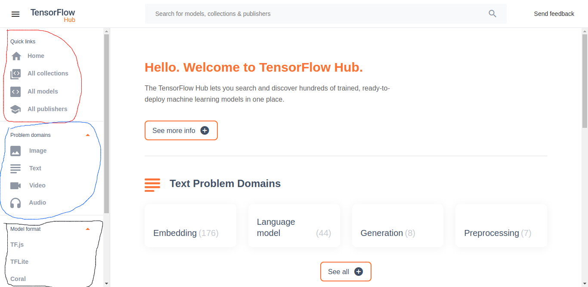
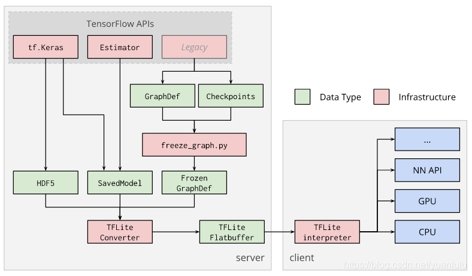
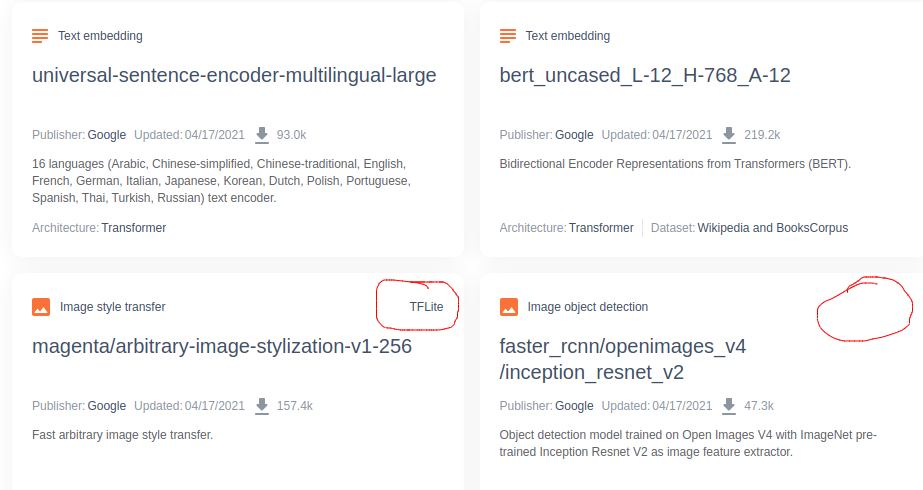
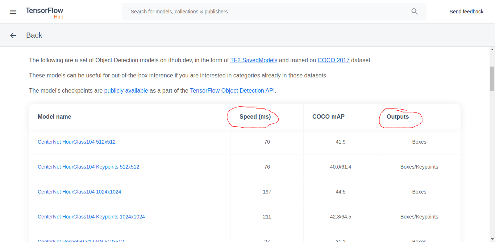

## `Tensorflow-hub`介绍



[tfhub.dev](https://tfhub.dev/)包含一系列模型，根据处理对象`Problem domain`分成了四类：`Image, Text, Video, Audio`

## 模型格式
模型格式又可分为`TF.js, TFLite, Coral`
* `TF.js` 是用于浏览器的模型。[ref](https://blog.csdn.net/xiangzhihong8/article/details/82597644)
* `TFLite` 使用的思路主要是从预训练的模型转换为tflite模型文件，拿到移动端部署。[ref](https://blog.csdn.net/yuanlulu/article/details/84063503)

* `Coral` 是google发布在一款开发板，类似树莓派，专门用于跑神经网络模型。[ref](https://www.sohu.com/a/299688498_223764)


上述三类模型都是比较特殊的格式（在电脑上或服务器上运行不使用上述3种格式！），模型列表中的右上角有标出格式。而实际上还有其他格式的模型（`TF2.0 Saved Model, Hub module`等），只有进入模型页面后才能看见。


**`Tensorflow Serving` 使用的是`TF2.0 Saved Model`格式的模型！**

---------------------------------
---------------------------------


`Collection`是处理一类问题的一系列模型的集合，而且在`Collection`中会展示模型的性能（推理时间等！）在选择模型时非常方便


---------------------------------
## 模型使用
进入模型介绍页面后，如下图：

* `COPY URL` 复制模型链接，在加载模型时，可直接使用`hub.load("model url")`的方式来加载，它会先自动下载模型到本地，再加载模型。但由于网络环境限制，不太好用，一般用下面的方法。
* `download` 下载模型到本地，加载模型时，可直接使用`hub.load("/home/xxx/modlepath")`，指定本地模型的路径。
* **`open colab notebook` 在colab中使用此模型，并且提供了模型的使用方法，非常方便！！！！**


## image object Detective

下面演示如何本地加载目标检测的模型以及用`Tensorflow Serving`部署模型！

1. 下载模型文件
    [模型集合](https://tfhub.dev/tensorflow/collections/object_detection/1)，随便选择一个模型，`output`一栏中有`Boxes, Boxes/Keypoints`表示用方框或方框+关键点表示物体。[选择一个模型]后，将模型文件下载到本地。*再点击`open colab notebook`，查看如何使用*
2. 安装可视化工具
    由于模型的输出是物体在图片中的坐标（方框的点的位置），只是数字而不是图片，不利于观察，所以需要将方框画在原图中，所以需要安装相应的包来完成。
  ```bash
  # Clone the tensorflow models repository
  git clone --depth 1 https://github.com/tensorflow/models
  sudo apt install -y protobuf-compiler
  cd models/research/
  protoc object_detection/protos/*.proto --python_out=.
  cp object_detection/packages/tf2/setup.py .
  python -m pip install .
  ```
3. 本地加载模型并测试，注意修改下面的路径变量
  ```python
import os
import sys
import time


import matplotlib
import matplotlib.pyplot as plt

import io
import numpy as np
from six import BytesIO
from PIL import Image, ImageDraw, ImageFont
from six.moves.urllib.request import urlopen

import tensorflow as tf
import tensorflow_hub as hub

# visualization
from object_detection.utils import label_map_util
from object_detection.utils import visualization_utils as viz_utils
from object_detection.utils import ops as utils_ops

COCO17_HUMAN_POSE_KEYPOINTS = [(0, 1),
    (0, 2),
    (1, 3),
    (2, 4),
    (0, 5),
    (0, 6),
    (5, 7),
    (7, 9),
    (6, 8),
    (8, 10),
    (5, 6),
    (5, 11),
    (6, 12),
    (11, 12),
    (11, 13),
    (13, 15),
    (12, 14),
    (14, 16)]

MODEL_PATH = "***/TensorflowServer/Model/centernet_resnet50v2_512x512_1/1"
PATH_TO_LABELS = '***/models/research/object_detection/data/mscoco_label_map.pbtxt'

def load_image_into_numpy_array(path):
    """Load an image from file into a numpy array.

    Puts image into numpy array to feed into tensorflow graph.
    Note that by convention we put it into a numpy array with shape
    (height, width, channels), where channels=3 for RGB.

    Args:
        path: the file path to the image

        Returns:
        uint8 numpy array with shape (img_height, img_width, 3)
    """
    image = None
    if(path.startswith('http')):
        response = urlopen(path)
        image_data = response.read()
        image_data = BytesIO(image_data)
        image = Image.open(image_data)
    else:
        image_data = tf.io.gfile.GFile(path, 'rb').read()
        image = Image.open(BytesIO(image_data))

    (im_width, im_height) = image.size
    return np.array(image.getdata()).reshape((1, im_height, im_width, 3)).astype(np.uint8)


def visualization(result, image_np):
    category_index = label_map_util.create_category_index_from_labelmap(PATH_TO_LABELS, use_display_name=True)

    label_id_offset = 0
    image_np_with_detections = image_np.copy()

    # Use keypoints if available in detections
    keypoints, keypoint_scores = None, None
    if 'detection_keypoints' in result:
        keypoints = result['detection_keypoints'][0]
        keypoint_scores = result['detection_keypoint_scores'][0]

    viz_utils.visualize_boxes_and_labels_on_image_array(
        image_np_with_detections[0],
        result['detection_boxes'][0],
        (result['detection_classes'][0] + label_id_offset).astype(int),
        result['detection_scores'][0],
        category_index,
        use_normalized_coordinates=True,
        max_boxes_to_draw=200,
        min_score_thresh=.30,
        agnostic_mode=False,
        keypoints=keypoints,
        keypoint_scores=keypoint_scores,
        keypoint_edges=COCO17_HUMAN_POSE_KEYPOINTS)

    plt.imsave("output.png", image_np_with_detections[0])


def main():
    imagePath = sys.argv[1]

    # get input picture
    start = time.time()
    image_np = load_image_into_numpy_array(imagePath)
    plt.imsave("input.png", image_np[0])
    end = time.time()
    print('load image: %s ms' % ((end - start)*1000))

    # load model
    start = time.time()
    detector = hub.load(MODEL_PATH)
    end = time.time()
    print('load model: %s ms' % ((end - start)*1000))

    # running inference
    start = time.time()
    results = detector(image_np)
    result = {key:value.numpy() for key,value in results.items()}
    end = time.time()
    print('inference time: %s ms' % ((end - start)*1000))

    # show result in picture
    visualization(result, image_np)


if __name__ == "__main__":
    main()
  ```

4. 使用`TensorFlow Serving`部署

  部署方式和之前的模型一样，用`model.config`比较方便，运行下面的命令：
  ```bash
docker run -t -d --rm -p 8501:8501 -p 8111:8500 --name tfserver --mount type=bind,source=MODELPATH/Model,target=/models tensorflow/serving --model_config_file=/models/model.config
  ```

  测试，使用`python`发送`REST`请求：
  ```python
import io
import os
import sys
import time
import json
import requests

import matplotlib
import matplotlib.pyplot as plt

import numpy as np
from six import BytesIO
from PIL import Image, ImageDraw, ImageFont
from six.moves.urllib.request import urlopen

import tensorflow as tf
import tensorflow_hub as hub

# visualization
from object_detection.utils import label_map_util
from object_detection.utils import visualization_utils as viz_utils
from object_detection.utils import ops as utils_ops

COCO17_HUMAN_POSE_KEYPOINTS = [(0, 1),
    (0, 2),
    (1, 3),
    (2, 4),
    (0, 5),
    (0, 6),
    (5, 7),
    (7, 9),
    (6, 8),
    (8, 10),
    (5, 6),
    (5, 11),
    (6, 12),
    (11, 12),
    (11, 13),
    (13, 15),
    (12, 14),
    (14, 16)]

PATH_TO_LABELS = '/home/yogurt/Desktop/EdgeX_Tutorial/TensorflowServer/tensorflow-models/research/object_detection/data/mscoco_label_map.pbtxt'

def load_image_into_numpy_array(path):
    """Load an image from file into a numpy array.

    Puts image into numpy array to feed into tensorflow graph.
    Note that by convention we put it into a numpy array with shape
    (height, width, channels), where channels=3 for RGB.

    Args:
        path: the file path to the image

        Returns:
        uint8 numpy array with shape (img_height, img_width, 3)
    """
    image = None
    if(path.startswith('http')):
        response = urlopen(path)
        image_data = response.read()
        image_data = BytesIO(image_data)
        image = Image.open(image_data)
    else:
        image_data = tf.io.gfile.GFile(path, 'rb').read()
        image = Image.open(BytesIO(image_data))

    (im_width, im_height) = image.size
    return np.array(image.getdata()).reshape((1, im_height, im_width, 3)).astype(np.uint8)


def visualization(result, image_np):
    category_index = label_map_util.create_category_index_from_labelmap(PATH_TO_LABELS, use_display_name=True)

    label_id_offset = 0
    image_np_with_detections = image_np.copy()

    # Use keypoints if available in detections
    keypoints, keypoint_scores = None, None
    if 'detection_keypoints' in result:
        keypoints = result['detection_keypoints'][0]
        keypoint_scores = result['detection_keypoint_scores'][0]

    viz_utils.visualize_boxes_and_labels_on_image_array(
        image_np_with_detections[0],
        result['detection_boxes'][0],
        (result['detection_classes'][0] + label_id_offset).astype(int),
        result['detection_scores'][0],
        category_index,
        use_normalized_coordinates=True,
        max_boxes_to_draw=200,
        min_score_thresh=.30,
        agnostic_mode=False,
        keypoints=keypoints,
        keypoint_scores=keypoint_scores,
        keypoint_edges=COCO17_HUMAN_POSE_KEYPOINTS)

    plt.imsave("output.png", image_np_with_detections[0])


def main():

    while True:
        imagePath = input("please input image url/path:")

        # get input picture
        start = time.time()
        image_np = load_image_into_numpy_array(imagePath)
        plt.imsave("input.png", image_np[0])
        end = time.time()
        print('load image: %s毫秒' % ((end - start)*1000))

        # request body
        data = json.dumps({"signature_name": "serving_default", "instances": image_np.tolist()})
        headers = {"content-type": "application/json"}
        start = time.time()
        json_response = requests.post('http://localhost:8501/v1/models/detect2:predict', data=data, headers=headers)
        end = time.time()
        print('inference time: %s ms' % ((end - start)*1000))
        # print(json_response.text)

        # decode result
        results = json.loads(json_response.text)['predictions'][0]
        result = {key:np.array([value], dtype=np.float32) for key,value in results.items()}

        visualization(result, image_np)


if __name__ == "__main__":
    main()
  ```
